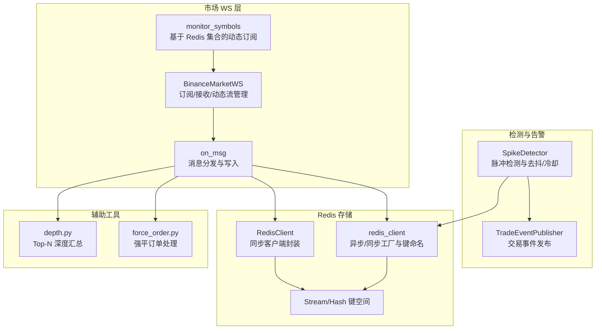
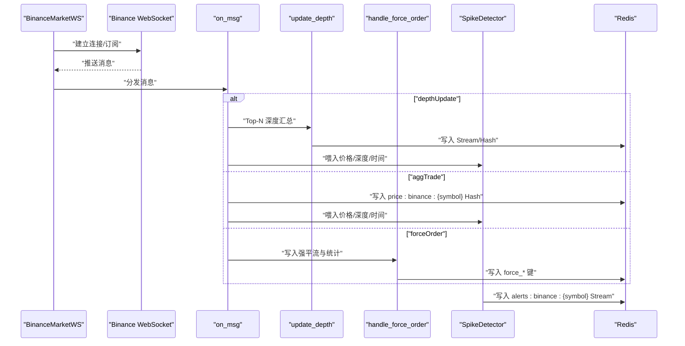
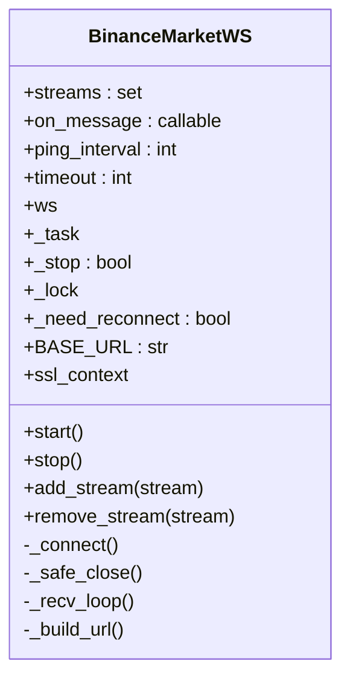
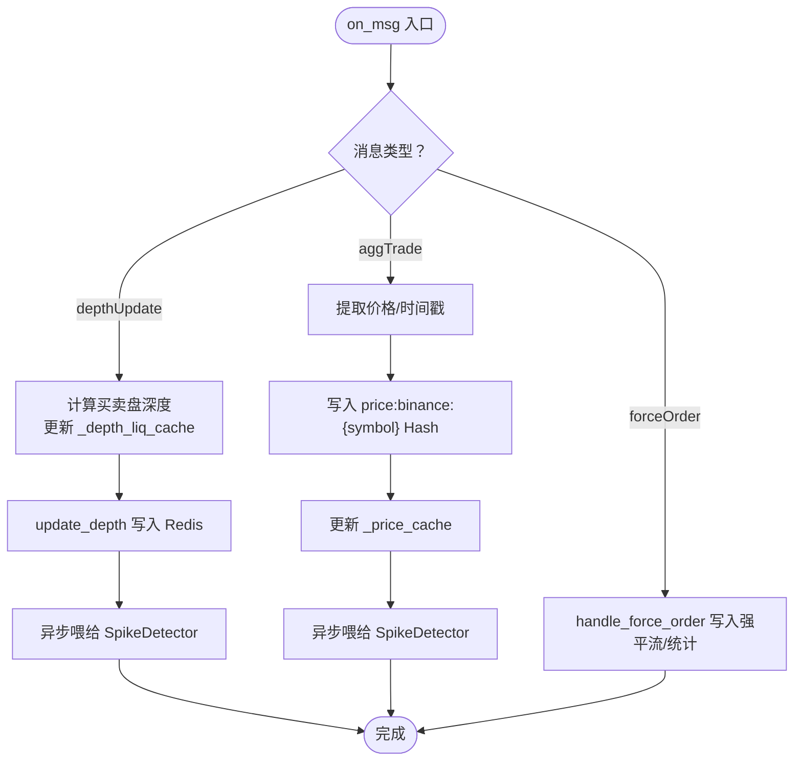
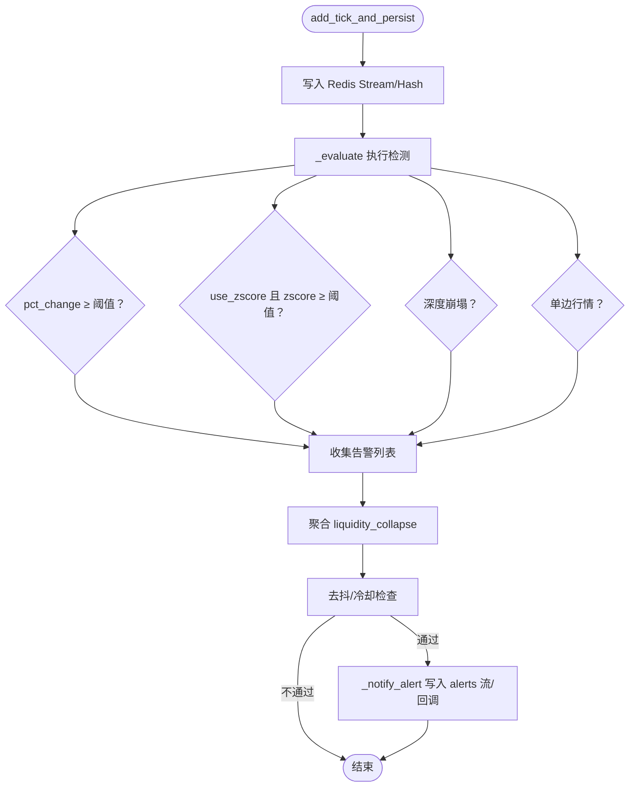
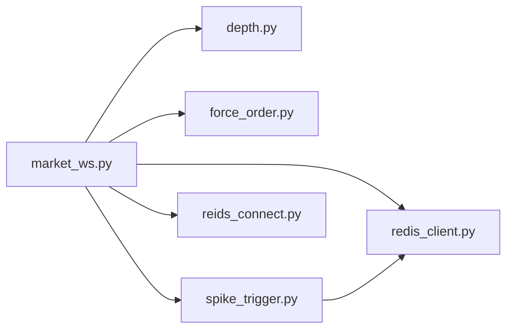

# 市场数据实时监听

<cite>
**本文引用的文件**
- [market_ws.py](file://data_server/binance/ws_binance/market_ws.py)
- [spike_trigger.py](file://data_server/binance/ws_binance/utils/spike_trigger.py)
- [redis_client.py](file://data_server/binance/ws_binance/utils/redis_client.py)
- [reids_connect.py](file://data_server/binance/ws_binance/utils/reids_connect.py)
- [depth.py](file://data_server/binance/ws_binance/utils/depth.py)
- [force_order.py](file://data_server/binance/ws_binance/utils/force_order.py)
- [trade_event_publisher.py](file://data_server/binance/ws_binance/utils/trade_event_publisher.py)
- [user_ws.py](file://data_server/binance/ws_binance/user_ws.py)
- [licence_ws.py](file://data_server/binance/ws_binance/licence_ws.py)
</cite>

## 目录
1. [引言](#引言)
2. [项目结构](#项目结构)
3. [核心组件](#核心组件)
4. [架构总览](#架构总览)
5. [详细组件分析](#详细组件分析)
6. [依赖关系分析](#依赖关系分析)
7. [性能考量](#性能考量)
8. [故障排查指南](#故障排查指南)
9. [结论](#结论)

## 引言
本文件深入解析 UTaker 系统中 Binance 市场数据实时监听子系统，聚焦以下目标：
- BinanceMarketWS 类如何通过 WebSocket 订阅聚合成交（aggTrade）、深度（depth10@100ms）与强平（forceOrder）三类核心数据流，并将价格与订单簿深度写入 Redis。
- SpikeDetector 在 spike_trigger.py 中的实现原理：如何结合价格变动百分比、Z-Score 统计异常与买卖盘流动性变化，检测市场脉冲事件（暴涨暴跌、流动性崩塌、单边行情），并通过 TradeEventPublisher 触发告警。
- 动态流管理（add_stream/remove_stream）与连接重连策略，以及 _price_cache 和 _depth_liq_cache 本地缓存的设计目的。
- on_msg 函数中不同类型消息的处理流程与性能优化（异步非阻塞写入、错误重试、去抖与冷却）。

## 项目结构
围绕市场数据实时监听，相关模块分布如下：
- 数据接入与处理：market_ws.py（WebSocket 接入、消息分发、动态订阅、清理）
- 深度与价格写入：depth.py（Top-N 深度汇总写入 Redis Stream）、reids_connect.py（同步 Redis 客户端封装）
- 强平订单处理：force_order.py（强平订单写入 Redis Stream 与统计）
- 告警与检测：spike_trigger.py（SpikeDetector 实现脉冲检测与告警）、trade_event_publisher.py（交易事件发布）
- 用户 WS（账户/资金/持仓）：user_ws.py、licence_ws.py（与市场 WS 解耦）

图表来源
- [market_ws.py](file://data_server/binance/ws_binance/market_ws.py#L1-L379)
- [spike_trigger.py](file://data_server/binance/ws_binance/utils/spike_trigger.py#L1-L436)
- [redis_client.py](file://data_server/binance/ws_binance/utils/redis_client.py#L1-L116)
- [reids_connect.py](file://data_server/binance/ws_binance/utils/reids_connect.py#L1-L95)
- [depth.py](file://data_server/binance/ws_binance/utils/depth.py#L1-L111)
- [force_order.py](file://data_server/binance/ws_binance/utils/force_order.py#L1-L129)
- [trade_event_publisher.py](file://data_server/binance/ws_binance/utils/trade_event_publisher.py#L1-L114)

章节来源
- [market_ws.py](file://data_server/binance/ws_binance/market_ws.py#L1-L379)

## 核心组件
- BinanceMarketWS：封装 WebSocket 连接、URL 构造、接收循环、动态订阅/取消订阅、重连策略与停止控制。
- on_msg：根据消息类型分发处理，写入 Redis Hash/Stream，更新本地缓存，并驱动 SpikeDetector。
- SpikeDetector：基于滑动窗口的价格变化、Z-Score、深度崩塌与单边行情检测，支持去抖与冷却。
- RedisClient/redis_client：统一 Redis 连接与键命名，提供安全的 HSET/XADD 封装。
- depth.py/force_order.py：分别负责 Top-N 深度汇总写入与强平订单统计与流写入。
- monitor_symbols：基于 Redis 集合“symbol:binance”动态增删订阅流。

章节来源
- [market_ws.py](file://data_server/binance/ws_binance/market_ws.py#L1-L379)
- [spike_trigger.py](file://data_server/binance/ws_binance/utils/spike_trigger.py#L1-L436)
- [redis_client.py](file://data_server/binance/ws_binance/utils/redis_client.py#L1-L116)
- [reids_connect.py](file://data_server/binance/ws_binance/utils/reids_connect.py#L1-L95)
- [depth.py](file://data_server/binance/ws_binance/utils/depth.py#L1-L111)
- [force_order.py](file://data_server/binance/ws_binance/utils/force_order.py#L1-L129)

## 架构总览
系统采用“WebSocket 接入 + 消息分发 + 检测告警 + Redis 存储”的分层设计。WebSocket 接收来自 Binance 的三类流，on_msg 将价格与深度写入 Redis，同时喂给 SpikeDetector。SpikeDetector 在内存滑动窗口中进行统计与规则判断，满足条件时通过 Redis Stream 与回调触发告警。monitor_symbols 通过 Redis 集合实现动态订阅管理。

图表来源
- [market_ws.py](file://data_server/binance/ws_binance/market_ws.py#L251-L379)
- [depth.py](file://data_server/binance/ws_binance/utils/depth.py#L1-L111)
- [force_order.py](file://data_server/binance/ws_binance/utils/force_order.py#L1-L129)
- [spike_trigger.py](file://data_server/binance/ws_binance/utils/spike_trigger.py#L190-L374)
- [redis_client.py](file://data_server/binance/ws_binance/utils/redis_client.py#L1-L116)

## 详细组件分析

### BinanceMarketWS：WebSocket 接入与动态流管理
- 连接与 URL 构造
  - 支持单流与多流拼接，构造 wss://fstream.binance.com/stream?streams=...
  - 使用 ping_interval/ping_timeout 控制心跳，max_queue=None 保证高吞吐。
- 接收循环与重连
  - 循环接收消息，异常时记录警告并等待 0.5s 后重连。
  - _need_reconnect 标志位与 _safe_close 配合，实现“立即断开 + 强制重连”。
- 动态订阅/取消订阅
  - add_stream/remove_stream 在持有锁的情况下修改 self.streams，并设置 _need_reconnect 以触发重连。
  - monitor_symbols 基于 Redis 集合“symbol:binance”动态增删三类流（aggTrade、depth10@100ms、forceOrder），并在移除时清理对应 Redis 键与本地缓存。
- 停止与清理
  - stop 设置 _stop 标志并等待任务结束，finally 中安全关闭连接。

图表来源
- [market_ws.py](file://data_server/binance/ws_binance/market_ws.py#L119-L250)

章节来源
- [market_ws.py](file://data_server/binance/ws_binance/market_ws.py#L119-L250)
- [market_ws.py](file://data_server/binance/ws_binance/market_ws.py#L251-L379)

### on_msg：消息分发与写入流程
- depthUpdate
  - 计算买卖盘深度汇总，更新 _depth_liq_cache。
  - 调用 update_depth 写入 Redis Stream/Hash。
  - 若存在 _price_cache，异步喂给 SpikeDetector。
- aggTrade
  - 提取价格与时间戳，写入 price:binance:{symbol} Hash。
  - 更新 _price_cache，并异步喂给 SpikeDetector。
- forceOrder
  - 调用 handle_force_order 写入强平流与统计。

图表来源
- [market_ws.py](file://data_server/binance/ws_binance/market_ws.py#L290-L347)
- [depth.py](file://data_server/binance/ws_binance/utils/depth.py#L13-L104)
- [force_order.py](file://data_server/binance/ws_binance/utils/force_order.py#L15-L81)

章节来源
- [market_ws.py](file://data_server/binance/ws_binance/market_ws.py#L290-L347)

### SpikeDetector：脉冲检测与告警
- 输入与存储
  - add_tick_and_persist 接收 symbol、price、bid_liq、ask_liq、ts，统一毫秒时间戳，写入 Redis Stream 与 latest Hash。
- 检测规则
  - 百分比变化：窗口首尾价比较，触发 pct_change_up/down。
  - Z-Score：基于收益序列的标准分数，识别异常波动。
  - 深度崩塌：当前买卖盘深度与历史均值比较，连续满足触发 bid_collapse/ask_collapse。
  - 单边行情：连续同向涨跌且总幅度达标，触发 one_side_up/one_side_down。
- 去抖与冷却
  - 使用 debounce_ms 与 cooldown_s 避免重复告警。
- 事件聚合
  - 在 aggregate_window_ms 内将多个深度崩塌事件聚合为 liquidity_collapse。
- 回调与输出
  - 将告警写入 alerts:binance:{symbol} Stream，并可选回调。

图表来源
- [spike_trigger.py](file://data_server/binance/ws_binance/utils/spike_trigger.py#L190-L374)
- [spike_trigger.py](file://data_server/binance/ws_binance/utils/spike_trigger.py#L376-L436)

章节来源
- [spike_trigger.py](file://data_server/binance/ws_binance/utils/spike_trigger.py#L83-L374)

### Redis 客户端与键空间
- RedisClient（同步）
  - 提供 set_hash/get_hash/delete_by_prefix 等方法，自动处理键类型不匹配问题。
- redis_client（异步/同步工厂）
  - 提供 get_async_redis/get_sync_redis，统一连接池与键命名工具（key_alerts/key_latest_price 等）。
- 键空间
  - price:binance:{symbol}：最新价格与时间戳（Hash）
  - ticks:binance:{symbol}：Top-N 深度与价格（Stream）
  - alerts:binance:{symbol}：脉冲告警（Stream）
  - force_stream:binance:{symbol}、force_stats:binance:{symbol}、force_stats_stream:binance:{symbol}：强平订单与统计（Stream/Hash）

章节来源
- [reids_connect.py](file://data_server/binance/ws_binance/utils/reids_connect.py#L1-L95)
- [redis_client.py](file://data_server/binance/ws_binance/utils/redis_client.py#L1-L116)

### 动态流管理与清理
- monitor_symbols
  - 从 Redis 集合“symbol:binance”读取活跃币对，按需 add_stream/remove_stream。
  - 移除订阅时调用 _cleanup_symbol_keys 清理 price/depth/ticks/alerts/force_stream/stats 等键，并清空本地缓存。
- _cleanup_symbol_keys
  - 使用 scan_iter 匹配多种大小写形式的键模式，支持重试与最终残留打印，确保清理彻底。

章节来源
- [market_ws.py](file://data_server/binance/ws_binance/market_ws.py#L49-L117)
- [market_ws.py](file://data_server/binance/ws_binance/market_ws.py#L251-L288)

### 强平订单处理
- handle_force_order
  - 写入 force_stream:binance:{symbol}（最近约 100 条）
  - 维护 force_stats:binance:{symbol}（累计统计，带过期）
  - 写入 force_stats_stream:binance:{symbol}（最近约 1000 条）

章节来源
- [force_order.py](file://data_server/binance/ws_binance/utils/force_order.py#L15-L81)

### 交易事件发布（与告警联动）
- TradeEventPublisher
  - 将交易事件写入 final_events Stream，供下游统一订阅与处理。
  - 与 SpikeDetector 的 alerts:binance:{symbol} Stream 形成互补：前者面向交易执行阶段，后者面向市场脉冲检测。

章节来源
- [trade_event_publisher.py](file://data_server/binance/ws_binance/utils/trade_event_publisher.py#L1-L114)

## 依赖关系分析
- 组件耦合
  - market_ws.py 依赖 depth.py、force_order.py、redis_client.py、spike_trigger.py。
  - spike_trigger.py 依赖 redis_client.py（异步 Redis 客户端）。
  - reids_connect.py 与 redis_client.py 共同提供同步/异步 Redis 访问能力。
- 外部依赖
  - websockets、redis.asyncio、numpy（可选）。
- 潜在循环依赖
  - 未见直接循环导入；各模块职责清晰，通过工具模块解耦。

图表来源
- [market_ws.py](file://data_server/binance/ws_binance/market_ws.py#L1-L379)
- [spike_trigger.py](file://data_server/binance/ws_binance/utils/spike_trigger.py#L1-L436)
- [redis_client.py](file://data_server/binance/ws_binance/utils/redis_client.py#L1-L116)
- [reids_connect.py](file://data_server/binance/ws_binance/utils/reids_connect.py#L1-L95)
- [depth.py](file://data_server/binance/ws_binance/utils/depth.py#L1-L111)
- [force_order.py](file://data_server/binance/ws_binance/utils/force_order.py#L1-L129)

章节来源
- [market_ws.py](file://data_server/binance/ws_binance/market_ws.py#L1-L379)
- [spike_trigger.py](file://data_server/binance/ws_binance/utils/spike_trigger.py#L1-L436)

## 性能考量
- 异步非阻塞写入
  - on_msg 对 Redis 写入与 SpikeDetector 喂入均使用 asyncio.create_task，避免阻塞接收循环。
  - SpikeDetector 的 add_tick_and_persist 内部异步写入 Redis Stream/Hash，并在最后非阻塞触发 _evaluate。
- 错误重试与容错
  - Redis 写入失败时打印错误与键类型，不影响主流程继续。
  - _cleanup_symbol_keys 支持多次重试与最终残留打印，提升稳定性。
- 去抖与冷却
  - SpikeDetector 使用 debounce_ms 与 cooldown_s，有效降低高频误报。
- 窗口与确认
  - confirm_ticks 与滑动窗口长度（window_seconds）平衡灵敏度与稳定性。
- 本地缓存
  - _price_cache 与 _depth_liq_cache 降低深度解析与跨模块通信成本，提高实时性。
- 连接与重连
  - _need_reconnect + _safe_close + 短暂 sleep，确保在动态订阅时快速重建连接。

章节来源
- [market_ws.py](file://data_server/binance/ws_binance/market_ws.py#L181-L215)
- [market_ws.py](file://data_server/binance/ws_binance/market_ws.py#L290-L347)
- [spike_trigger.py](file://data_server/binance/ws_binance/utils/spike_trigger.py#L190-L374)

## 故障排查指南
- WebSocket 连接问题
  - 检查 BASE_URL 与 SSL 上下文；确认网络可达与 ping_interval/ping_timeout 设置合理。
  - 观察日志中“Disconnected”与“Applying new subscriptions…”提示，确认重连是否生效。
- Redis 写入失败
  - 查看 HSET/XADD 错误日志，确认键类型（Hash/Stream）与键名格式。
  - 使用 redis_client 的 safe_* 封装或手动检查键类型后清理。
- 动态订阅异常
  - 确认 Redis 集合“symbol:binance”内容正确，monitor_symbols 是否正常运行。
  - 使用 _cleanup_symbol_keys 清理残留键，避免历史数据干扰。
- SpikeDetector 告警缺失
  - 检查 confirm_ticks、pct_change_th、zscore_th、depth_ratio_th、min_depth_liq 等阈值设置。
  - 确认去抖/冷却时间是否过长导致告警被抑制。
- 强平统计异常
  - 检查 force_stats:binance:{symbol} 是否过期，确认 EXPIRE_SECONDS 设置。
  - 核对 force_stream 与 force_stats_stream 的 maxlen 是否合理。

章节来源
- [market_ws.py](file://data_server/binance/ws_binance/market_ws.py#L155-L215)
- [market_ws.py](file://data_server/binance/ws_binance/market_ws.py#L49-L117)
- [spike_trigger.py](file://data_server/binance/ws_binance/utils/spike_trigger.py#L190-L374)
- [force_order.py](file://data_server/binance/ws_binance/utils/force_order.py#L15-L81)

## 结论
本系统通过 BinanceMarketWS 实现对聚合成交、深度与强平三类核心数据流的实时接入，并以 on_msg 为核心枢纽，将价格与深度写入 Redis，同时驱动 SpikeDetector 进行脉冲检测与告警。动态流管理与清理机制保障了订阅灵活性与数据一致性；异步非阻塞写入、去抖与冷却等策略提升了系统稳定性与性能。整体架构清晰、模块职责明确，适合在高频市场环境中持续演进与扩展。