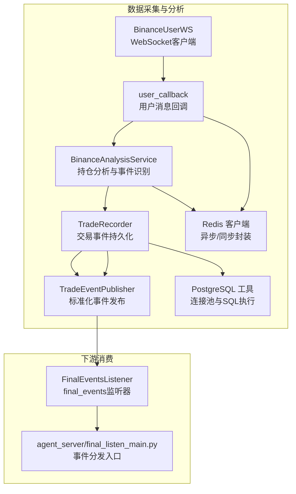
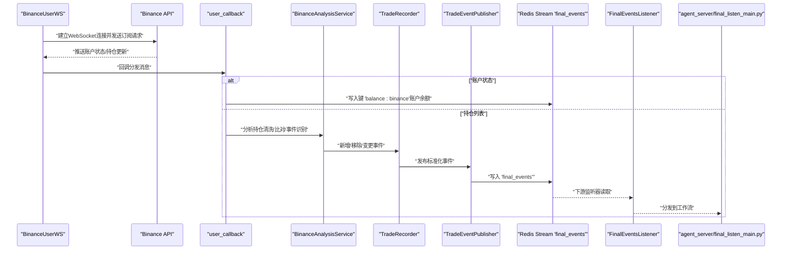
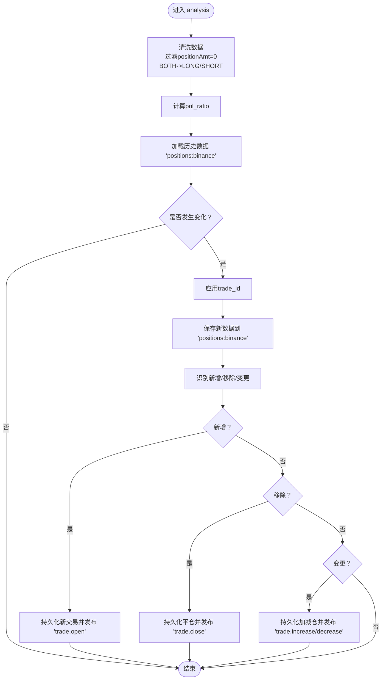
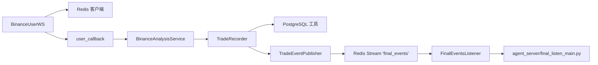

# 用户行为与订单监听

<cite>
**本文引用的文件列表**
- [user_ws.py](file://data_server/binance/ws_binance/user_ws.py)
- [binance_pos_analysis.py](file://data_server/binance/ws_binance/utils/binance_pos_analysis.py)
- [trade_recorder.py](file://data_server/binance/ws_binance/utils/trade_recorder.py)
- [trade_event_publisher.py](file://data_server/binance/ws_binance/utils/trade_event_publisher.py)
- [redis_client.py](file://data_server/binance/ws_binance/utils/redis_client.py)
- [reids_connect.py](file://data_server/binance/ws_binance/utils/reids_connect.py)
- [db_utils.py](file://data_server/binance/ws_binance/utils/db_utils.py)
- [final_events.py](file://agent_server/utils/watchers/final_events.py)
- [final_listen_main.py](file://agent_server/final_listen_main.py)
</cite>

## 目录
1. [简介](#简介)
2. [项目结构](#项目结构)
3. [核心组件](#核心组件)
4. [架构总览](#架构总览)
5. [组件详解](#组件详解)
6. [依赖关系分析](#依赖关系分析)
7. [性能与可靠性](#性能与可靠性)
8. [故障排查指南](#故障排查指南)
9. [结论](#结论)

## 简介
本文件面向UTaker系统中“用户行为与订单监听”子系统，聚焦于通过BinanceUserWS类实现的用户数据WebSocket监听能力。该模块以用户的API Key与Secret为基础，采用HMAC-SHA256签名认证，连接Binance USDT-M Futures用户数据WebSocket，订阅账户状态与持仓信息的实时更新；同时内置自动重连、心跳保活与异常处理机制。在消息回调中，模块将账户余额写入Redis（键名“balance:binance”），并将持仓数据交由BinanceAnalysisService进行分析；分析完成后，通过TradeRecorder将交易行为（开仓、平仓、加仓、减仓）转化为标准化事件并发布到Redis Stream“final_events”，供下游agent_server进行行为分析与风险评估。

## 项目结构
围绕用户行为与订单监听的关键文件组织如下：
- 数据采集与分析
  - BinanceUserWS：用户数据WebSocket客户端，负责签名、连接、订阅、心跳与重连
  - user_callback：用户消息回调，分别处理账户状态与持仓列表
  - BinanceAnalysisService：对持仓数据进行清洗、比对、事件识别与持久化
  - TradeRecorder：将交易事件写入PostgreSQL并发布到Redis Stream
  - TradeEventPublisher：标准化交易事件并写入final_events流
  - Redis工具：异步/同步Redis客户端封装与键空间命名
  - PostgreSQL工具：连接池与SQL执行封装
- 下游消费
  - agent_server/utils/watchers/final_events.py：监听final_events流，进行优先级过滤、去重与冷却控制
  - agent_server/final_listen_main.py：从final_events流读取事件并分发到工作流

图表来源
- [user_ws.py](file://data_server/binance/ws_binance/user_ws.py#L17-L163)
- [binance_pos_analysis.py](file://data_server/binance/ws_binance/utils/binance_pos_analysis.py#L1-L193)
- [trade_recorder.py](file://data_server/binance/ws_binance/utils/trade_recorder.py#L1-L181)
- [trade_event_publisher.py](file://data_server/binance/ws_binance/utils/trade_event_publisher.py#L1-L114)
- [redis_client.py](file://data_server/binance/ws_binance/utils/redis_client.py#L1-L116)
- [db_utils.py](file://data_server/binance/ws_binance/utils/db_utils.py#L1-L256)
- [final_events.py](file://agent_server/utils/watchers/final_events.py#L1-L97)
- [final_listen_main.py](file://agent_server/final_listen_main.py#L31-L55)

章节来源
- [user_ws.py](file://data_server/binance/ws_binance/user_ws.py#L17-L163)
- [binance_pos_analysis.py](file://data_server/binance/ws_binance/utils/binance_pos_analysis.py#L1-L193)
- [trade_recorder.py](file://data_server/binance/ws_binance/utils/trade_recorder.py#L1-L181)
- [trade_event_publisher.py](file://data_server/binance/ws_binance/utils/trade_event_publisher.py#L1-L114)
- [redis_client.py](file://data_server/binance/ws_binance/utils/redis_client.py#L1-L116)
- [db_utils.py](file://data_server/binance/ws_binance/utils/db_utils.py#L1-L256)
- [final_events.py](file://agent_server/utils/watchers/final_events.py#L1-L97)
- [final_listen_main.py](file://agent_server/final_listen_main.py#L31-L55)

## 核心组件
- BinanceUserWS：基于websockets库的异步WebSocket客户端，支持HMAC-SHA256签名、SSL容错、自动重连、心跳保活与回调分发。
- user_callback：根据消息结构区分账户状态与持仓列表，分别处理余额写入Redis与持仓分析。
- BinanceAnalysisService：对v2/account.position返回的持仓列表进行清洗、计算pnl_ratio、应用trade_id、对比前后状态并识别新增/移除/变更项。
- TradeRecorder：将新增/平仓/加减仓事件写入PostgreSQL，并通过TradeEventPublisher发布到final_events流。
- TradeEventPublisher：标准化事件字段，写入Redis Stream“final_events”，便于下游统一消费。
- Redis工具：提供异步/同步Redis客户端与常用键空间命名方法。
- PostgreSQL工具：线程池连接、重试与SQL执行封装。
- FinalEventsListener：从final_events流读取事件，进行优先级过滤、去重与冷却控制。
- agent_server/final_listen_main.py：从final_events流阻塞读取并分发到工作流。

章节来源
- [user_ws.py](file://data_server/binance/ws_binance/user_ws.py#L17-L163)
- [binance_pos_analysis.py](file://data_server/binance/ws_binance/utils/binance_pos_analysis.py#L1-L193)
- [trade_recorder.py](file://data_server/binance/ws_binance/utils/trade_recorder.py#L1-L181)
- [trade_event_publisher.py](file://data_server/binance/ws_binance/utils/trade_event_publisher.py#L1-L114)
- [redis_client.py](file://data_server/binance/ws_binance/utils/redis_client.py#L1-L116)
- [db_utils.py](file://data_server/binance/ws_binance/utils/db_utils.py#L1-L256)
- [final_events.py](file://agent_server/utils/watchers/final_events.py#L1-L97)
- [final_listen_main.py](file://agent_server/final_listen_main.py#L31-L55)

## 架构总览
下图展示从WebSocket接收用户数据到下游分析的整体流程，包括签名认证、消息处理、Redis与数据库持久化以及Stream发布。

图表来源
- [user_ws.py](file://data_server/binance/ws_binance/user_ws.py#L66-L127)
- [binance_pos_analysis.py](file://data_server/binance/ws_binance/utils/binance_pos_analysis.py#L129-L171)
- [trade_recorder.py](file://data_server/binance/ws_binance/utils/trade_recorder.py#L29-L181)
- [trade_event_publisher.py](file://data_server/binance/ws_binance/utils/trade_event_publisher.py#L20-L114)
- [final_events.py](file://agent_server/utils/watchers/final_events.py#L52-L97)
- [final_listen_main.py](file://agent_server/final_listen_main.py#L31-L55)

## 组件详解

### BinanceUserWS：签名、连接、订阅与重连
- 认证与签名
  - 使用HMAC-SHA256对参数进行签名，参数包含apiKey与timestamp，签名后加入请求体。
  - 请求方法分别为“v2/account.status”和“v2/account.position”，用于订阅账户状态与持仓列表。
- 连接与心跳
  - 通过websockets.connect建立wss连接，底层自动ping/pong保活。
  - 使用SSL上下文，测试环境下可禁用证书校验。
- 自动重连与异常处理
  - run循环内持续尝试连接，异常时等待reconnect_delay秒后重连。
  - _connect内部通过超时机制主动发送订阅请求，避免长时间无响应。
- 回调分发
  - 支持注册异步/同步回调函数，将原始消息传递给上层处理。

章节来源
- [user_ws.py](file://data_server/binance/ws_binance/user_ws.py#L17-L127)

### user_callback：账户余额与持仓分析
- 账户余额写入Redis
  - 当消息结果为字典时，提取totalMarginBalance与availableBalance，序列化后写入键“balance:binance”。
- 持仓分析
  - 当消息结果为列表时，调用BinanceAnalysisService().analysis对持仓进行清洗、pnl_ratio计算、trade_id应用与事件识别。
- 异常处理
  - 对分析过程与Redis写入进行异常捕获并打印日志。

章节来源
- [user_ws.py](file://data_server/binance/ws_binance/user_ws.py#L128-L163)

### BinanceAnalysisService：持仓清洗、事件识别与持久化
- 数据清洗
  - 过滤positionAmt为0的持仓；将positionSide为“BOTH”的项转换为LONG或SHORT。
- 计算pnl_ratio
  - 基于unRealizedProfit与initialMargin计算pnl_ratio，避免除零。
- trade_id应用
  - 通过与历史数据比对，为新出现的持仓项分配唯一trade_id，确保跨批次追踪。
- 历史缓存与对比
  - 从Redis读取“positions:binance”作为旧数据，若发生变化则进行added/removed/changed三类事件识别。
- 新增/移除/变更事件
  - 新增：写入symbol集合、持久化新交易并发布“trade.open”事件。
  - 移除：从symbol集合移除、持久化平仓并发布“trade.close”事件。
  - 变更：持久化加减仓并发布“trade.increase/decrease”事件。

图表来源
- [binance_pos_analysis.py](file://data_server/binance/ws_binance/utils/binance_pos_analysis.py#L1-L171)

章节来源
- [binance_pos_analysis.py](file://data_server/binance/ws_binance/utils/binance_pos_analysis.py#L1-L171)

### TradeRecorder：交易事件持久化与事件发布
- 新开仓
  - 写入trades表（trade、symbol、exchange、position_side、size/max_size、entry_time、entry_price等），并写入trade_actions表（OPEN）。
  - 发布“trade.open”事件到final_events。
- 平仓
  - 查询开仓时间计算时长，更新trades表（close_time、close_price、size置0、closed_size累加），写入trade_actions表（CLOSE）。
  - 若时长小于防抖阈值，标记为短线交易并发布“trade.close”事件。
- 加减仓
  - 更新trades表（size、max_size、closed_size），写入trade_actions表（INCREASE/DECREASE）。
  - 若两次更新间隔小于防抖阈值，标记为短线交易并发布对应事件。
- 防抖配置
  - 可通过环境变量启用/禁用与设置阈值，默认开启，阈值3分钟。

章节来源
- [trade_recorder.py](file://data_server/binance/ws_binance/utils/trade_recorder.py#L1-L181)

### TradeEventPublisher：标准化事件发布
- 标准化字段
  - event_id、stage、event_type、account_id、symbol、timestamp、is_short_term、trade_details、meta等。
- 写入Redis Stream
  - 使用RedisClient同步客户端写入“final_events”，设置最大长度防止无限增长。
- 事件类型
  - trade.open、trade.close、trade.increase、trade.decrease，并附带action与change_amount等。

章节来源
- [trade_event_publisher.py](file://data_server/binance/ws_binance/utils/trade_event_publisher.py#L1-L114)

### Redis与数据库工具
- Redis客户端
  - 提供异步/同步客户端工厂与常用键空间命名方法，保证连接复用与类型安全。
- 同步Redis封装
  - 提供set/get/Stream写入等便捷方法，简化Redis操作。
- PostgreSQL工具
  - 线程池连接、重试与SQL执行封装，支持批量与单条执行、fetch_one/fetch_all等。

章节来源
- [redis_client.py](file://data_server/binance/ws_binance/utils/redis_client.py#L1-L116)
- [reids_connect.py](file://data_server/binance/ws_binance/utils/reids_connect.py#L1-L31)
- [db_utils.py](file://data_server/binance/ws_binance/utils/db_utils.py#L1-L256)

### 下游消费：FinalEventsListener与agent_server/final_listen_main.py
- FinalEventsListener
  - 创建消费者组，按优先级门限过滤事件，进行去重与冷却控制，最终将事件打印到终端供分析。
- agent_server/final_listen_main.py
  - 从final_events流阻塞读取，解析嵌套JSON，分发到后续工作流。

章节来源
- [final_events.py](file://agent_server/utils/watchers/final_events.py#L1-L97)
- [final_listen_main.py](file://agent_server/final_listen_main.py#L31-L55)

## 依赖关系分析
- 组件耦合
  - BinanceUserWS依赖websockets、hmac、hashlib与SSL上下文；回调依赖Redis与BinanceAnalysisService。
  - BinanceAnalysisService依赖RedisClient与TradeRecorder，间接依赖PostgreSQL与TradeEventPublisher。
  - TradeRecorder依赖PostgreSQL工具与TradeEventPublisher。
  - TradeEventPublisher依赖RedisClient与Redis Stream。
  - 下游FinalEventsListener依赖Redis Stream与环境变量配置。
- 外部依赖
  - Binance WebSocket API（v2/account.status、v2/account.position）
  - Redis（异步/同步客户端、Stream）
  - PostgreSQL（连接池、SQL执行）

图表来源
- [user_ws.py](file://data_server/binance/ws_binance/user_ws.py#L17-L163)
- [binance_pos_analysis.py](file://data_server/binance/ws_binance/utils/binance_pos_analysis.py#L1-L193)
- [trade_recorder.py](file://data_server/binance/ws_binance/utils/trade_recorder.py#L1-L181)
- [trade_event_publisher.py](file://data_server/binance/ws_binance/utils/trade_event_publisher.py#L1-L114)
- [redis_client.py](file://data_server/binance/ws_binance/utils/redis_client.py#L1-L116)
- [db_utils.py](file://data_server/binance/ws_binance/utils/db_utils.py#L1-L256)
- [final_events.py](file://agent_server/utils/watchers/final_events.py#L1-L97)
- [final_listen_main.py](file://agent_server/final_listen_main.py#L31-L55)

## 性能与可靠性
- 连接与重连
  - run循环与异常捕获确保在网络波动时自动恢复；ping_interval由底层WebSocket提供，减少断线风险。
- 消息处理
  - user_callback对账户状态与持仓列表分别处理，避免不必要的计算；BinanceAnalysisService仅在数据变化时触发事件识别。
- Redis与数据库
  - Redis使用异步客户端写入“balance:binance”，同步客户端写入final_events，降低阻塞风险。
  - PostgreSQL使用线程池连接与重试机制，保障高并发下的稳定性。
- 防抖与短时交易
  - TradeRecorder对高频加减仓与短时平仓进行防抖标记，减少下游无效事件。

[本节为通用性能讨论，无需列出章节来源]

## 故障排查指南
- WebSocket连接失败
  - 检查API Key/Secret是否正确，确认SSL上下文配置；查看重连延迟与异常日志。
  - 参考路径：[user_ws.py](file://data_server/binance/ws_binance/user_ws.py#L80-L127)
- 签名错误
  - 确认参数排序与urlencode编码顺序，检查timestamp精度（毫秒）与secret有效性。
  - 参考路径：[user_ws.py](file://data_server/binance/ws_binance/user_ws.py#L56-L77)
- Redis写入失败
  - 检查Redis连接参数与网络连通性；确认键空间命名与数据序列化。
  - 参考路径：[redis_client.py](file://data_server/binance/ws_binance/utils/redis_client.py#L1-L41)、[user_ws.py](file://data_server/binance/ws_binance/user_ws.py#L140-L153)
- PostgreSQL执行失败
  - 查看连接池状态与SQL参数；确认表结构与约束；关注重试日志。
  - 参考路径：[db_utils.py](file://data_server/binance/ws_binance/utils/db_utils.py#L1-L256)
- 事件未到达下游
  - 检查final_events流是否存在消费者组、优先级门限、去重与冷却配置。
  - 参考路径：[final_events.py](file://agent_server/utils/watchers/final_events.py#L52-L97)、[final_listen_main.py](file://agent_server/final_listen_main.py#L31-L55)

章节来源
- [user_ws.py](file://data_server/binance/ws_binance/user_ws.py#L56-L127)
- [redis_client.py](file://data_server/binance/ws_binance/utils/redis_client.py#L1-L41)
- [db_utils.py](file://data_server/binance/ws_binance/utils/db_utils.py#L1-L256)
- [final_events.py](file://agent_server/utils/watchers/final_events.py#L52-L97)
- [final_listen_main.py](file://agent_server/final_listen_main.py#L31-L55)

## 结论
该模块通过BinanceUserWS实现了对Binance USDT-M Futures用户数据的可靠订阅与处理，结合BinanceAnalysisService完成持仓事件识别，并通过TradeRecorder与TradeEventPublisher将交易行为标准化并发布到final_events流，最终由agent_server完成进一步的行为分析与风险评估。整体设计具备良好的可扩展性与健壮性，适合在生产环境中稳定运行。