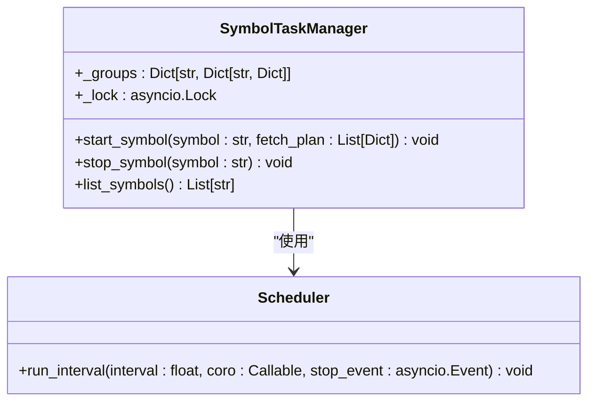
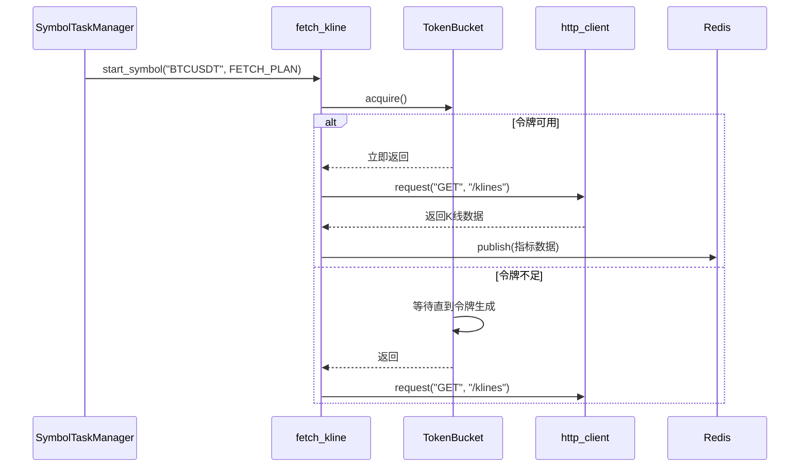
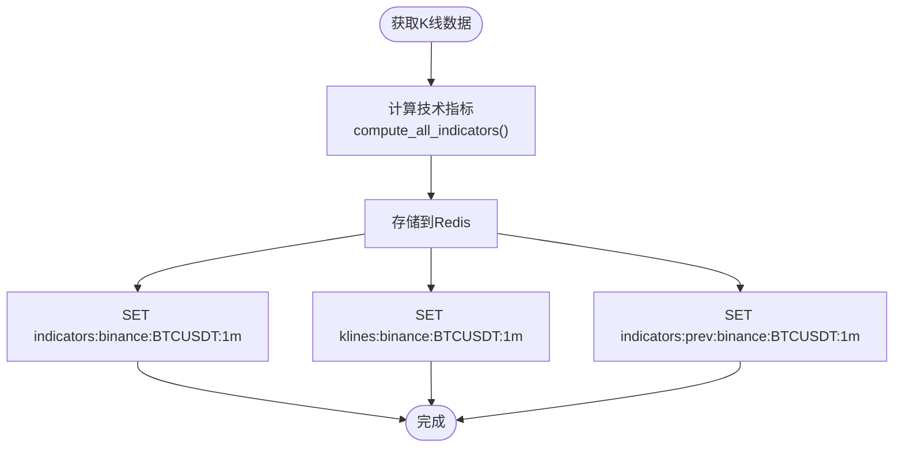
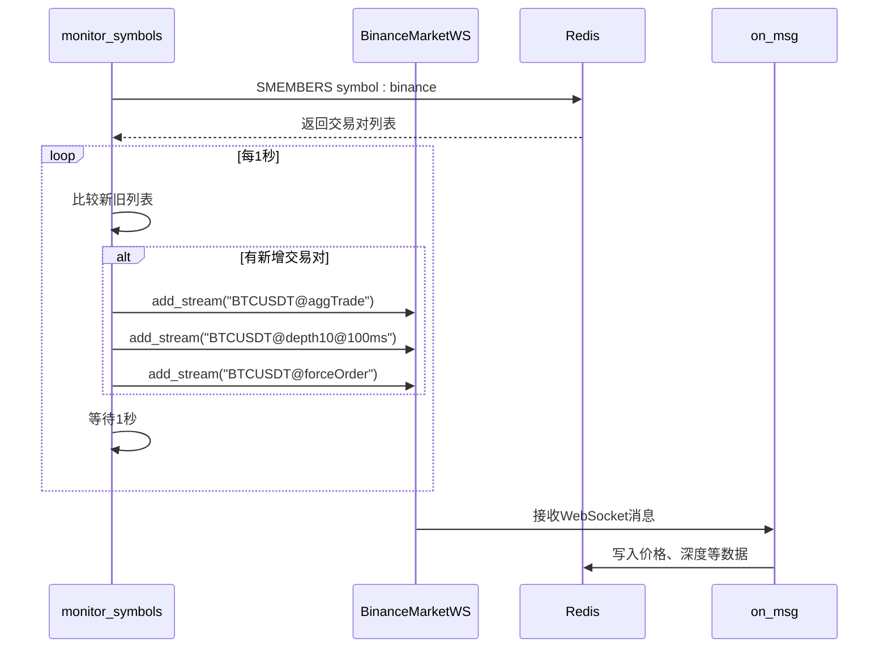
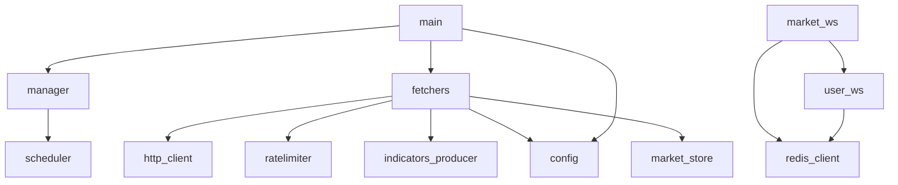

# 数据采集服务

<cite>
**本文档引用的文件**   
- [main.py](file://data_server/binance/rest_binance/app/main.py)
- [manager.py](file://data_server/binance/rest_binance/app/manager.py)
- [fetchers.py](file://data_server/binance/rest_binance/app/fetchers.py)
- [indicators_producer.py](file://data_server/binance/rest_binance/app/indicators_producer.py)
- [scheduler.py](file://data_server/binance/rest_binance/app/scheduler.py)
- [ratelimiter.py](file://data_server/binance/rest_binance/app/ratelimiter.py)
- [config.py](file://data_server/binance/rest_binance/app/config.py)
- [market_ws.py](file://data_server/binance/ws_binance/market_ws.py)
- [user_ws.py](file://data_server/binance/ws_binance/user_ws.py)
</cite>

## 目录
1. [简介](#简介)
2. [项目结构](#项目结构)
3. [核心组件](#核心组件)
4. [架构概述](#架构概述)
5. [详细组件分析](#详细组件分析)
6. [依赖分析](#依赖分析)
7. [性能考虑](#性能考虑)
8. [故障排除指南](#故障排除指南)
9. [结论](#结论)

## 简介
UTaker数据采集服务是一个专为Binance交易所设计的高性能、高可靠性的数据采集系统，旨在实时获取和处理加密货币市场的多维度数据。该服务采用双通道架构，结合REST API轮询与WebSocket实时流，全面覆盖K线、资金费率、持仓比例、逐笔成交、市场深度和强平订单等关键市场数据。系统通过动态任务调度、精细化限流控制、异常重试机制和Redis数据持久化，确保了数据采集的稳定性和时效性。本文档将深入解析其核心机制，包括SymbolTaskManager的任务管理、各类数据抓取函数的实现、技术指标的生成与发布，以及WebSocket服务如何通过Redis Stream推送市场事件。

## 项目结构
UTaker数据采集服务的代码库结构清晰，模块化程度高，主要分为REST API数据采集和WebSocket实时流两大模块。REST API部分位于`data_server/binance/rest_binance/app/`目录下，负责通过HTTP轮询方式获取历史和准实时数据。WebSocket部分位于`data_server/binance/ws_binance/`目录下，负责建立长连接以接收实时市场事件。系统通过Redis作为中央配置和数据存储枢纽，实现了任务的动态启停和数据的统一管理。

```mermaid
graph TD
subgraph "REST API 数据采集"
A[main.py] --> B[manager.py]
B --> C[scheduler.py]
A --> D[fetchers.py]
D --> E[ratelimiter.py]
D --> F[indicators_producer.py]
A --> G[config.py]
end
subgraph "WebSocket 实时流"
H[market_ws.py] --> I[user_ws.py]
H --> J[utils/]
I --> J
end
K[Redis] < --> A
K < --> H
K < --> I
D --> K
F --> K
```

**图示来源**
- [main.py](file://data_server/binance/rest_binance/app/main.py)
- [manager.py](file://data_server/binance/rest_binance/app/manager.py)
- [fetchers.py](file://data_server/binance/rest_binance/app/fetchers.py)
- [market_ws.py](file://data_server/binance/ws_binance/market_ws.py)

## 核心组件
数据采集服务的核心组件包括`SymbolTaskManager`、各类`fetchers`、`indicators_producer`以及WebSocket客户端。`SymbolTaskManager`是整个REST API采集模块的调度中枢，负责根据Redis中的交易对列表动态启动和停止数据采集任务。`fetchers`模块封装了所有针对Binance API的HTTP请求，实现了对K线、资金费率、持仓比例等数据的采集。`indicators_producer`负责在获取原始K线数据后，计算并发布技术指标。WebSocket客户端则负责建立与Binance的实时连接，监听并处理逐笔成交、深度变化和强平订单等事件。

**组件来源**
- [manager.py](file://data_server/binance/rest_binance/app/manager.py#L7-L52)
- [fetchers.py](file://data_server/binance/rest_binance/app/fetchers.py#L33-L170)
- [indicators_producer.py](file://data_server/binance/rest_binance/app/indicators_producer.py#L13-L34)
- [market_ws.py](file://data_server/binance/ws_binance/market_ws.py#L119-L249)

## 架构概述
UTaker数据采集服务采用双通道混合架构，分别处理批量/周期性数据和实时流数据。

```mermaid
graph LR
subgraph "REST API 轮询通道"
A[SymbolTaskManager] --> B[fetch_kline]
A --> C[fetch_fundingRate]
A --> D[fetch_takerLongShortRatio]
B --> E[IndicatorsProducer]
E --> F[(Redis)]
B --> F
C --> F
D --> F
end
subgraph "WebSocket 实时流通道"
G[BinanceMarketWS] --> H[逐笔成交]
G --> I[市场深度]
G --> J[强平订单]
H --> K[Redis Stream]
I --> K
J --> K
end
L[Redis] < --> A
K < --> M[其他服务]
```

**图示来源**
- [main.py](file://data_server/binance/rest_binance/app/main.py#L60-L90)
- [market_ws.py](file://data_server/binance/ws_binance/market_ws.py#L119-L249)

## 详细组件分析

### SymbolTaskManager 动态任务调度
`SymbolTaskManager`是REST API数据采集的核心调度器，它实现了对交易对任务的动态生命周期管理。系统通过`RedisSymbolWatcher`监控Redis中名为`symbol:binance`的集合，当该集合发生变化时，`SymbolTaskManager`会自动为新增的交易对启动所有预定义的采集任务，并为移除的交易对停止所有相关任务。



**图示来源**
- [manager.py](file://data_server/binance/rest_binance/app/manager.py#L7-L52)
- [scheduler.py](file://data_server/binance/rest_binance/app/scheduler.py#L6-L24)

#### REST API 数据抓取函数
`fetchers.py`模块定义了所有数据抓取函数，每个函数都针对Binance的一个特定API端点。这些函数通过`TokenBucket`限流器来遵守Binance的API速率限制，确保请求不会被服务器拒绝。



**图示来源**
- [fetchers.py](file://data_server/binance/rest_binance/app/fetchers.py#L33-L50)
- [ratelimiter.py](file://data_server/binance/rest_binance/app/ratelimiter.py#L5-L33)

#### 指标生产者
`indicators_producer.py`中的`EventGenerator`类负责将原始K线数据转化为技术指标。它调用`signals.aggregate`模块中的`compute_all_indicators`函数进行计算，并将结果以JSON格式存储到Redis中，供下游服务消费。



**图示来源**
- [indicators_producer.py](file://data_server/binance/rest_binance/app/indicators_producer.py#L13-L34)
- [fetchers.py](file://data_server/binance/rest_binance/app/fetchers.py#L46-L47)

#### WebSocket 实时数据流
`market_ws.py`实现了与Binance市场的WebSocket连接。它使用`BinanceMarketWS`类管理WebSocket连接，并通过`monitor_symbols`协程监控Redis中的交易对列表，动态地添加或移除订阅的流。



**图示来源**
- [market_ws.py](file://data_server/binance/ws_binance/market_ws.py#L251-L282)
- [market_ws.py](file://data_server/binance/ws_binance/market_ws.py#L290-L346)

## 依赖分析
数据采集服务的组件间依赖关系清晰，耦合度低。`main.py`作为入口，依赖`manager.py`和`fetchers.py`。`fetchers.py`依赖`http_client.py`进行HTTP通信，依赖`ratelimiter.py`进行限流，依赖`indicators_producer.py`发布指标，并依赖`config.py`获取配置。`market_ws.py`和`user_ws.py`独立于REST模块，直接依赖WebSocket库和Redis客户端。所有模块通过Redis进行松耦合通信，使得系统易于扩展和维护。



**图示来源**
- [main.py](file://data_server/binance/rest_binance/app/main.py)
- [manager.py](file://data_server/binance/rest_binance/app/manager.py)
- [fetchers.py](file://data_server/binance/rest_binance/app/fetchers.py)

## 性能考虑
系统在性能方面进行了多项优化。首先，采用异步I/O（asyncio）模型，使得单个进程可以高效地处理大量并发的HTTP请求和WebSocket消息。其次，通过`TokenBucket`算法实现精确的速率限制，避免了因请求过快而导致的API被封禁。再者，`SymbolTaskManager`使用`asyncio.Lock`确保了在动态增减任务时的线程安全。最后，数据存储直接写入Redis，利用其内存数据库的高速特性，保证了数据处理的低延迟。

## 故障排除指南
常见问题及解决方案：
- **问题：无法连接到Binance API**
  - **检查**：确认`config.py`中的代理设置`proxy_mode`和`http_proxy`是否正确，尤其是在本地开发环境中。
- **问题：Redis连接失败**
  - **检查**：验证`config.py`中的`redis_host`、`redis_port`和`redis_password`是否与Redis服务器配置匹配。
- **问题：WebSocket连接频繁断开**
  - **检查**：查看日志中是否有SSL错误，可尝试在`user_ws.py`中调整`ssl_context`的验证模式。
- **问题：某些交易对的数据未被采集**
  - **检查**：确认该交易对是否已正确添加到Redis的`symbol:binance`集合中。

**故障排除来源**
- [config.py](file://data_server/binance/rest_binance/app/config.py#L5-L8)
- [market_ws.py](file://data_server/binance/ws_binance/market_ws.py#L43-L46)

## 结论
UTaker数据采集服务通过精心设计的双通道架构，成功实现了对Binance交易所多维度数据的高效、稳定采集。其模块化的设计、动态的任务调度、严格的限流策略和基于Redis的松耦合通信，共同构成了一个健壮且可扩展的数据采集平台。该服务不仅满足了当前的数据需求，其清晰的架构也为未来支持更多交易所和数据类型奠定了坚实的基础。