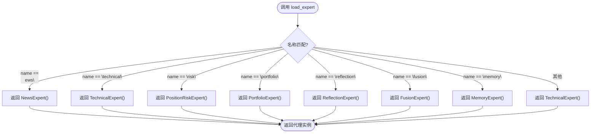
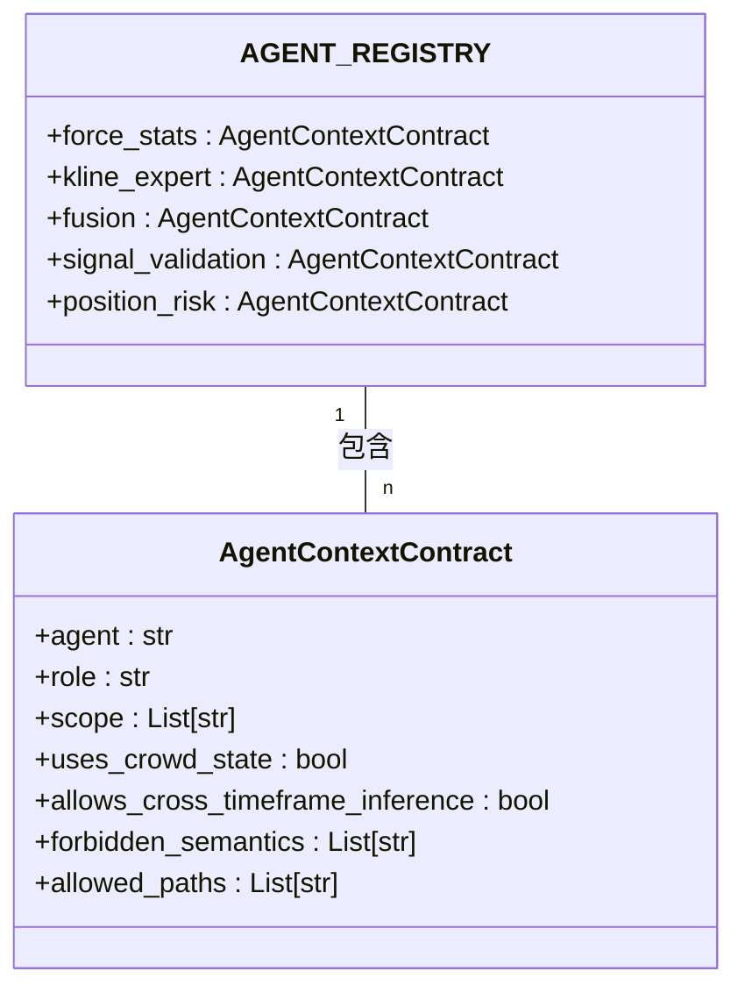
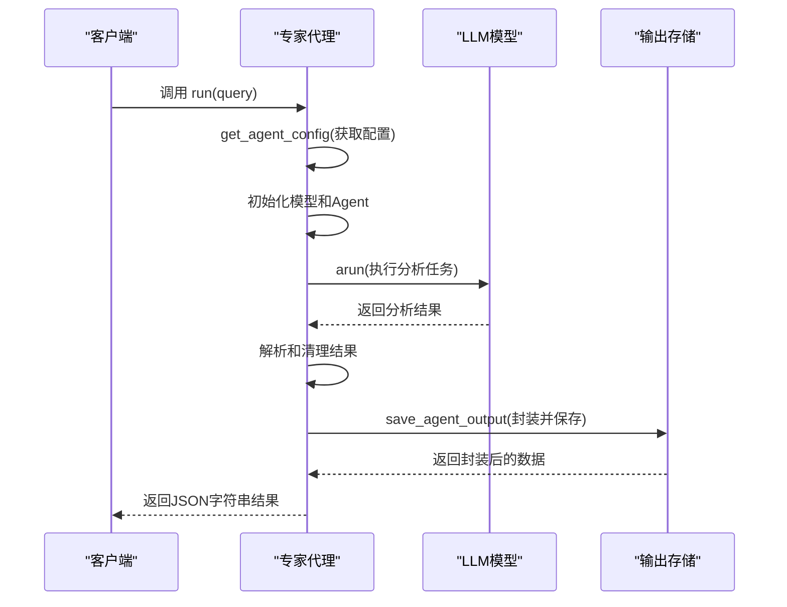
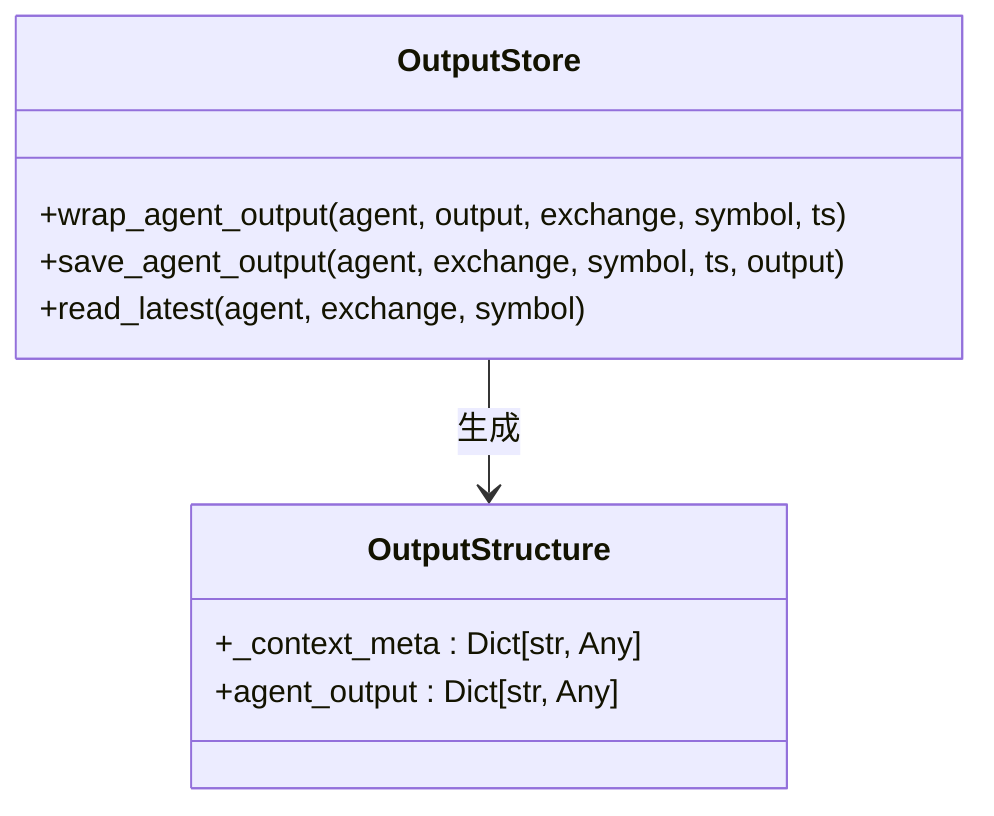

# 专家代理架构

<cite>
**本文档引用的文件**
- [agent_server/agents/experts/__init__.py](file://agent_server/agents/experts/__init__.py)
- [agent_server/agent_context/registry.py](file://agent_server/agent_context/registry.py)
- [agent_server/agent_context/output_store.py](file://agent_server/agent_context/output_store.py)
- [agent_server/agents/experts/analysis/position_risk.py](file://agent_server/agents/experts/analysis/position_risk.py)
- [agent_server/agents/experts/analysis/signal_validation.py](file://agent_server/agents/experts/analysis/signal_validation.py)
- [agent_server/agents/experts/orchestration/fusion.py](file://agent_server/agents/experts/orchestration/fusion.py)
- [agent_server/agents/experts/orchestration/memory.py](file://agent_server/agents/experts/orchestration/memory.py)
- [agent_server/agents/experts/orchestration/reflection.py](file://agent_server/agents/experts/orchestration/reflection.py)
- [agent_server/agent_context/contracts.py](file://agent_server/agent_context/contracts.py)
- [agent_server/configs/source.py](file://agent_server/configs/source.py)
- [agent_server/agent_context/builder.py](file://agent_server/agent_context/builder.py)
- [agent_server/agents/instructions.py](file://agent_server/agents/instructions.py)
- [agent_server/agents/experts/analysis/technical.py](file://agent_server/agents/experts/analysis/technical.py)
- [agent_server/agents/experts/analysis/news.py](file://agent_server/agents/experts/analysis/news.py)
- [agent_server/agents/experts/analysis/portfolio.py](file://agent_server/agents/experts/analysis/portfolio.py)
- [agent_server/agents/experts/analysis/force_stats.py](file://agent_server/agents/experts/analysis/force_stats.py)
</cite>

## 目录
1. [引言](#引言)
2. [核心架构与组件](#核心架构与组件)
3. [专家代理加载机制](#专家代理加载机制)
4. [注册表与元数据校验](#注册表与元数据校验)
5. [专家代理职责划分](#专家代理职责划分)
6. [标准接口与执行流程](#标准接口与执行流程)
7. [配置驱动的模型参数加载](#配置驱动的模型参数加载)
8. [上下文构建与数据过滤](#上下文构建与数据过滤)
9. [输出封装与持久化](#输出封装与持久化)
10. [开发新专家代理流程](#开发新专家代理流程)

## 引言
UTaker系统中的专家代理（Expert Agents）架构旨在通过模块化、可扩展的方式实现多维度市场分析与决策支持。该系统将不同类型的分析任务解耦为独立的专家代理，每个代理专注于特定领域的分析或协调任务。通过`load_expert`函数和`AGENT_REGISTRY`注册表，系统实现了专家代理的动态加载、统一管理与元数据校验。本文档将深入解析该架构的设计原理与实现机制，涵盖从代理加载、配置管理到执行流程的完整生命周期。

## 核心架构与组件
UTaker的专家代理系统由多个核心组件构成，形成一个分层、模块化的架构。系统通过`agent_server/agents/experts`目录组织各类专家代理，按功能划分为分析类（analysis）和编排类（orchestration）两大类别。分析类代理负责单一维度的市场分析，如技术指标、资金流动、持仓风险等；编排类代理则负责多代理协同、状态维护与决策融合。`agent_context`模块提供上下文管理、输出封装与注册表等基础设施，确保代理间的数据隔离与标准化交互。

**组件来源**
- [agent_server/agents/experts](file://agent_server/agents/experts)
- [agent_server/agent_context](file://agent_server/agent_context)

## 专家代理加载机制
系统通过`agent_server/agents/experts/__init__.py`文件中的`load_expert`函数实现专家代理的动态加载。该函数根据传入的名称字符串，返回对应类型的专家代理实例。加载逻辑采用简单的条件判断，将不同的名称映射到具体的专家类构造函数。

**图示来源**
- [agent_server/agents/experts/__init__.py](file://agent_server/agents/experts/__init__.py#L23-L39)

**章节来源**
- [agent_server/agents/experts/__init__.py](file://agent_server/agents/experts/__init__.py#L23-L39)

## 注册表与元数据校验
`AGENT_REGISTRY`注册表是专家代理系统的核心元数据管理机制，定义于`agent_server/agent_context/registry.py`文件中。该注册表是一个字典，以代理名称为键，存储每个代理的合约元信息（AgentContextContract），包括角色（role）、作用域（scope）、是否使用人群状态（uses_crowd_state）、允许的字段路径（allowed_paths）以及禁止的语义（forbidden_semantics）等。

**图示来源**
- [agent_server/agent_context/registry.py](file://agent_server/agent_context/registry.py#L6-L122)
- [agent_server/agent_context/contracts.py](file://agent_server/agent_context/contracts.py#L16-L36)

**章节来源**
- [agent_server/agent_context/registry.py](file://agent_server/agent_context/registry.py#L6-L122)
- [agent_server/agent_context/contracts.py](file://agent_server/agent_context/contracts.py#L16-L36)

## 专家代理职责划分
专家代理根据其功能被划分为两大类：分析类代理和编排类代理。

### 分析类代理
分析类代理专注于单一维度的市场分析，每个代理负责处理特定类型的数据和逻辑。
- **技术分析代理 (TechnicalExpert)**：分析技术指标和趋势背景。
- **新闻分析代理 (NewsExpert)**：总结与市场相关的新闻背景。
- **资金流分析代理 (ForceStatsExpert)**：分析市场清算结构和微观状态。
- **持仓风险代理 (PositionRiskExpert)**：评估持仓风险，结合市场结构和人群状态。
- **信号验证代理 (SignalValidationExpert)**：验证技术信号的有效性，确保其与市场背景一致。

### 编排类代理
编排类代理负责协调多个分析代理的输出，进行状态维护和决策融合。
- **融合代理 (FusionExpert)**：接收多个代理的输出和权重，进行加权融合，生成最终决策。
- **记忆代理 (MemoryExpert)**：负责持久化交易上下文，维护长期记忆状态。
- **反思代理 (ReflectionExpert)**：对多个代理的输出进行反思，生成反思分数和简要笔记。

**章节来源**
- [agent_server/agents/experts/analysis](file://agent_server/agents/experts/analysis)
- [agent_server/agents/experts/orchestration](file://agent_server/agents/experts/orchestration)

## 标准接口与执行流程
所有专家代理均实现统一的`run`方法接口，该方法接收一个字符串类型的查询参数，并返回一个字符串类型的JSON结果。`run`方法是代理执行分析任务的核心入口。

**图示来源**
- [agent_server/agents/experts/analysis/position_risk.py](file://agent_server/agents/experts/analysis/position_risk.py#L18-L78)
- [agent_server/agents/experts/analysis/signal_validation.py](file://agent_server/agents/experts/analysis/signal_validation.py#L20-L80)

**章节来源**
- [agent_server/agents/experts/analysis/position_risk.py](file://agent_server/agents/experts/analysis/position_risk.py#L18-L78)
- [agent_server/agents/experts/analysis/signal_validation.py](file://agent_server/agents/experts/analysis/signal_validation.py#L20-L80)

## 配置驱动的模型参数加载
系统通过`agent_server/configs/source.py`文件中的`get_agent_config`函数实现配置驱动的模型参数加载。该函数从`query_db_env`函数返回的全局配置字典中，根据代理名称查询对应的模型配置，包括`model_id`、`llm_base_url`和`llm_api_key`等。这种设计使得系统能够灵活支持多种LLM模型，并通过配置文件进行集中管理，无需修改代码即可切换模型。

**章节来源**
- [agent_server/configs/source.py](file://agent_server/configs/source.py#L66-L68)

## 上下文构建与数据过滤
`agent_context/builder.py`文件中的`build_agent_context`函数负责为专家代理构建安全、合规的上下文。该函数根据`AGENT_REGISTRY`中定义的`allowed_paths`白名单，从完整的上下文中提取代理有权访问的字段，实现数据隔离。对于`fusion`这类特殊代理，则允许访问完整上下文。此机制确保了每个代理只能在其职责范围内访问数据，防止信息泄露和越权分析。

**章节来源**
- [agent_server/agent_context/builder.py](file://agent_server/agent_context/builder.py#L18-L49)

## 输出封装与持久化
`agent_context/output_store.py`模块提供了`wrap_agent_output`和`save_agent_output`等函数，用于封装和持久化专家代理的输出。`wrap_agent_output`函数将代理的原始输出与来自`AGENT_REGISTRY`的`_context_meta`元信息结合，形成标准化的输出结构。`save_agent_output`函数则负责将封装后的数据异步保存到Redis中，支持流式存储和最新状态存储两种模式。

**图示来源**
- [agent_server/agent_context/output_store.py](file://agent_server/agent_context/output_store.py#L29-L38)
- [agent_server/agent_context/output_store.py](file://agent_server/agent_context/output_store.py#L51-L60)

**章节来源**
- [agent_server/agent_context/output_store.py](file://agent_server/agent_context/output_store.py#L1-L73)

## 开发新专家代理流程
开发一个新的专家代理需要遵循以下步骤：
1. **定义类**：在`agent_server/agents/experts`目录下的相应子目录（analysis或orchestration）中创建新的Python文件，并定义继承自基类的专家代理类。
2. **注册到AGENT_REGISTRY**：在`agent_server/agent_context/registry.py`的`AGENT_REGISTRY`字典中添加新的代理条目，配置其元数据。
3. **实现run方法**：在代理类中实现`run`方法，定义具体的分析逻辑，调用LLM模型执行任务，并处理输入输出。
4. **添加配置项**：在`agent_server/configs/source.py`的`query_db_env`函数返回的字典中，为新代理添加对应的模型配置。
5. **更新load_expert**：在`agent_server/agents/experts/__init__.py`的`load_expert`函数中添加新的名称映射，使其可通过名称加载。

**章节来源**
- [agent_server/agents/experts/__init__.py](file://agent_server/agents/experts/__init__.py)
- [agent_server/agent_context/registry.py](file://agent_server/agent_context/registry.py)
- [agent_server/configs/source.py](file://agent_server/configs/source.py)