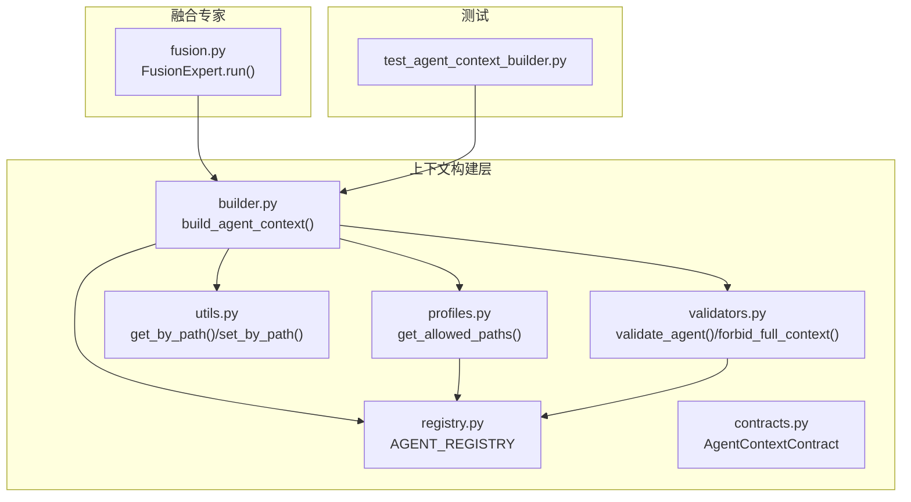
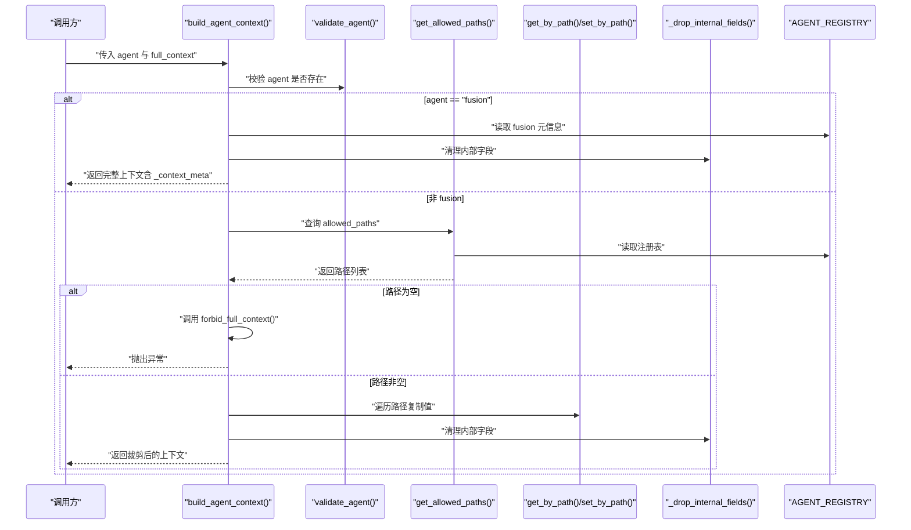
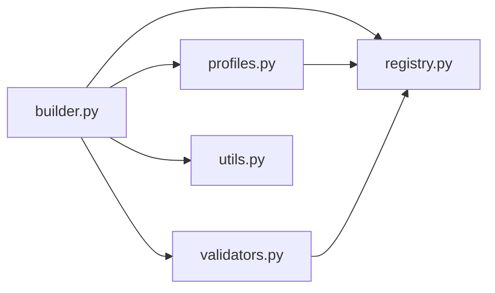
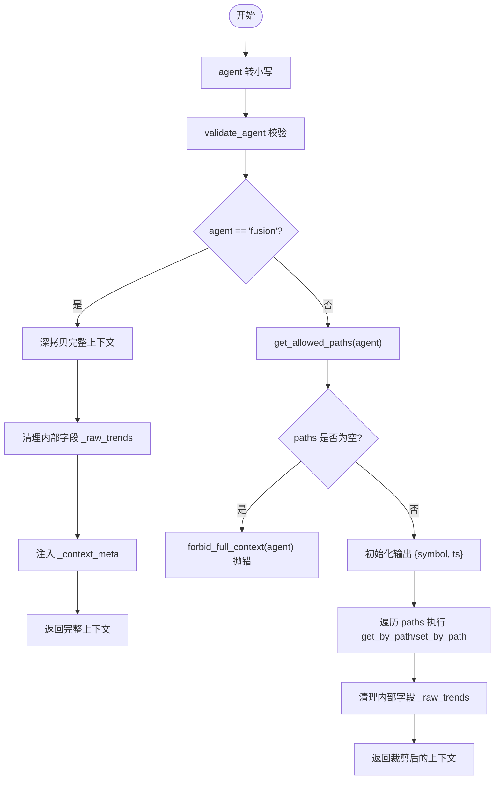

# 代理上下文管理

<cite>
**本文引用的文件**
- [agent_server/agent_context/builder.py](file://agent_server/agent_context/builder.py)
- [agent_server/agent_context/profiles.py](file://agent_server/agent_context/profiles.py)
- [agent_server/agent_context/utils.py](file://agent_server/agent_context/utils.py)
- [agent_server/agent_context/validators.py](file://agent_server/agent_context/validators.py)
- [agent_server/agent_context/registry.py](file://agent_server/agent_context/registry.py)
- [agent_server/agent_context/contracts.py](file://agent_server/agent_context/contracts.py)
- [agent_server/agents/experts/orchestration/fusion.py](file://agent_server/agents/experts/orchestration/fusion.py)
- [tests/test_agent_context_builder.py](file://tests/test_agent_context_builder.py)
</cite>

## 目录
1. [引言](#引言)
2. [项目结构](#项目结构)
3. [核心组件](#核心组件)
4. [架构总览](#架构总览)
5. [详细组件分析](#详细组件分析)
6. [依赖关系分析](#依赖关系分析)
7. [性能考量](#性能考量)
8. [故障排查指南](#故障排查指南)
9. [结论](#结论)
10. [附录](#附录)

## 引言
本文件系统化阐述 UTaker 智能代理系统的“上下文构建”机制，聚焦以下目标：
- 解析 build_agent_context 如何依据代理类型从完整上下文中安全提取所需数据子集，防止越权访问。
- 说明 get_allowed_paths 如何基于代理角色与作用域返回允许访问的字段路径集合，确保数据隔离。
- 分析 fusion 代理的特殊权限：可获取完整上下文，并解释其在多维度信息融合中的必要性。
- 阐述 validate_agent 与 forbid_full_context 的校验逻辑，保障系统安全，防止未知或越权代理请求。
- 结合测试用例（test_build_fusion_context_full）说明边界条件与异常处理。
- 解释 _drop_internal_fields 移除 _raw_trends 等内部字段的设计意图，确保输出纯净。
- 提供上下文配置文件（profiles.py）的结构说明与自定义访问策略的方法。

## 项目结构
围绕上下文构建的关键模块分布如下：
- 上下文构建器：负责从完整上下文生成代理可用的最小化上下文，包含安全过滤与元信息注入。
- 访问策略：通过注册表与合约定义，为不同代理声明 allowed_paths、scope、role 等约束。
- 工具函数：提供按路径读取/写入的通用能力，以及内部字段清理。
- 校验器：对代理身份进行合法性检查，限制越权请求完整上下文。
- 测试：覆盖典型代理的上下文裁剪、fusion 的全量上下文获取、未知代理的异常处理等。

图表来源
- [agent_server/agent_context/builder.py](file://agent_server/agent_context/builder.py#L1-L49)
- [agent_server/agent_context/profiles.py](file://agent_server/agent_context/profiles.py#L1-L13)
- [agent_server/agent_context/utils.py](file://agent_server/agent_context/utils.py#L1-L23)
- [agent_server/agent_context/validators.py](file://agent_server/agent_context/validators.py#L1-L16)
- [agent_server/agent_context/registry.py](file://agent_server/agent_context/registry.py#L1-L123)
- [agent_server/agent_context/contracts.py](file://agent_server/agent_context/contracts.py#L1-L36)
- [agent_server/agents/experts/orchestration/fusion.py](file://agent_server/agents/experts/orchestration/fusion.py#L1-L31)
- [tests/test_agent_context_builder.py](file://tests/test_agent_context_builder.py#L1-L100)

章节来源
- [agent_server/agent_context/builder.py](file://agent_server/agent_context/builder.py#L1-L49)
- [agent_server/agent_context/profiles.py](file://agent_server/agent_context/profiles.py#L1-L13)
- [agent_server/agent_context/utils.py](file://agent_server/agent_context/utils.py#L1-L23)
- [agent_server/agent_context/validators.py](file://agent_server/agent_context/validators.py#L1-L16)
- [agent_server/agent_context/registry.py](file://agent_server/agent_context/registry.py#L1-L123)
- [agent_server/agent_context/contracts.py](file://agent_server/agent_context/contracts.py#L1-L36)
- [agent_server/agents/experts/orchestration/fusion.py](file://agent_server/agents/experts/orchestration/fusion.py#L1-L31)
- [tests/test_agent_context_builder.py](file://tests/test_agent_context_builder.py#L1-L100)

## 核心组件
- build_agent_context：主流程入口，完成代理校验、路径白名单解析、字段裁剪与内部字段清理、元信息注入。
- get_allowed_paths：从注册表读取指定代理的 allowed_paths，作为裁剪依据。
- get_by_path/set_by_path：按点号分隔的路径在嵌套字典中读取/写入值。
- validate_agent/forbid_full_context：校验代理是否存在于注册表；若无白名单则禁止请求完整上下文。
- _drop_internal_fields：移除内部字段（如 _raw_trends），保证输出干净。
- AGENT_REGISTRY：集中定义各代理的角色、作用域、允许路径、语义约束等。
- AgentContextContract：对注册表条目进行类型约束与文档化。

章节来源
- [agent_server/agent_context/builder.py](file://agent_server/agent_context/builder.py#L1-L49)
- [agent_server/agent_context/profiles.py](file://agent_server/agent_context/profiles.py#L1-L13)
- [agent_server/agent_context/utils.py](file://agent_server/agent_context/utils.py#L1-L23)
- [agent_server/agent_context/validators.py](file://agent_server/agent_context/validators.py#L1-L16)
- [agent_server/agent_context/registry.py](file://agent_server/agent_context/registry.py#L1-L123)
- [agent_server/agent_context/contracts.py](file://agent_server/agent_context/contracts.py#L1-L36)

## 架构总览
上下文构建遵循“白名单驱动”的安全原则：先校验代理身份，再依据 allowed_paths 从完整上下文中按路径复制到输出对象；对于 fusion 代理，直接返回完整上下文并清理内部字段，同时注入元信息。

图表来源
- [agent_server/agent_context/builder.py](file://agent_server/agent_context/builder.py#L1-L49)
- [agent_server/agent_context/profiles.py](file://agent_server/agent_context/profiles.py#L1-L13)
- [agent_server/agent_context/utils.py](file://agent_server/agent_context/utils.py#L1-L23)
- [agent_server/agent_context/validators.py](file://agent_server/agent_context/validators.py#L1-L16)
- [agent_server/agent_context/registry.py](file://agent_server/agent_context/registry.py#L1-L123)

## 详细组件分析

### 组件一：上下文构建器（build_agent_context）
- 输入：代理标识（agent）、完整上下文（full_context）。
- 关键流程：
  - 将 agent 转为小写并校验是否存在注册表。
  - 若 agent 为 fusion：深拷贝完整上下文，清理内部字段，注入 _context_meta（来自注册表），直接返回。
  - 否则：读取 allowed_paths；若为空，调用 forbid_full_context 抛错；否则以 symbol/ts 为根，按路径复制值到输出对象，最后清理内部字段并返回。
- 安全要点：
  - 严格依赖 allowed_paths 进行字段级复制，避免越权读取。
  - 对 fusion 例外放行，但同样执行内部字段清理与元信息注入。
  - 通过校验器确保未知代理无法进入后续流程。

章节来源
- [agent_server/agent_context/builder.py](file://agent_server/agent_context/builder.py#L1-L49)

### 组件二：访问策略（get_allowed_paths）
- 功能：根据代理名从 AGENT_REGISTRY 中取出对应 allowed_paths 列表。
- 设计意图：将“可见字段”与“代理职责”解耦，便于统一维护与扩展。
- 边界条件：若代理未注册，返回空列表，触发 forbid_full_context 的异常分支。

章节来源
- [agent_server/agent_context/profiles.py](file://agent_server/agent_context/profiles.py#L1-L13)
- [agent_server/agent_context/registry.py](file://agent_server/agent_context/registry.py#L1-L123)

### 组件三：路径工具（get_by_path / set_by_path）
- get_by_path：按点号路径逐层访问，若任一层缺失或类型不符则返回 None，避免异常传播。
- set_by_path：按路径创建必要的中间字典，最终写入目标值，支持嵌套结构的增量构建。
- 复杂度：单次操作 O(L)，L 为路径长度；整体复制复杂度 O(N×L)，N 为 allowed_paths 数量。

章节来源
- [agent_server/agent_context/utils.py](file://agent_server/agent_context/utils.py#L1-L23)

### 组件四：校验器（validate_agent / forbid_full_context）
- validate_agent：若 agent 不在注册表中，抛出异常，阻止未知代理进入系统。
- forbid_full_context：若代理不在注册表或未声明 allowed_paths，则拒绝请求完整上下文；仅 fusion 可豁免。
- 作用：双重防线，既防“未知”，也防“越权”。

章节来源
- [agent_server/agent_context/validators.py](file://agent_server/agent_context/validators.py#L1-L16)
- [agent_server/agent_context/registry.py](file://agent_server/agent_context/registry.py#L1-L123)

### 组件五：内部字段清理（_drop_internal_fields）
- 目标：移除 market_state 下各时间尺度的 _raw_trends 等内部字段，避免泄露未公开数据。
- 设计意图：保持对外输出的纯净性，仅暴露业务友好的字段。

章节来源
- [agent_server/agent_context/builder.py](file://agent_server/agent_context/builder.py#L1-L49)

### 组件六：融合专家（FusionExpert.run）
- 角色：在多代理输出基础上进行加权融合，生成综合权重与融合结果文本。
- 与上下文构建的关系：融合过程通常需要完整上下文以便跨尺度推理与综合判断，因此 fusion 代理具备“完整上下文”权限。
- 注意：融合专家本身不直接调用 build_agent_context，但其输入往往来源于构建后的上下文。

章节来源
- [agent_server/agents/experts/orchestration/fusion.py](file://agent_server/agents/experts/orchestration/fusion.py#L1-L31)

### 组件七：注册表与合约（AGENT_REGISTRY / AgentContextContract）
- AgentContextContract：定义代理契约的字段与类型约束，包括 agent、role、scope、allowed_paths、uses_crowd_state、allows_cross_timeframe_inference、forbidden_semantics。
- AGENT_REGISTRY：集中存放各代理的契约配置，是 get_allowed_paths 的唯一数据源。
- fusion 的特殊性：allowed_paths 为空，表示可访问完整上下文；同时 role 为融合决策，scope 包含 cross，体现其跨尺度融合职责。

章节来源
- [agent_server/agent_context/contracts.py](file://agent_server/agent_context/contracts.py#L1-L36)
- [agent_server/agent_context/registry.py](file://agent_server/agent_context/registry.py#L1-L123)

### 组件八：测试用例（test_build_fusion_context_full 与相关断言）
- 覆盖点：
  - fusion 获取完整上下文（包含 market_state、crowd_state、misc），并清理内部字段。
  - 输出包含 _context_meta，且等于 AGENT_REGISTRY["fusion"]。
  - 非 fusion 代理仅返回白名单内的字段，misc 等不受限字段不会出现在输出中。
  - 未知代理会抛出异常。
- 边界条件：
  - 路径不存在时，get_by_path 返回 None，set_by_path 不写入，避免污染输出。
  - 内部字段 _raw_trends 在清理后不再出现在输出中。

章节来源
- [tests/test_agent_context_builder.py](file://tests/test_agent_context_builder.py#L1-L100)

## 依赖关系分析
- 模块内聚与耦合：
  - builder 依赖 profiles、validators、utils、registry，形成“策略+校验+工具”的组合。
  - profiles 仅依赖 registry，职责单一，耦合低。
  - utils 为纯工具函数，无状态，复用性强。
  - validators 依赖 registry，提供安全门禁。
- 外部依赖：
  - 无第三方库依赖，核心逻辑完全由标准库与本地模块组成，便于审计与维护。
- 循环依赖：
  - 未发现循环导入；模块间单向依赖清晰。

图表来源
- [agent_server/agent_context/builder.py](file://agent_server/agent_context/builder.py#L1-L49)
- [agent_server/agent_context/profiles.py](file://agent_server/agent_context/profiles.py#L1-L13)
- [agent_server/agent_context/validators.py](file://agent_server/agent_context/validators.py#L1-L16)
- [agent_server/agent_context/registry.py](file://agent_server/agent_context/registry.py#L1-L123)
- [agent_server/agent_context/utils.py](file://agent_server/agent_context/utils.py#L1-L23)

## 性能考量
- 时间复杂度：
  - 路径复制：O(N×L)，N 为 allowed_paths 数量，L 为平均路径长度。
  - 清理内部字段：O(T)，T 为 market_state 下的时间尺度数量。
- 空间复杂度：
  - 非 fusion：输出对象大小取决于 allowed_paths 的覆盖范围。
  - fusion：输出对象大小等于完整上下文，但仅做浅拷贝（深拷贝在 fusion 分支中使用，成本较高）。
- 优化建议：
  - 对高频代理，可缓存 get_allowed_paths 的结果（需考虑注册表变更）。
  - 路径复制时尽量减少不必要的中间对象创建。
  - 对于超大上下文，优先按需裁剪而非一次性深拷贝。

## 故障排查指南
- 问题：Unknown agent 异常
  - 现象：调用 build_agent_context 抛出“未知代理”错误。
  - 排查：确认 agent 名称是否存在于 AGENT_REGISTRY；注意大小写转换逻辑。
  - 参考：validate_agent 的校验逻辑。
- 问题：请求完整上下文被拒
  - 现象：非 fusion 代理请求完整上下文时报错。
  - 排查：检查该代理是否在注册表中声明 allowed_paths；若为空则会被 forbid_full_context 拦截。
  - 参考：forbid_full_context 的校验逻辑。
- 问题：输出仍包含内部字段
  - 现象：下游仍能看到 _raw_trends 等内部字段。
  - 排查：确认 _drop_internal_fields 是否被调用；检查路径复制是否遗漏某些字段层级。
  - 参考：_drop_internal_fields 的清理逻辑。
- 问题：路径不存在导致字段缺失
  - 现象：期望字段未出现在输出。
  - 排查：核对 allowed_paths 是否正确；get_by_path 对缺失路径返回 None，不会写入。
  - 参考：get_by_path 的实现。

章节来源
- [agent_server/agent_context/validators.py](file://agent_server/agent_context/validators.py#L1-L16)
- [agent_server/agent_context/builder.py](file://agent_server/agent_context/builder.py#L1-L49)
- [agent_server/agent_context/utils.py](file://agent_server/agent_context/utils.py#L1-L23)

## 结论
UTaker 的上下文构建机制以“白名单+校验+清理”为核心，通过 AGENT_REGISTRY 与 AgentContextContract 将“可见字段”与“代理职责”强绑定，确保数据隔离与安全。fusion 代理因其跨尺度融合需求，被赋予完整上下文访问权，但仍受内部字段清理与元信息注入的约束。测试用例覆盖了关键边界条件与异常场景，验证了系统的健壮性与可维护性。

## 附录

### 上下文配置文件（profiles.py）结构说明
- get_allowed_paths(agent)：根据 agent 查找 AGENT_REGISTRY，返回 allowed_paths 列表。
- 自定义访问策略方法：
  - 在 AGENT_REGISTRY 中新增或修改代理条目，设置 allowed_paths、scope、role 等字段。
  - 通过 forbidden_semantics 与 uses_crowd_state 等字段表达更细粒度的语义与数据使用约束。
  - fusion 的 allowed_paths 为空，表示可访问完整上下文；其他代理应明确列出所需字段路径。

章节来源
- [agent_server/agent_context/profiles.py](file://agent_server/agent_context/profiles.py#L1-L13)
- [agent_server/agent_context/registry.py](file://agent_server/agent_context/registry.py#L1-L123)
- [agent_server/agent_context/contracts.py](file://agent_server/agent_context/contracts.py#L1-L36)

### 关键流程图：build_agent_context 主流程

图表来源
- [agent_server/agent_context/builder.py](file://agent_server/agent_context/builder.py#L1-L49)
- [agent_server/agent_context/profiles.py](file://agent_server/agent_context/profiles.py#L1-L13)
- [agent_server/agent_context/validators.py](file://agent_server/agent_context/validators.py#L1-L16)
- [agent_server/agent_context/utils.py](file://agent_server/agent_context/utils.py#L1-L23)