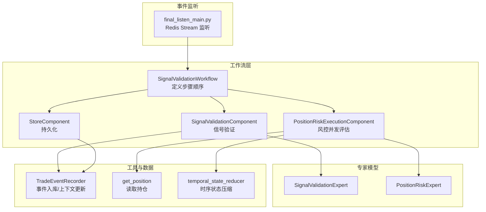
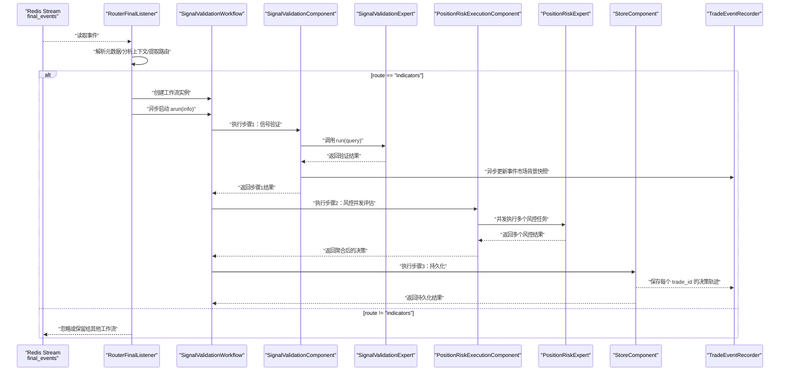
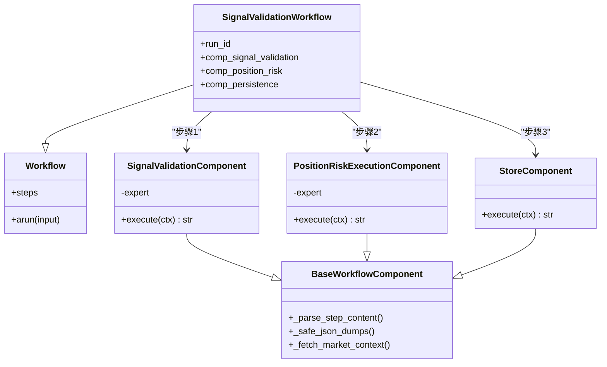
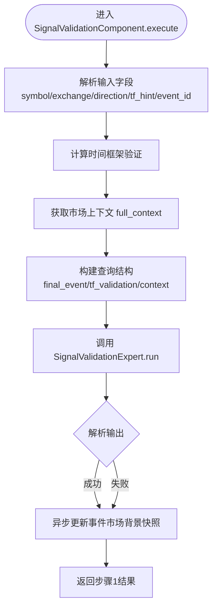
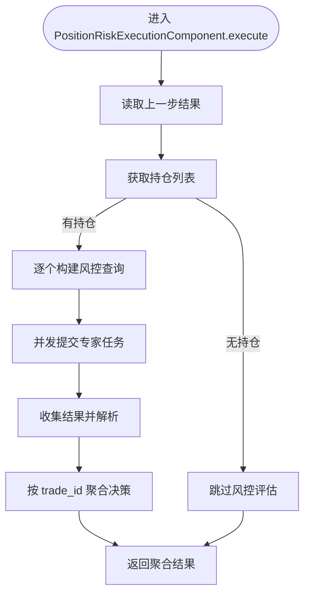
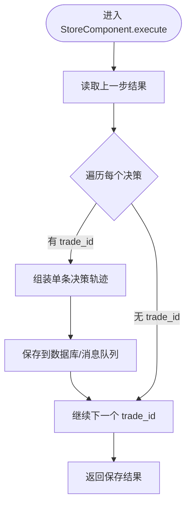
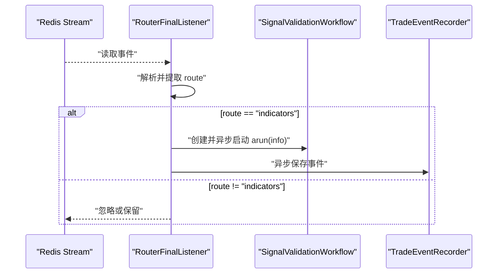
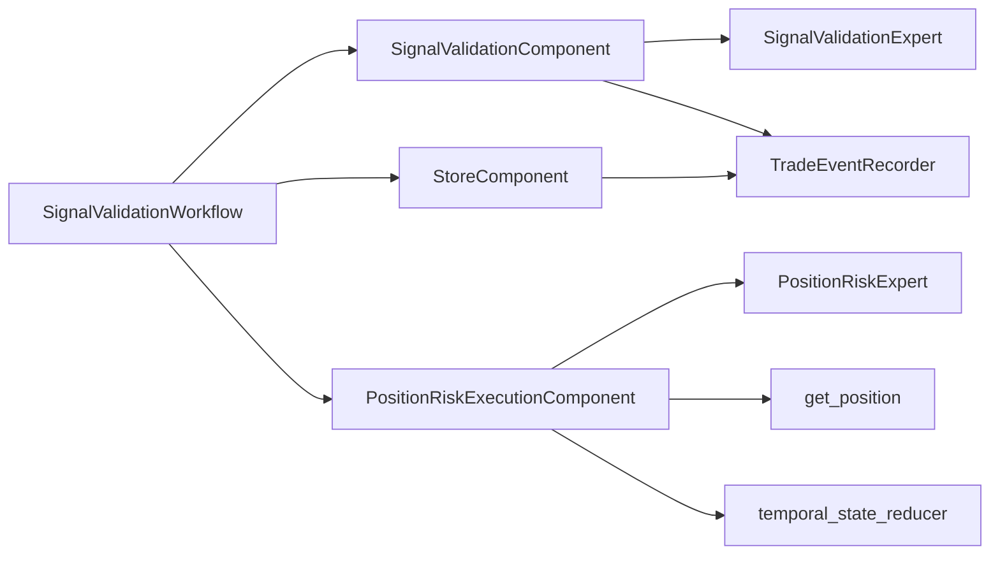

# 工作流机制

<cite>
**本文引用的文件**
- [signal_validation_workflow.py](file://agent_server/agent_workflow/signal_validation_workflow.py)
- [base.py](file://agent_server/agent_workflow/components/base.py)
- [signal_validation_execution.py](file://agent_server/agent_workflow/components/executors/signal_validation_execution.py)
- [position_risk_execution.py](file://agent_server/agent_workflow/components/executors/position_risk_execution.py)
- [store.py](file://agent_server/agent_workflow/components/store.py)
- [final_listen_main.py](file://agent_server/final_listen_main.py)
- [signal_validation.py](file://agent_server/agents/experts/analysis/signal_validation.py)
- [position_risk.py](file://agent_server/agents/experts/analysis/position_risk.py)
- [trade_event_recorder.py](file://agent_server/utils/trade_event_recorder.py)
- [get_position.py](file://agent_server/tools/get_position.py)
- [temporal_state_reducer.py](file://agent_server/reducers/temporal_state_reducer.py)
</cite>

## 目录
1. [引言](#引言)
2. [项目结构](#项目结构)
3. [核心组件](#核心组件)
4. [架构总览](#架构总览)
5. [详细组件分析](#详细组件分析)
6. [依赖关系分析](#依赖关系分析)
7. [性能考量](#性能考量)
8. [故障排查指南](#故障排查指南)
9. [结论](#结论)
10. [附录：扩展自定义工作流指南](#附录扩展自定义工作流指南)

## 引言
本文件围绕 UTaker 系统中的工作流（Workflow）执行机制展开，以 SignalValidationWorkflow 为例，系统性解析其设计与运行流程。该工作流串联“信号验证”“持仓风控评估”“结果持久化”三大核心步骤，形成完整的决策闭环。文档重点说明：
- Workflow 基类（来自 agno.workflow）如何通过 steps 列表定义执行顺序，并异步调用各组件的 execute 方法；
- SignalValidationComponent 如何调用 SignalValidationExpert 对交易信号进行语义级验证；
- PositionRiskExecutionComponent 如何并发执行多个持仓风险评估任务；
- StoreComponent 如何将最终决策结果持久化到数据库或消息队列，并保证每个 trade_id 拥有独立的决策历史；
- 结合 final_listen_main.py 中的事件监听逻辑，解释当 route 为 indicators 时如何触发该工作流的异步执行（asyncio.create_task(wf.arun(info))），实现事件驱动的自动化处理；
- 提供扩展自定义工作流的实践指导：定义新组件、编排执行步骤、集成到事件监听器。

## 项目结构
围绕工作流机制的相关模块分布如下：
- 工作流定义与组件：agent_server/agent_workflow/signal_validation_workflow.py、components/base.py、executors/*、store.py
- 专家模型：agents/experts/analysis/*
- 事件监听与路由：agent_server/final_listen_main.py
- 辅助工具：utils/trade_event_recorder.py、tools/get_position.py、reducers/temporal_state_reducer.py

图表来源
- [signal_validation_workflow.py](file://agent_server/agent_workflow/signal_validation_workflow.py#L1-L34)
- [signal_validation_execution.py](file://agent_server/agent_workflow/components/executors/signal_validation_execution.py#L1-L71)
- [position_risk_execution.py](file://agent_server/agent_workflow/components/executors/position_risk_execution.py#L1-L184)
- [store.py](file://agent_server/agent_workflow/components/store.py#L1-L52)
- [final_listen_main.py](file://agent_server/final_listen_main.py#L1-L166)
- [signal_validation.py](file://agent_server/agents/experts/analysis/signal_validation.py#L1-L136)
- [position_risk.py](file://agent_server/agents/experts/analysis/position_risk.py#L1-L229)
- [trade_event_recorder.py](file://agent_server/utils/trade_event_recorder.py#L1-L451)
- [get_position.py](file://agent_server/tools/get_position.py#L1-L44)
- [temporal_state_reducer.py](file://agent_server/reducers/temporal_state_reducer.py#L1-L147)

章节来源
- [signal_validation_workflow.py](file://agent_server/agent_workflow/signal_validation_workflow.py#L1-L34)
- [final_listen_main.py](file://agent_server/final_listen_main.py#L1-L166)

## 核心组件
- SignalValidationWorkflow：继承自 agno.workflow.Workflow，通过 steps 列表定义三步执行顺序，分别为信号验证、风控并发评估、持久化。
- SignalValidationComponent：负责从上游事件数据构建查询，调用 SignalValidationExpert 执行语义级验证，并异步更新事件的市场背景快照。
- PositionRiskExecutionComponent：从上一步结果提取信号验证输出与市场上下文，构建风控专家的查询，按 trade_id 并发执行 PositionRiskExpert，并聚合决策。
- StoreComponent：将每个 trade_id 的完整决策轨迹（含信号验证、风控评估、最终决策）持久化，确保独立的历史记录。
- BaseWorkflowComponent：提供通用的 JSON 解析、安全序列化、从 Redis 获取市场上下文等能力，供各组件复用。
- 事件监听器 RouterFinalListener：从 Redis Stream 读取 final_events，根据 route 分发到不同工作流；当 route 为 indicators 时，异步启动 SignalValidationWorkflow。

章节来源
- [signal_validation_workflow.py](file://agent_server/agent_workflow/signal_validation_workflow.py#L1-L34)
- [base.py](file://agent_server/agent_workflow/components/base.py#L1-L44)
- [signal_validation_execution.py](file://agent_server/agent_workflow/components/executors/signal_validation_execution.py#L1-L71)
- [position_risk_execution.py](file://agent_server/agent_workflow/components/executors/position_risk_execution.py#L1-L184)
- [store.py](file://agent_server/agent_workflow/components/store.py#L1-L52)
- [final_listen_main.py](file://agent_server/final_listen_main.py#L1-L166)

## 架构总览
下面的时序图展示了从事件监听到工作流执行再到持久化的完整链路，以及各组件之间的调用关系。

图表来源
- [final_listen_main.py](file://agent_server/final_listen_main.py#L114-L129)
- [signal_validation_workflow.py](file://agent_server/agent_workflow/signal_validation_workflow.py#L18-L33)
- [signal_validation_execution.py](file://agent_server/agent_workflow/components/executors/signal_validation_execution.py#L16-L71)
- [position_risk_execution.py](file://agent_server/agent_workflow/components/executors/position_risk_execution.py#L23-L184)
- [store.py](file://agent_server/agent_workflow/components/store.py#L8-L52)
- [trade_event_recorder.py](file://agent_server/utils/trade_event_recorder.py#L304-L371)

## 详细组件分析

### SignalValidationWorkflow 设计与运行
- 步骤编排：通过 steps 列表依次注册 SignalValidationComponent.execute、PositionRiskExecutionComponent.execute、StoreComponent.execute，确保严格顺序执行。
- 运行入口：Workflow 基类提供异步运行接口（arun），由事件监听器在检测到 route==indicators 时调用。
- 上下文生成：SignalValidationComponent 在执行前会基于 Redis 中的 market_state 构建标准化 full_context，供后续步骤使用。

图表来源
- [signal_validation_workflow.py](file://agent_server/agent_workflow/signal_validation_workflow.py#L10-L33)
- [base.py](file://agent_server/agent_workflow/components/base.py#L1-L44)

章节来源
- [signal_validation_workflow.py](file://agent_server/agent_workflow/signal_validation_workflow.py#L10-L33)

### SignalValidationComponent：信号验证
- 输入解析：从 StepInput.input 中提取 symbol、exchange、direction、tf_hint、event_id 等关键字段。
- 周期一致性校验：调用 compute_tf_validation 生成时间框架验证结果。
- 市场上下文：通过 _fetch_market_context 从 Redis 读取 background:*:market_state 并构建 full_context。
- 专家调用：构造查询结构（包含 final_event、tf_validation、context 等），调用 SignalValidationExpert.run 执行语义级验证。
- 异步更新：若存在 event_id 与 full_context，异步调用 TradeEventRecorder.update_event_context，将市场背景快照写回数据库对应事件记录。

图表来源
- [signal_validation_execution.py](file://agent_server/agent_workflow/components/executors/signal_validation_execution.py#L16-L71)
- [trade_event_recorder.py](file://agent_server/utils/trade_event_recorder.py#L385-L431)

章节来源
- [signal_validation_execution.py](file://agent_server/agent_workflow/components/executors/signal_validation_execution.py#L16-L71)
- [signal_validation.py](file://agent_server/agents/experts/analysis/signal_validation.py#L20-L81)

### PositionRiskExecutionComponent：并发风控评估
- 输入承接：从 previous_step_content 中读取 event_data、sv_output、full_context。
- 持仓获取：调用 get_position 获取当前 symbol 的所有活跃持仓。
- 上下文准备：优先使用上游传入的 full_context，否则自行拉取；提取市场与人群维度上下文。
- 时序状态压缩：对每个 position_snapshot 调用 reduce_temporal_state，得到 deterministic 的时序状态。
- 并发执行：为每个持仓构建 query 并并发提交 PositionRiskExpert.run，使用 asyncio.gather 收集结果。
- 决策聚合：遍历 queries 与 parsed_results，按 trade_id 聚合 recommended_action，形成 decisions 列表。
- 输出封装：返回包含 decisions、risk_results、queries、step1_result 的结构，供 StoreComponent 使用。

图表来源
- [position_risk_execution.py](file://agent_server/agent_workflow/components/executors/position_risk_execution.py#L23-L184)
- [get_position.py](file://agent_server/tools/get_position.py#L14-L44)
- [temporal_state_reducer.py](file://agent_server/reducers/temporal_state_reducer.py#L38-L127)

章节来源
- [position_risk_execution.py](file://agent_server/agent_workflow/components/executors/position_risk_execution.py#L23-L184)
- [position_risk.py](file://agent_server/agents/experts/analysis/position_risk.py#L18-L79)

### StoreComponent：持久化与历史追踪
- 输入解析：从 previous_step_content 中读取 decisions、risk_results、queries、step1_result。
- 历史拆分：针对每个 trade_id，组装单条决策轨迹（包含 event_input、signal_validation、risk_assessment、final_decision）。
- 时序与幂等：通过 ts 与 trade_id 组合，确保每笔交易的完整历史被独立保存。
- 存储落盘：目前打印保存标识，后续可接入数据库或消息队列；返回 saved_trades 与状态。

图表来源
- [store.py](file://agent_server/agent_workflow/components/store.py#L8-L52)

章节来源
- [store.py](file://agent_server/agent_workflow/components/store.py#L8-L52)

### 事件监听与触发：final_listen_main.py
- Redis Stream 监听：RouterFinalListener 以消费者组方式读取 final_events，解析 meta/analysis_context/structure/trade_details 等字段。
- 路由分发：根据 origin_source_hint（或 analysis_context.provenance.origin_source_hint）提取 route；当 route==indicators 时，创建 SignalValidationWorkflow 实例并异步启动（asyncio.create_task(wf.arun(info))）。
- 异步入库：同时异步调用 TradeEventRecorder.save_event，将事件写入数据库，不阻塞后续处理。
- 消息确认：处理完成后 xack 确认消息。

图表来源
- [final_listen_main.py](file://agent_server/final_listen_main.py#L114-L129)

章节来源
- [final_listen_main.py](file://agent_server/final_listen_main.py#L1-L166)
- [trade_event_recorder.py](file://agent_server/utils/trade_event_recorder.py#L304-L371)

## 依赖关系分析
- 组件耦合：SignalValidationWorkflow 通过 steps 列表耦合三个组件；各组件均继承 BaseWorkflowComponent，共享上下文获取与 JSON 处理能力。
- 外部依赖：
  - Redis：用于 market_state 快照、positions、agent_output 最新建议等；
  - PostgreSQL：TradeEventRecorder 将事件持久化到 trade_events 表；
  - LLM 专家：SignalValidationExpert 与 PositionRiskExpert 通过 OpenAI-like 模型执行推理。
- 循环依赖：未发现直接循环依赖；组件间通过异步调用与数据传递解耦。

图表来源
- [signal_validation_workflow.py](file://agent_server/agent_workflow/signal_validation_workflow.py#L18-L33)
- [signal_validation_execution.py](file://agent_server/agent_workflow/components/executors/signal_validation_execution.py#L16-L71)
- [position_risk_execution.py](file://agent_server/agent_workflow/components/executors/position_risk_execution.py#L23-L184)
- [store.py](file://agent_server/agent_workflow/components/store.py#L8-L52)
- [trade_event_recorder.py](file://agent_server/utils/trade_event_recorder.py#L1-L451)
- [get_position.py](file://agent_server/tools/get_position.py#L14-L44)
- [temporal_state_reducer.py](file://agent_server/reducers/temporal_state_reducer.py#L38-L127)

章节来源
- [signal_validation_workflow.py](file://agent_server/agent_workflow/signal_validation_workflow.py#L18-L33)
- [signal_validation_execution.py](file://agent_server/agent_workflow/components/executors/signal_validation_execution.py#L16-L71)
- [position_risk_execution.py](file://agent_server/agent_workflow/components/executors/position_risk_execution.py#L23-L184)
- [store.py](file://agent_server/agent_workflow/components/store.py#L8-L52)
- [trade_event_recorder.py](file://agent_server/utils/trade_event_recorder.py#L1-L451)

## 性能考量
- 异步非阻塞：事件监听与信号验证、持久化均采用异步方式，避免阻塞 Redis 读取与后续处理。
- 并发评估：PositionRiskExecutionComponent 对多个持仓并发执行风控任务，显著降低端到端延迟。
- 缓存与上下文：通过 Redis 缓存 market_state 与 agent_output，减少重复 IO。
- 数据库入库：TradeEventRecorder 使用线程池执行同步数据库操作，避免阻塞事件处理主流程。
- 建议优化：
  - 对高频查询增加本地缓存；
  - 控制并发任务数量，避免专家模型与数据库压力过大；
  - 对 JSON 解析与序列化路径进行批量优化。

[本节为通用性能讨论，不直接分析具体文件，故无章节来源]

## 故障排查指南
- 信号验证失败：
  - 检查 Redis 中 market_state 键是否正确；
  - 确认 SignalValidationExpert 的模型配置与 API Key；
  - 查看 TradeEventRecorder.update_event_context 是否成功更新事件上下文。
- 并发风控无结果：
  - 检查 get_position 返回的持仓列表是否为空；
  - 确认 PositionRiskExpert.run 的输入 query 结构是否完整；
  - 关注 asyncio.gather 的异常收集与日志。
- 持久化失败：
  - 检查 StoreComponent 的 trade_id 是否存在；
  - 确认数据库连接与表结构（trade_events）是否正确；
  - 关注 TradeEventRecorder.save_event 的并发保存结果。
- 事件监听卡住：
  - 检查 Redis Stream 的消费者组创建与 ack 是否正常；
  - 确认 final_listen_main.py 的 block 与 count 设置是否合理。

章节来源
- [signal_validation_execution.py](file://agent_server/agent_workflow/components/executors/signal_validation_execution.py#L16-L71)
- [position_risk_execution.py](file://agent_server/agent_workflow/components/executors/position_risk_execution.py#L23-L184)
- [store.py](file://agent_server/agent_workflow/components/store.py#L8-L52)
- [trade_event_recorder.py](file://agent_server/utils/trade_event_recorder.py#L304-L371)
- [final_listen_main.py](file://agent_server/final_listen_main.py#L1-L166)

## 结论
SignalValidationWorkflow 通过明确的三步编排，将信号验证、风控并发评估与持久化有机结合，形成闭环决策流程。其异步与并发特性有效提升了系统的吞吐与响应速度；通过 trade_id 粒度的历史追踪，保障了每笔交易的可审计性与可追溯性。事件驱动的监听器设计使得系统具备良好的扩展性，便于接入更多路由与工作流。

[本节为总结性内容，不直接分析具体文件，故无章节来源]

## 附录：扩展自定义工作流指南
- 定义新组件：
  - 继承 BaseWorkflowComponent，实现 async def execute(self, ctx: StepInput) -> str；
  - 在 execute 中完成输入解析、上下文准备、外部调用与结果封装；
  - 使用 _parse_step_content、_safe_json_dumps、_fetch_market_context 等通用能力。
- 编排执行步骤：
  - 在新工作流类中初始化组件实例；
  - 在 __init__ 中通过 super().__init__(steps=[...]) 注册组件 execute 方法，确保顺序正确。
- 集成到事件监听器：
  - 在 RouterFinalListener 中根据新的 route 分支创建并异步启动新工作流；
  - 保持异步非阻塞，避免影响 Redis 读取与 ack。
- 最佳实践：
  - 明确每步输入/输出的数据契约；
  - 对外部依赖（Redis、数据库、LLM）增加超时与重试；
  - 为每个 trade_id 维护独立的历史轨迹，便于审计与回放。

章节来源
- [base.py](file://agent_server/agent_workflow/components/base.py#L1-L44)
- [signal_validation_workflow.py](file://agent_server/agent_workflow/signal_validation_workflow.py#L18-L33)
- [final_listen_main.py](file://agent_server/final_listen_main.py#L114-L129)