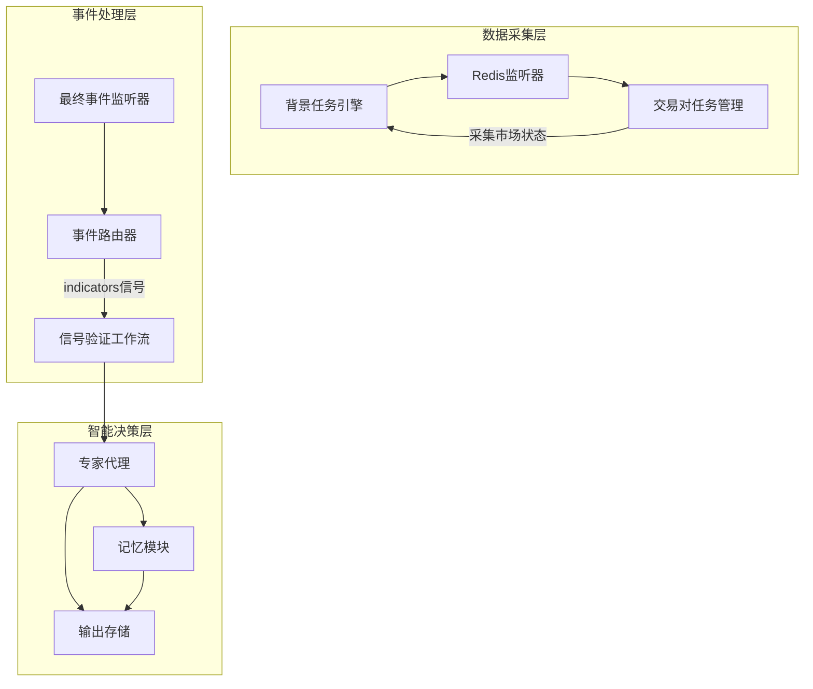
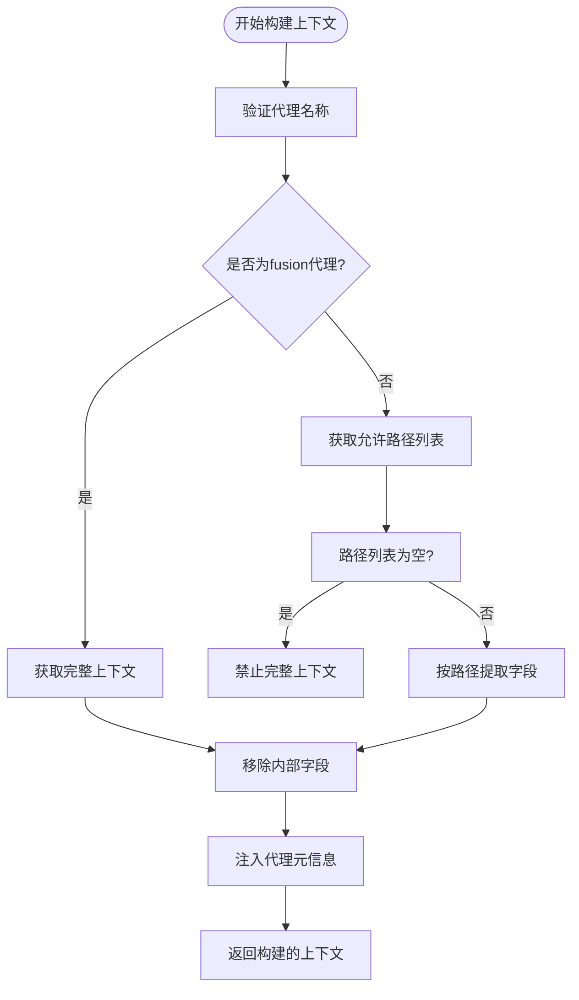
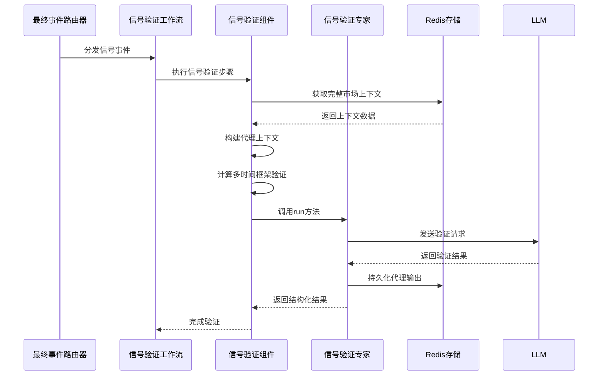

# 智能代理系统

<cite>
**本文档引用文件**  
- [main.py](file://agent_server/main.py)
- [background_main.py](file://agent_server/background_main.py)
- [final_listen_main.py](file://agent_server/final_listen_main.py)
- [builder.py](file://agent_server/agent_context/builder.py)
- [registry.py](file://agent_server/agent_context/registry.py)
- [signal_validation_workflow.py](file://agent_server/agent_workflow/signal_validation_workflow.py)
- [signal_validation_execution.py](file://agent_server/agent_workflow/components/executors/signal_validation_execution.py)
- [position_risk_execution.py](file://agent_server/agent_workflow/components/executors/position_risk_execution.py)
- [signal_validation.py](file://agent_server/agents/experts/analysis/signal_validation.py)
- [memory.py](file://agent_server/agents/experts/orchestration/memory.py)
- [output_store.py](file://agent_server/agent_context/output_store.py)
- [store.py](file://agent_server/memory/store.py)
- [config.py](file://agent_server/config.py)
</cite>

## 目录
1. [系统架构概览](#系统架构概览)
2. [主程序与协程调度机制](#主程序与协程调度机制)
3. [专家代理注册与上下文构建](#专家代理注册与上下文构建)
4. [信号验证工作流解析](#信号验证工作流解析)
5. [记忆模块与长期市场认知](#记忆模块与长期市场认知)
6. [代理输出存储与Redis键设计](#代理输出存储与redis键设计)
7. [开发新专家代理的集成方法](#开发新专家代理的集成方法)

## 系统架构概览

UTaker智能代理系统采用异步事件驱动架构，由两个核心后台任务协同工作：背景任务（background_main）负责实时采集和聚合市场数据，最终事件监听器（final_listen_main）负责接收并路由交易信号至相应的工作流进行处理。整个系统通过Redis作为消息中间件和状态存储，实现了高并发、低延迟的交易信号处理能力。

系统主要组件包括：
- **背景任务引擎**：持续监听交易所与交易对变化，动态启动数据采集任务
- **最终事件路由器**：从Redis Stream消费信号事件，按来源类型路由至不同工作流
- **专家代理系统**：基于注册表（AGENT_REGISTRY）管理不同职能的AI代理
- **上下文构建器**：为各专家代理提供定制化的市场与人群情绪数据视图
- **信号验证工作流**：串联LLM驱动的信号验证与持仓风控评估
- **记忆协调器**：维护长期市场认知与交易状态



**图示来源**  
- [background_main.py](file://agent_server/background_main.py#L1-L84)
- [final_listen_main.py](file://agent_server/final_listen_main.py#L1-L166)
- [signal_validation_workflow.py](file://agent_server/agent_workflow/signal_validation_workflow.py#L1-L34)

## 主程序与协程调度机制

系统入口文件`main.py`通过`_run_all`协程同时启动两个独立的后台服务：`background_main`和`final_listen_main`。这种设计实现了数据采集与信号处理的完全解耦，确保系统在高负载下仍能稳定运行。

```python
async def _run_all():
    t1 = asyncio.create_task(run_background(), name="agent_background_main")
    t2 = asyncio.create_task(run_final(), name="final_listen")
    await asyncio.gather(t1, t2)
```

`background_main`模块负责监控Redis中交易所与交易对的变化，动态创建和销毁数据采集任务。它通过`RedisExchangeWatcher`和`RedisSymbolWatcher`监听配置变更，利用`SymbolTaskManager`管理每个交易对的数据采集任务生命周期。

`final_listen_main`模块则作为事件中枢，监听名为`final_events`的Redis Stream。它解析传入的交易信号，提取路由提示（origin_source_hint），并将"indicators"类型的信号分发至`SignalValidationWorkflow`进行语义级验证。

**本节来源**  
- [main.py](file://agent_server/main.py#L8-L16)
- [background_main.py](file://agent_server/background_main.py#L31-L84)
- [final_listen_main.py](file://agent_server/final_listen_main.py#L12-L133)

## 专家代理注册与上下文构建

### 代理注册机制（AGENT_REGISTRY）

系统通过`AGENT_REGISTRY`全局字典实现专家代理的集中注册与元数据管理。每个代理注册项包含以下关键属性：

- **agent**: 代理唯一标识符
- **role**: 代理角色（如technical_signal, risk_management）
- **scope**: 时间范围（micro, short, mid, long）
- **uses_crowd_state**: 是否使用人群情绪数据
- **allowed_paths**: 允许访问的数据字段白名单
- **forbidden_semantics**: 禁止的语义行为

```python
AGENT_REGISTRY: dict[str, AgentContextContract] = {
    "signal_validation": {
        "agent": "signal_validation",
        "role": "technical_signal",
        "scope": ["short", "mid", "long"],
        "uses_crowd_state": True,
        "allowed_paths": [
            "market_state.short_term.direction",
            "market_state.short_term.momentum",
            "crowd_state.bias",
            "crowd_state.crowding_level"
        ],
        "forbidden_semantics": [
            "trend_forecast",
            "strategy_advice",
            "generate_new_direction"
        ]
    },
    # ... 其他代理定义
}
```

### 上下文构建流程

上下文构建由`builder.py`中的`build_agent_context`函数实现，其核心流程如下：

1. 验证代理名称的有效性
2. 对于特殊代理（如fusion），返回完整上下文
3. 根据代理注册表中的`allowed_paths`白名单，从完整上下文中提取允许访问的字段
4. 移除内部元数据字段（如_raw_trends）
5. 注入代理元信息（_context_meta）

该机制确保了各专家代理只能访问其职责范围内所需的数据，实现了数据隔离与安全控制。



**本节来源**  
- [registry.py](file://agent_server/agent_context/registry.py#L6-L122)
- [builder.py](file://agent_server/agent_context/builder.py#L18-L49)
- [profiles.py](file://agent_server/agent_context/profiles.py#L7-L13)
- [utils.py](file://agent_server/agent_context/utils.py#L6-L23)

## 信号验证工作流解析

信号验证工作流（`SignalValidationWorkflow`）是系统的核心决策引擎，采用流水线式设计，依次执行信号验证、持仓风控评估和结果持久化三个步骤。

### 工作流结构

```python
class SignalValidationWorkflow(Workflow):
    def __init__(self, run_id: Optional[str] = None, **kwargs):
        self.comp_signal_validation = SignalValidationComponent()
        self.comp_position_risk = PositionRiskExecutionComponent()
        self.comp_persistence = StoreComponent()

        super().__init__(
            steps=[
                self.comp_signal_validation.execute,
                self.comp_position_risk.execute,
                self.comp_persistence.execute,
            ],
            **kwargs
        )
```

### 信号验证执行器

`SignalValidationComponent`负责调用LLM对交易信号进行语义级验证，其主要流程包括：

1. 计算多时间框架验证指标（tf_validation）
2. 从Redis获取完整的市场上下文
3. 使用`build_agent_context`为信号验证代理构建专用上下文
4. 构造包含信号详情、多时间框架验证结果和市场上下文的查询
5. 调用`SignalValidationExpert`执行LLM推理
6. 异步更新事件的市场背景快照



**图示来源**  
- [signal_validation_workflow.py](file://agent_server/agent_workflow/signal_validation_workflow.py#L10-L34)
- [signal_validation_execution.py](file://agent_server/agent_workflow/components/executors/signal_validation_execution.py#L12-L71)
- [signal_validation.py](file://agent_server/agents/experts/analysis/signal_validation.py#L17-L81)

## 记忆模块与长期市场认知

记忆模块通过`MemoryExpert`和`MemoryStore`协同工作，维护交易的长期上下文和状态演化。

### 记忆专家（MemoryExpert）

`MemoryExpert`作为外部接口，接收包含交易ID、融合结果、各代理输出、反思结果和权重的查询，协调记忆状态的更新。

```python
class MemoryExpert:
    async def run(self, query: str) -> str:
        obj = json.loads(query or "{}")
        trade_id = str(obj.get("trade_id") or obj.get("id") or obj.get("symbol") or "")
        fused = obj.get("fused")
        outputs = obj.get("outputs") or []
        reflection = obj.get("reflection") or {}
        weights = obj.get("weights") or {}
        event_payload = obj.get("event") or obj.get("payload") or {}
        
        mc = MemoryCoordinator()
        await mc.update(trade_id, fused, outputs, reflection, weights, event_payload)
        
        store = MemoryStore()
        ctx = await store.get_model_context(trade_id)
        return json.dumps({"ok": True, "trade_id": trade_id, "context": ctx})
```

### 记忆协调器（MemoryCoordinator）

`MemoryCoordinator`负责将原始数据转化为结构化的记忆表示：

- **摘要生成**：基于融合结果、权重和反思分数生成市场趋势摘要
- **状态更新**：维护趋势状态、风险状态、驱动因素等动态属性
- **上下文切片**：保留最近5个高分分析结果作为上下文参考

### 存储结构

记忆数据在Redis中按以下结构组织：
- `memory:{trade_id}:events` - 事件流
- `memory:{trade_id}:latest_summary` - 最新摘要
- `memory:{trade_id}:state` - 当前状态
- `memory:{trade_id}:context_slices` - 上下文切片

**本节来源**  
- [memory.py](file://agent_server/agents/experts/orchestration/memory.py#L4-L25)
- [store.py](file://agent_server/memory/store.py#L12-L180)

## 代理输出存储与Redis键设计

`output_store.py`模块提供了专家代理产出物的标准化封装与持久化机制。

### 输出结构

每个代理输出被封装为统一格式：
```json
{
  "_context_meta": {
    "agent": "signal_validation",
    "role": "technical_signal",
    "scope": ["short", "mid", "long"],
    "uses_crowd_state": true
  },
  "agent_output": {
    // 专家代理的原始JSON输出
  }
}
```

### Redis键设计

采用分层命名空间设计，确保数据的可检索性和隔离性：

- **流式存储键**：`agent_output:{exchange}:{symbol}:{agent}:stream`
  - 用于持久化所有历史输出，支持时间序列分析
- **最新值键**：`agent_output:{exchange}:{symbol}:{agent}:latest`
  - 用于快速获取最新状态，支持实时决策

```python
def compute_stream_key(agent: str, exchange: str, symbol: str) -> str:
    a = agent.lower()
    return f"agent_output:{exchange}:{symbol}:{a}:stream"

def compute_latest_key(agent: str, exchange: str, symbol: str) -> str:
    a = agent.lower()
    return f"agent_output:{exchange}:{symbol}:{a}:latest"
```

该设计支持高效的读写操作，同时便于监控和调试。

**本节来源**  
- [output_store.py](file://agent_server/agent_context/output_store.py#L29-L73)

## 开发新专家代理的集成方法

要开发新的专家代理并集成到系统中，需遵循以下步骤：

### 1. 创建代理类

在`agents/experts/analysis/`目录下创建新的代理模块，继承基础代理模式：

```python
class NewExpert:
    name = "new_expert"  # 必须与注册表中的键一致

    async def run(self, query: str) -> str:
        # 解析输入查询
        # 执行核心逻辑（可调用LLM或其他服务）
        # 构造并返回结构化输出
        # 调用save_agent_output持久化结果
        pass
```

### 2. 注册代理元信息

在`agent_context/registry.py`的`AGENT_REGISTRY`中添加新代理的配置：

```python
"new_expert": {
    "agent": "new_expert",
    "role": "new_role",
    "scope": ["short", "mid"],
    "uses_crowd_state": True,
    "allowed_paths": [
        "market_state.short_term.direction",
        "crowd_state.bias"
    ],
    "forbidden_semantics": []
}
```

### 3. 创建提示词模板

在`configs/prompts/`目录下创建对应的提示词文件，定义LLM的指令和输出格式。

### 4. 配置模型参数

在`configs/source.py`中配置新代理的LLM模型参数（模型ID、API端点、密钥等）。

### 5. 集成到工作流

根据需要，将新代理的执行器添加到相应的工作流中：

```python
class NewWorkflow(Workflow):
    def __init__(self):
        self.new_component = NewComponent()
        super().__init__(steps=[self.new_component.execute])
```

通过以上步骤，新开发的专家代理即可无缝集成到UTaker系统中，参与交易信号的分析与决策过程。

**本节来源**  
- [signal_validation.py](file://agent_server/agents/experts/analysis/signal_validation.py#L17-L81)
- [registry.py](file://agent_server/agent_context/registry.py#L6-L122)
- [output_store.py](file://agent_server/agent_context/output_store.py#L51-L60)