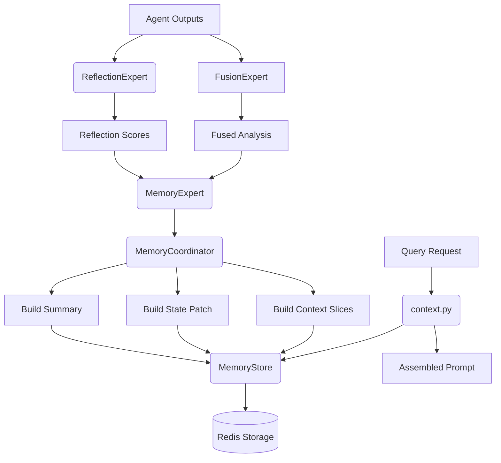

# 记忆系统

<cite>
**本文档中引用的文件**  
- [memory.py](file://agent_server/agents/experts/orchestration/memory.py)
- [reflection.py](file://agent_server/agents/experts/orchestration/reflection.py)
- [fusion.py](file://agent_server/agents/experts/orchestration/fusion.py)
- [store.py](file://agent_server/memory/store.py)
- [context.py](file://agent_server/memory/context.py)
- [schema.py](file://agent_server/memory/schema.py)
- [redis_client.py](file://api/application/common/redis_client.py)
- [builder.py](file://agent_server/agent_context/builder.py)
- [registry.py](file://agent_server/agent_context/registry.py)
- [trade_event_recorder_example.py](file://agent_server/utils/trade_event_recorder_example.py)
</cite>

## 目录
1. [简介](#简介)
2. [核心组件](#核心组件)
3. [记忆系统架构](#记忆系统架构)
4. [MemoryExpert：记忆入口点](#memoryexpert记忆入口点)
5. [MemoryCoordinator：状态协调与摘要生成](#memorycoordinator状态协调与摘要生成)
6. [MemoryStore：持久化存储与数据结构](#memorystore持久化存储与数据结构)
7. [ReflectionExpert：输出质量评估](#reflectionexpert输出质量评估)
8. [Redis存储结构与访问模式](#redis存储结构与访问模式)
9. [上下文查询与API使用示例](#上下文查询与api使用示例)
10. [融合分析与跨周期连贯性](#融合分析与跨周期连贯性)

## 简介
UTaker的记忆系统旨在维护长期市场认知与交易决策上下文，支持基于`trade_id`的独立决策链追溯。该系统通过`MemoryExpert`接收来自多个代理的融合分析结果、原始输出及反思评分，并调用`MemoryCoordinator`进行状态更新。系统将关键信息结构化存储于Redis中，包括最新市场摘要、状态变量和上下文切片，为后续决策提供历史依据。同时，`ReflectionExpert`对各代理输出进行质量评分，确保记忆输入的可靠性。

## 核心组件
记忆系统由多个核心组件构成，协同完成上下文维护与状态更新任务。

**Section sources**
- [memory.py](file://agent_server/agents/experts/orchestration/memory.py)
- [reflection.py](file://agent_server/agents/experts/orchestration/reflection.py)
- [store.py](file://agent_server/memory/store.py)

## 记忆系统架构


**Diagram sources**
- [memory.py](file://agent_server/agents/experts/orchestration/memory.py)
- [reflection.py](file://agent_server/agents/experts/orchestration/reflection.py)
- [fusion.py](file://agent_server/agents/experts/orchestration/fusion.py)
- [store.py](file://agent_server/memory/store.py)
- [context.py](file://agent_server/memory/context.py)

## MemoryExpert：记忆入口点
`MemoryExpert`是记忆系统的统一入口，负责接收来自工作流的综合信息并触发状态更新流程。其主要职责包括：
- 解析输入参数，提取`trade_id`、融合结果（fused）、各代理输出（outputs）、反思评分（reflection）等关键字段
- 验证`trade_id`的有效性，若缺失则返回错误响应
- 实例化`MemoryCoordinator`并调用其`update`方法执行状态更新
- 返回更新后的完整上下文对象，供后续流程使用

该组件作为协调者，不直接处理数据，而是将任务委托给`MemoryCoordinator`进行具体的状态管理。

**Section sources**
- [memory.py](file://agent_server/agents/experts/orchestration/memory.py#L4-L25)

## MemoryCoordinator：状态协调与摘要生成
`MemoryCoordinator`是记忆系统的核心逻辑处理器，负责生成结构化市场摘要、更新状态补丁和构建上下文切片。

### _build_summary 方法
该方法综合趋势、驱动因素、风险因子等维度生成结构化的市场摘要。输入包括：
- `fused`: 融合分析结果
- `weights`: 各代理权重
- `reflection`: 反思评分
- `event_payload`: 当前事件负载

输出为JSON格式的摘要对象，包含以下字段：
- `current_trend_bias`: 当前趋势偏向
- `main_driver`: 主要驱动因素
- `risk_factors`: 风险因子列表
- `confidence`: 置信度（基于反思评分计算）
- `market_regime`: 市场状态
- `weights`: 各代理权重分布
- `summary_hint`: 摘要提示（截取前400字符）

### _build_state_patch 方法
基于新旧摘要对比，生成状态更新补丁，用于维护长期状态变量，如趋势状态、风险状态、驱动状态等。

### _build_slices 方法
从各代理输出中提取高价值分析片段，按评分排序后保留前5个，形成可追溯的上下文切片。

**Section sources**
- [store.py](file://agent_server/memory/store.py#L78-L180)

## MemoryStore：持久化存储与数据结构
`MemoryStore`负责与Redis交互，实现记忆数据的持久化存储与检索。

### 存储结构
每个`trade_id`对应一组Redis键值对：
- `memory:{trade_id}:latest_summary` - 最新市场摘要（字符串）
- `memory:{trade_id}:state` - 状态对象（JSON字符串）
- `memory:{trade_id}:context_slices` - 上下文切片（JSON数组）
- `memory:{trade_id}:events` - 事件日志流（Redis Stream）

### 访问模式
提供异步方法支持高效读写：
- `get_model_context`: 获取完整上下文对象
- `assemble_prompt`: 组装文本提示
- `log_event`: 记录事件到流

**Section sources**
- [store.py](file://agent_server/memory/store.py#L12-L76)
- [context.py](file://agent_server/memory/context.py#L7-L27)

## ReflectionExpert：输出质量评估
`ReflectionExpert`负责对多个代理的输出进行质量评估，为记忆系统提供可靠的输入依据。

### 评分机制
采用长度归一化评分公式：`len(t) / 1000.0`，将输出长度映射到[0,1]区间，作为基础质量指标。

### 输出结构
生成包含以下字段的反思结果：
- `mode`: 反思模式
- `reflection_scores`: 各代理输出的评分字典
- `notes`: 简要笔记列表，包含每个代理的核心洞察（截取前160字符）

此机制确保只有达到一定信息密度的输出才能获得较高权重，防止低质量内容污染记忆系统。

**Section sources**
- [reflection.py](file://agent_server/agents/experts/orchestration/reflection.py#L4-L23)

## Redis存储结构与访问模式
记忆系统基于Redis实现高性能、低延迟的数据存储与访问。

### Redis客户端配置
使用`redis.asyncio`库构建异步连接池，支持高并发访问。配置参数包括主机、端口、数据库编号和密码（开发环境可能省略）。

### 数据访问模式
- **读操作**：通过`get`命令获取摘要、状态和切片
- **写操作**：通过`set`命令更新状态，`xadd`命令追加事件日志
- **复合操作**：`get_model_context`组合多个读操作返回完整上下文

### 键命名规范
采用`memory:{trade_id}:{suffix}`格式，确保键名唯一且易于理解。

**Section sources**
- [redis_client.py](file://api/application/common/redis_client.py#L1-L33)
- [store.py](file://agent_server/memory/store.py#L8-L16)

## 上下文查询与API使用示例
### 初始化与写入
```python
# 示例：触发记忆更新
query = {
    "trade_id": "BTCUSDT-LONG-123",
    "fused": "综合分析结果...",
    "outputs": ["代理1输出...", "代理2输出..."],
    "reflection": {"reflection_scores": {"agent1": 0.8, "agent2": 0.6}},
    "weights": {"agent1": 0.7, "agent2": 0.3},
    "event": {"signals": {"RSI_5m": 68}, "funding_rate": 0.12}
}
result = await MemoryExpert().run(json.dumps(query))
```

### 上下文查询
```python
# 获取特定交易的完整上下文
ctx = await get_agent_context("BTCUSDT-LONG-123", current_event, "fusion", {})
prompt = await assemble_text_prompt("BTCUSDT-LONG-123", current_event, "fusion", {})
```

### 使用场景
- 交易决策前获取历史上下文
- 分析过程中的状态验证
- 复盘时追溯完整决策链路

**Section sources**
- [context.py](file://agent_server/memory/context.py#L7-L27)
- [trade_event_recorder_example.py](file://agent_server/utils/trade_event_recorder_example.py#L1-L298)

## 融合分析与跨周期连贯性
记忆系统通过`fusion`代理实现跨周期的连贯分析能力。

### 融合流程
1. `fusion`代理获取完整上下文（包括历史摘要、状态和切片）
2. 结合当前市场信号进行综合判断
3. 生成融合分析结果并提交至`MemoryExpert`
4. 更新全局记忆状态

### 连贯性保障
- **状态继承**：新状态基于旧状态进行增量更新
- **趋势跟踪**：通过`confidence_change`字段追踪置信度变化
- **风险累积**：持续监控并记录风险因子演变

此机制确保系统能够在多个时间周期内保持一致的分析视角，避免决策断层。

**Section sources**
- [fusion.py](file://agent_server/agents/experts/orchestration/fusion.py#L5-L31)
- [builder.py](file://agent_server/agent_context/builder.py#L18-L49)
- [registry.py](file://agent_server/agent_context/registry.py#L6-L122)