# 系统架构详解

<cite>
**本文档引用的文件**   
- [main.py](file://agent_server/main.py)
- [final_listen_main.py](file://agent_server/final_listen_main.py)
- [config.py](file://agent_server/config.py)
- [redis_client.py](file://agent_server/utils/redis_client.py)
- [l0_processor.py](file://event_center/pipeline/l0_processor.py)
- [l1_aggregator.py](file://event_center/pipeline/l1_aggregator.py)
- [final_grader.py](file://event_center/pipeline/final_grader.py)
- [main.py](file://event_center/main.py)
- [main.py](file://data_server/binance/rest_binance/app/main.py)
- [config.py](file://event_center/config.py)
- [store.py](file://agent_server/memory/store.py)
- [scheduler.py](file://agent_server/utils/scheduler.py)
- [settings.py](file://api/application/settings.py)
</cite>

## 目录
1. [系统上下文图](#系统上下文图)
2. [微服务架构与职责划分](#微服务架构与职责划分)
3. [事件驱动数据流模型](#事件驱动数据流模型)
4. [Redis Stream通信机制](#redis-stream通信机制)
5. [三级事件处理流水线](#三级事件处理流水线)
6. [专家代理分析流程](#专家代理分析流程)
7. [内存状态管理](#内存状态管理)
8. [异步任务调度](#异步任务调度)
9. [可扩展性与容错性](#可扩展性与容错性)
10. [性能瓶颈应对](#性能瓶颈应对)

## 系统上下文图

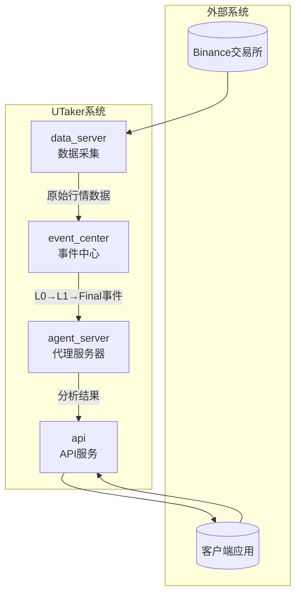

**图示来源**
- [main.py](file://data_server/binance/rest_binance/app/main.py)
- [main.py](file://event_center/main.py)
- [main.py](file://agent_server/main.py)
- [main.py](file://api/main.py)

## 微服务架构与职责划分

UTaker系统采用微服务架构，由四个核心服务模块构成，各司其职并协同工作。

**data_server** 负责从Binance交易所采集原始行情数据，包括K线、资金费率、持仓量等市场指标。该服务通过REST API定期轮询获取数据，并将其发布到Redis Stream中供后续处理。

**event_center** 是系统的核心处理引擎，负责执行L0→L1→Final三级事件处理流水线。它消费data_server产生的原始数据，通过多阶段聚合、评分和过滤，生成结构化的市场状态事件。

**agent_server** 作为智能分析层，消费event_center输出的最终事件，启动专家代理进行深度分析。它维护交易上下文的内存状态，并通过多代理协作生成投资决策建议。

**api** 服务作为系统的统一入口，聚合来自各服务的数据，对外提供RESTful API接口。它连接PostgreSQL数据库存储持久化数据，并通过Redis缓存提高响应性能。

**系统来源**
- [main.py](file://agent_server/main.py)
- [main.py](file://event_center/main.py)
- [main.py](file://data_server/binance/rest_binance/app/main.py)
- [main.py](file://api/main.py)

## 事件驱动数据流模型

系统采用事件驱动架构，数据在服务间通过Redis Stream进行异步传递，形成清晰的数据流管道。

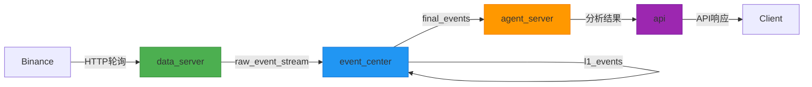

**图示来源**
- [main.py](file://data_server/binance/rest_binance/app/main.py)
- [config.py](file://event_center/config.py)
- [final_listen_main.py](file://agent_server/final_listen_main.py)

## Redis Stream通信机制

Redis Stream在UTaker系统中扮演着服务间通信中枢的角色，实现了可靠的消息传递、状态同步和任务触发。

系统通过配置化的Stream名称进行通信：
- `raw_event_stream`: data_server向event_center发送原始数据
- `l0_events`: event_center内部L0处理阶段输出
- `l1_events`: event_center内部L1处理阶段输出  
- `final_events`: event_center向agent_server发送最终事件

每个消费者组使用独立的消费者名称和组名，确保消息的可靠消费和确认。系统采用`xreadgroup`命令进行阻塞读取，并在处理完成后使用`xack`确认消息，防止消息丢失。

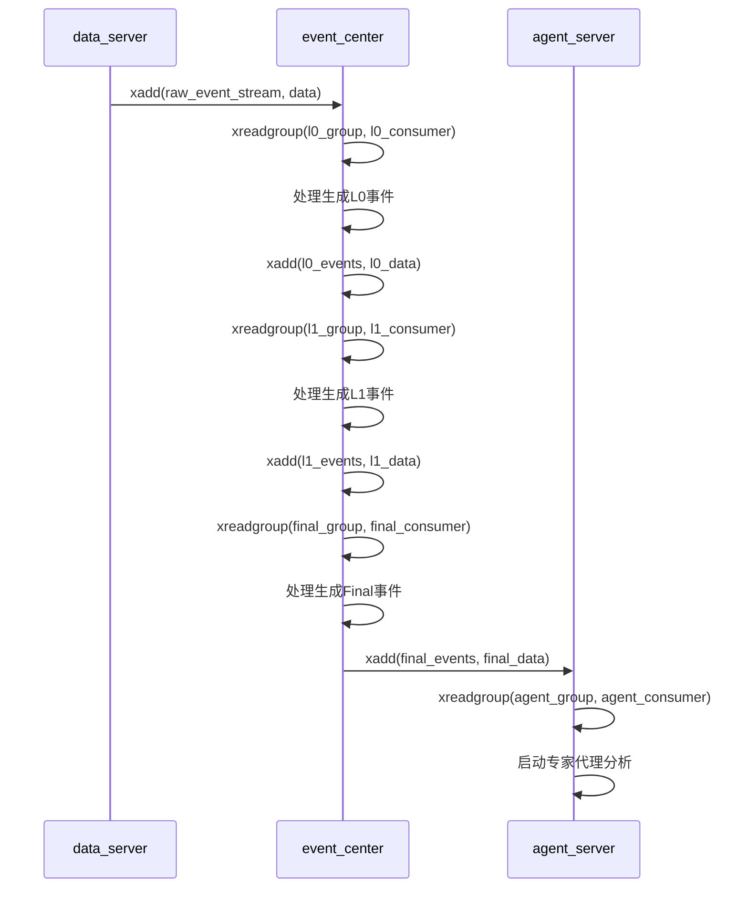

**图示来源**
- [config.py](file://event_center/config.py)
- [l0_processor.py](file://event_center/pipeline/l0_processor.py)
- [l1_aggregator.py](file://event_center/pipeline/l1_aggregator.py)
- [final_grader.py](file://event_center/pipeline/final_grader.py)
- [final_listen_main.py](file://agent_server/final_listen_main.py)

## 三级事件处理流水线

event_center实现了L0→L1→Final三级事件处理流水线，逐层提炼市场信号。

### L0处理器

L0处理器负责基础信号确认，从原始事件中提取方向和强度，应用时间窗口一致性检查。

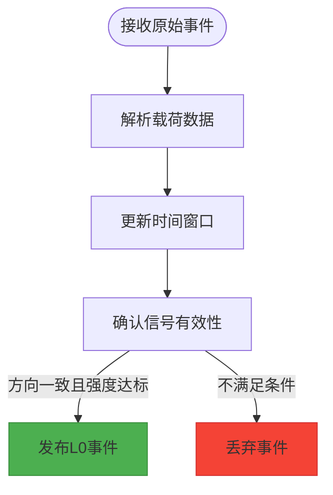

**代码来源**
- [l0_processor.py](file://event_center/pipeline/l0_processor.py#L1-L305)

### L1聚合器

L1聚合器按时间框架（短、中、长）对L0事件进行聚合，生成市场结构视图。

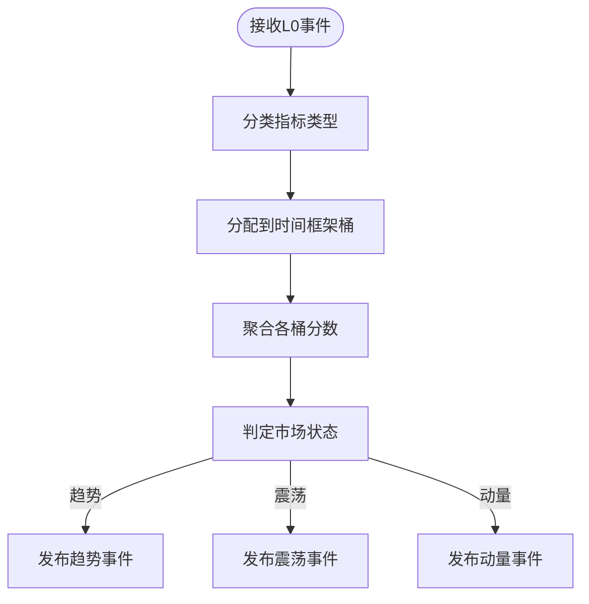

**代码来源**
- [l1_aggregator.py](file://event_center/pipeline/l1_aggregator.py#L1-L415)

### Final评分器

Final评分器执行最终过滤，应用优先级门控和状态去抖动，生成可供消费的最终事件。

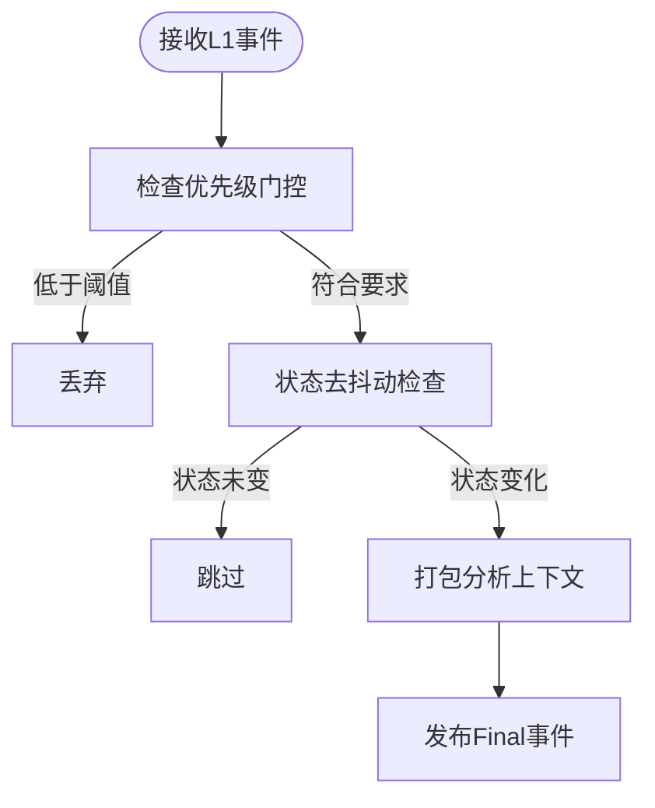

**代码来源**
- [final_grader.py](file://event_center/pipeline/final_grader.py#L1-L305)

## 专家代理分析流程

agent_server消费final_events流中的事件，启动专家代理进行深度分析。

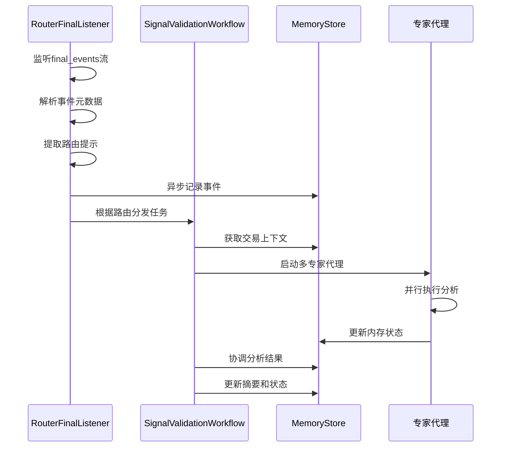

**代码来源**
- [final_listen_main.py](file://agent_server/final_listen_main.py#L1-L166)
- [signal_validation_workflow.py](file://agent_server/agent_workflow/signal_validation_workflow.py)

## 内存状态管理

系统通过Redis实现交易上下文的内存状态管理，维护分析过程中的关键信息。

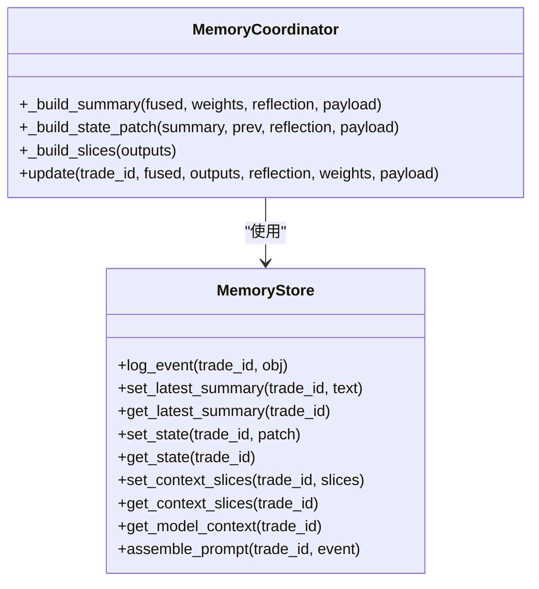

**代码来源**
- [store.py](file://agent_server/memory/store.py#L1-L180)

## 异步任务调度

系统采用异步任务调度机制，确保各组件高效运行。

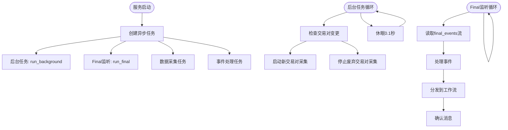

**代码来源**
- [main.py](file://agent_server/main.py#L1-L21)
- [main.py](file://data_server/binance/rest_binance/app/main.py#L1-L99)
- [scheduler.py](file://agent_server/utils/scheduler.py#L1-L23)

## 可扩展性与容错性

系统设计充分考虑了可扩展性和容错性，确保在高负载和故障情况下的稳定运行。

### 可扩展性设计
- **水平扩展**: 每个服务均可独立部署多个实例
- **并发处理**: 使用asyncio实现高并发异步处理
- **动态发现**: event_center自动发现交易所和交易对
- **配置化**: 通过配置文件调整处理参数

### 容错性机制
- **消息确认**: 使用Redis Stream的ACK机制确保消息不丢失
- **异常捕获**: 各处理阶段均有异常捕获和日志记录
- **状态恢复**: 内存状态持久化到Redis，支持故障恢复
- **健康检查**: 各服务提供健康检查接口

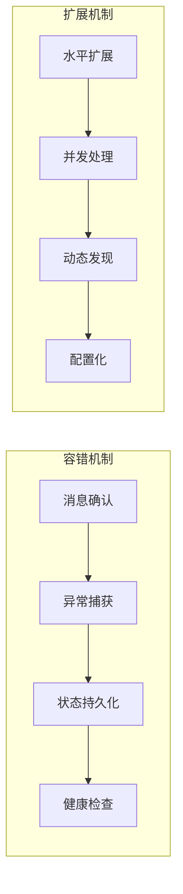

**代码来源**
- [main.py](file://event_center/main.py#L1-L106)
- [l0_processor.py](file://event_center/pipeline/l0_processor.py#L1-L305)
- [final_listen_main.py](file://agent_server/final_listen_main.py#L1-L166)

## 性能瓶颈应对

系统通过多种优化策略应对潜在的性能瓶颈。

### 数据库优化
- **连接池**: 使用Tortoise ORM连接池管理数据库连接
- **索引优化**: 在关键字段上创建索引
- **批量操作**: 尽可能使用批量读写操作

### Redis优化
- **管道操作**: 使用Redis管道减少网络往返
- **批量清理**: 批量删除过期数据
- **内存管理**: 设置合理的过期时间防止内存溢出

### 处理优化
- **窗口聚合**: 使用滑动窗口减少计算量
- **优先级过滤**: 早期过滤低优先级事件
- **并行处理**: 多个交易所并行处理

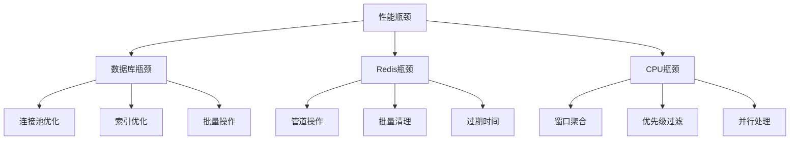

**代码来源**
- [settings.py](file://api/application/settings.py#L1-L34)
- [l0_processor.py](file://event_center/pipeline/l0_processor.py#L1-L305)
- [l1_aggregator.py](file://event_center/pipeline/l1_aggregator.py#L1-L415)