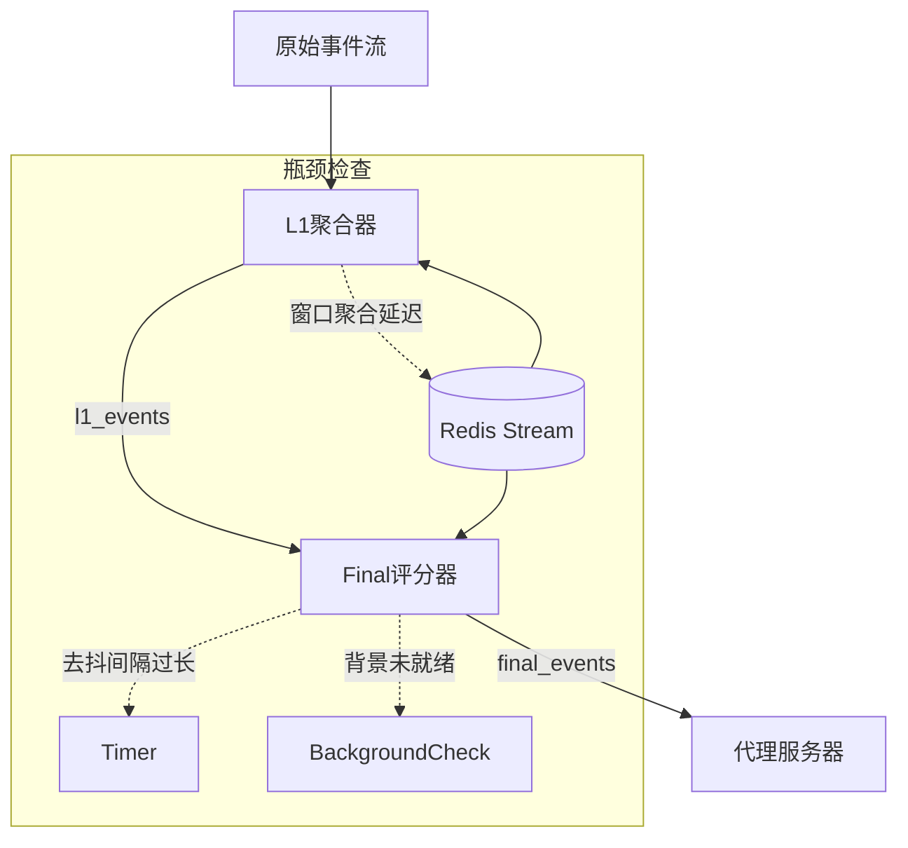
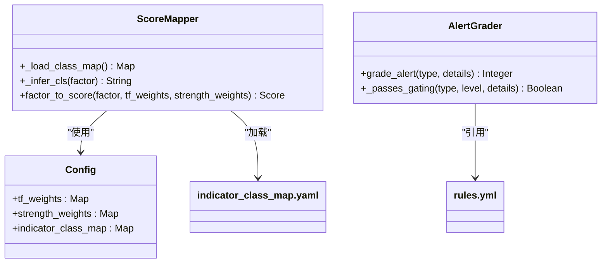

# 故障排查

<cite>
**本文档中引用的文件**  
- [alerts_consumer.py](file://event_center/alerts_consumer.py)
- [l1_aggregator.py](file://event_center/pipeline/l1_aggregator.py)
- [final_grader.py](file://event_center/pipeline/final_grader.py)
- [signal_validation_workflow.py](file://agent_server/agent_workflow/signal_validation_workflow.py)
- [ratelimiter.py](file://data_server/binance/rest_binance/app/ratelimiter.py)
- [redis_client.py](file://agent_server/utils/redis_client.py)
- [config.py](file://event_center/config.py)
- [rules.yml](file://event_center/rules.yml)
- [score_mapper.py](file://event_center/indicators_event/scoring/score_mapper.py)
- [read_final_stream.py](file://tools/read_final_stream.py)
</cite>

## 目录
1. [数据采集中断](#数据采集中断)  
2. [事件堆积](#事件堆积)  
3. [代理无响应](#代理无响应)  
4. [评分异常](#评分异常)  
5. [诊断命令示例](#诊断命令示例)

## 数据采集中断

当系统无法从Binance API获取实时市场数据时，可能导致整个事件处理流水线停滞。此问题通常涉及网络连接、API限流策略或服务进程异常。

首先，检查`data_server/binance/rest_binance/app/ratelimiter.py`中的限流器实现。该文件定义了`TokenBucket`类，用于控制对Binance API的请求频率。若限流器配置过于严格（如`rate`过低），或系统在高并发下耗尽令牌，将导致请求被阻塞。可通过日志确认是否频繁出现`acquire`等待行为。

其次，验证网络连通性。确保服务器能够访问Binance API端点（如`api.binance.com`），可通过`ping`或`curl`测试。同时检查防火墙规则和DNS解析是否正常。

最后，确认`rest_binance/main.py`服务是否正常运行，查看其日志中是否存在连接超时、SSL错误或认证失败等`ERROR`或`WARNING`信息。

**Section sources**  
- [ratelimiter.py](file://data_server/binance/rest_binance/app/ratelimiter.py#L1-L33)

## 事件堆积

事件堆积通常发生在`event_center`的消费者处理能力不足时，导致Redis Stream中的消息积压。重点关注L0、L1和Final三级流水线的处理逻辑。

`event_center/pipeline/l1_aggregator.py`负责将原始事件聚合为L1结构化信号。该模块使用Redis的ZSET和HSET进行窗口聚合计算。若`_update_and_fetch_window`方法中因Redis操作延迟导致处理缓慢，可能引发堆积。检查`window_seconds`和`window_count`配置是否合理，并确认Redis实例的CPU和内存使用率是否过高。

`event_center/pipeline/final_grader.py`作为最终评分器，执行优先级门控和状态去抖。其`run`方法中通过`xreadgroup`消费L1流。若`min_interval`设置过长或背景检查（`FINAL_REQUIRE_BACKGROUND`）频繁失败，会导致事件无法及时推送至`final_events`流。

可通过`redis-cli llen final_events`命令查看最终事件队列长度，若持续增长则表明Final流水线存在瓶颈。

**Diagram sources**  
- [l1_aggregator.py](file://event_center/pipeline/l1_aggregator.py#L1-L415)
- [final_grader.py](file://event_center/pipeline/final_grader.py#L1-L305)

**Section sources**  
- [l1_aggregator.py](file://event_center/pipeline/l1_aggregator.py#L1-L415)
- [final_grader.py](file://event_center/pipeline/final_grader.py#L1-L305)

## 代理无响应

代理无响应通常表现为`agent_server`未能接收到`final_events`流中的新事件。首先，验证`agent_server/main.py`是否正常订阅了Redis Stream。

检查`agent_server/utils/redis_client.py`中的`RedisClient`实现，确认其能够成功连接Redis并执行`xrevrange`和`xadd_json`操作。若连接失败，可能是`config.py`中配置的`redis_host`、`redis_port`或`redis_password`不正确。

其次，分析`agent_server/agent_workflow/signal_validation_workflow.py`中的工作流执行逻辑。该文件定义了`SignalValidationWorkflow`，包含信号验证、持仓风控和持久化三个步骤。若任一组件（如`SignalValidationComponent`）执行超时或抛出异常，将导致整个工作流阻塞。

此外，检查LLM调用延迟。若`signal_validation_execution.py`中对大语言模型的请求响应时间过长，可能拖慢整个代理处理速度。建议设置合理的超时机制并监控调用耗时。

**Section sources**  
- [signal_validation_workflow.py](file://agent_server/agent_workflow/signal_validation_workflow.py#L1-L34)
- [redis_client.py](file://agent_server/utils/redis_client.py#L1-L53)

## 评分异常

评分异常可能源于`alerts_consumer.py`的评分逻辑、`rules.yml`的规则配置或`score_mapper.py`的权重映射错误。

`event_center/alerts_consumer.py`中的`grade_alert`函数负责对原始告警进行分级。例如，`pct_change_up`事件根据价格变动百分比分为1-4级。可通过运行`tests/test_alerts_consumer_grading.py`单元测试验证评分逻辑是否符合预期。

`event_center/rules.yml`文件定义了事件优先级规则。例如，`instant_rules`中`l0_unrealized_20`规则将浮亏20%以上的事件标记为`critical`优先级。若评分结果不符合预期，需核对此文件中的`priority`配置。

`event_center/indicators_event/scoring/score_mapper.py`中的`factor_to_score`函数根据时间框架权重（`tf_weights`）和强度权重（`strength_weights`）计算最终分数。检查`indicators_event/config/`目录下的`tf_weights.yaml`和`strength_weights.yaml`配置是否正确加载。

**Diagram sources**  
- [score_mapper.py](file://event_center/indicators_event/scoring/score_mapper.py#L1-L58)
- [rules.yml](file://event_center/rules.yml#L1-L88)

**Section sources**  
- [alerts_consumer.py](file://event_center/alerts_consumer.py#L1-L304)
- [rules.yml](file://event_center/rules.yml#L1-L88)
- [score_mapper.py](file://event_center/indicators_event/scoring/score_mapper.py#L1-L58)

## 诊断命令示例

以下为常用诊断命令，可用于快速排查系统问题：

- 查看最终事件队列长度：  
  `redis-cli llen final_events`

- 查看L1事件流最新条目：  
  `redis-cli xrevrange l1_events + - count 1`

- 搜索包含错误的日志：  
  `grep -r "ERROR" /path/to/logs/`

- 搜索包含警告的日志：  
  `grep -r "WARNING" /path/to/logs/`

- 使用单元测试模拟评分场景：  
  `python -m tests.test_alerts_consumer_grading`

- 检查代理服务器Redis连接状态：  
  `python -c "from agent_server.utils.redis_client import get_redis_client; import asyncio; r = get_redis_client(); print(asyncio.run(r.ping()))"`

- 查看所有活动的Redis消费者组：  
  `redis-cli xinfo groups final_events`