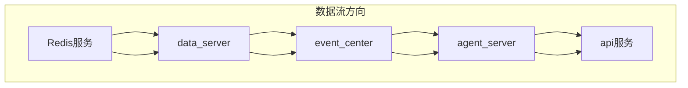

# 服务启动顺序

<cite>
**本文档中引用的文件**  
- [main.py](file://agent_server/main.py)
- [final_listen_main.py](file://agent_server/final_listen_main.py)
- [config.py](file://agent_server/config.py)
- [main.py](file://api/main.py)
- [application/settings.py](file://api/application/settings.py)
- [main.py](file://data_server/binance/rest_binance/app/main.py)
- [config.py](file://data_server/binance/rest_binance/app/config.py)
- [main.py](file://event_center/main.py)
- [config.py](file://event_center/config.py)
- [redis_client.py](file://data_server/binance/ws_binance/utils/redis_client.py)
- [redis_client.py](file://api/application/common/redis_client.py)
- [requirements.txt](file://requirements.txt)
</cite>

## 目录
1. [启动顺序概述](#启动顺序概述)
2. [服务依赖关系](#服务依赖关系)
3. [各服务启动步骤](#各服务启动步骤)
4. [配置与环境变量](#配置与环境变量)
5. [验证服务状态](#验证服务状态)

## 启动顺序概述

UTaker系统的微服务必须按照严格的顺序启动，以确保数据流的正确性和服务间的依赖关系得到满足。正确的启动顺序为：首先启动Redis服务，然后依次启动data_server、event_center、agent_server和api服务。每个服务都依赖于前一个服务生成的数据或状态，因此必须遵循此顺序以避免数据缺失或服务异常。

**Section sources**
- [main.py](file://event_center/main.py#L1-L106)
- [main.py](file://agent_server/main.py#L1-L21)
- [main.py](file://api/main.py#L1-L14)

## 服务依赖关系

UTaker系统中的微服务形成了一个清晰的数据处理流水线，各服务之间存在明确的依赖关系。data_server负责从Binance等交易所采集原始K线和指标数据，并将其存储在Redis中。event_center消费这些原始数据，经过L0/L1/Final三级事件处理流水线，生成结构化的事件流。agent_server消费event_center生成的最终事件，执行智能分析和决策。api服务作为最上层的服务，聚合所有后端服务的数据，对外提供HTTP接口。



**Diagram sources**
- [main.py](file://data_server/binance/rest_binance/app/main.py#L1-L99)
- [main.py](file://event_center/main.py#L1-L106)
- [final_listen_main.py](file://agent_server/final_listen_main.py#L1-L166)
- [main.py](file://api/main.py#L1-L14)

## 各服务启动步骤

### 1. 启动Redis服务

在启动任何微服务之前，必须确保Redis服务已正常运行。Redis作为整个系统的核心数据总线，被所有服务用于数据存储和消息传递。

```bash
# 启动Redis服务
redis-server --port 6379 --daemonize yes
```

### 2. 启动data_server服务

data_server服务负责从Binance交易所采集K线和指标数据。启动后，应验证其是否成功连接到Binance API并开始数据采集。

```bash
# 进入data_server目录
cd data_server/binance/rest_binance/app

# 设置环境变量（可选）
export REDIS_HOST=127.0.0.1
export REDIS_PORT=6379
export REDIS_DB=1

# 启动data_server服务
python main.py
```

**Section sources**
- [main.py](file://data_server/binance/rest_binance/app/main.py#L1-L99)
- [config.py](file://data_server/binance/rest_binance/app/config.py#L1-L26)

### 3. 启动event_center服务

event_center服务处理L0/L1/Final事件流水线。它从Redis读取data_server采集的原始数据，经过多级处理生成最终事件。

```bash
# 进入event_center目录
cd event_center

# 启动event_center服务
python main.py
```

**Section sources**
- [main.py](file://event_center/main.py#L1-L106)
- [config.py](file://event_center/config.py#L1-L23)

### 4. 启动agent_server服务

agent_server服务消费event_center生成的最终事件，执行智能分析。它包含两个主要组件：background_main和final_listen_main。

```bash
# 进入agent_server目录
cd agent_server

# 启动agent_server服务
python main.py
```

**Section sources**
- [main.py](file://agent_server/main.py#L1-L21)
- [final_listen_main.py](file://agent_server/final_listen_main.py#L1-L166)
- [config.py](file://agent_server/config.py#L1-L61)

### 5. 启动api服务

api服务是系统的最上层服务，对外暴露HTTP接口。它依赖于所有后端服务的数据聚合。

```bash
# 进入api目录
cd api

# 启动api服务
python main.py
```

**Section sources**
- [main.py](file://api/main.py#L1-L14)
- [application/settings.py](file://api/application/settings.py#L1-L34)

## 配置与环境变量

所有服务都通过环境变量进行配置，主要配置项包括Redis连接信息、数据库连接信息等。以下是关键环境变量：

| 环境变量 | 默认值 | 说明 |
|---------|-------|------|
| REDIS_HOST | 127.0.0.1 | Redis服务器地址 |
| REDIS_PORT | 6379 | Redis服务器端口 |
| REDIS_DB | 1 | Redis数据库编号 |
| REDIS_PASSWORD | 无 | Redis密码 |
| DB_HOST | 127.0.0.1 | PostgreSQL数据库地址 |
| DB_PORT | 5432 | PostgreSQL数据库端口 |
| DB_USER | postgres | PostgreSQL用户名 |
| DB_PASSWORD | apeyes | PostgreSQL密码 |
| DB_DATABASE | utaker | PostgreSQL数据库名 |
| APP_HOST | 0.0.0.0 | API服务监听地址 |
| APP_PORT | 8000 | API服务监听端口 |

**Section sources**
- [config.py](file://agent_server/config.py#L1-L61)
- [config.py](file://data_server/binance/rest_binance/app/config.py#L1-L26)
- [config.py](file://event_center/config.py#L1-L23)
- [application/settings.py](file://api/application/settings.py#L1-L34)

## 验证服务状态

启动各服务后，应验证其运行状态是否正常：

1. **Redis服务**：使用`redis-cli ping`命令验证Redis是否响应。
2. **data_server**：检查日志中是否有K线数据采集成功的记录。
3. **event_center**：验证是否成功从Redis读取原始数据并生成L0/L1事件。
4. **agent_server**：确认final_listen_main是否成功消费final_events流。
5. **api服务**：访问`http://localhost:8000/docs`验证API文档是否正常加载。

**Section sources**
- [redis_client.py](file://data_server/binance/ws_binance/utils/redis_client.py#L1-L40)
- [redis_client.py](file://api/application/common/redis_client.py#L1-L33)
- [requirements.txt](file://requirements.txt#L1-L107)