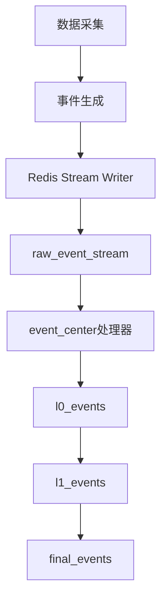

# 部署准备

<cite>
**本文档中引用的文件**  
- [requirements.txt](file://requirements.txt)
- [agent_server/config.py](file://agent_server/config.py)
- [api/application/settings.py](file://api/application/settings.py)
- [event_center/config.py](file://event_center/config.py)
- [data_server/binance/rest_binance/app/config.py](file://data_server/binance/rest_binance/app/config.py)
- [data_server/binance/ws_binance/utils/redis_client.py](file://data_server/binance/ws_binance/utils/redis_client.py)
- [data_server/binance/ws_binance/utils/trade_event_publisher.py](file://data_server/binance/ws_binance/utils/trade_event_publisher.py)
- [data_server/binance/rest_binance/app/utils/redis_stream.py](file://data_server/binance/rest_binance/app/utils/redis_stream.py)
- [api/main.py](file://api/main.py)
</cite>

## 目录
1. [系统概述](#系统概述)
2. [硬件环境要求](#硬件环境要求)
3. [软件环境要求](#软件环境要求)
4. [Python环境配置](#python环境配置)
5. [Redis服务部署与配置](#redis服务部署与配置)
6. [依赖库安装](#依赖库安装)
7. [Redis Stream事件队列配置](#redis-stream事件队列配置)
8. [AOF持久化配置](#aof持久化配置)
9. [部署方式前置条件](#部署方式前置条件)
10. [环境变量配置](#环境变量配置)
11. [各服务配置文件路径与关键参数](#各服务配置文件路径与关键参数)

## 系统概述
UTaker系统是一个基于多智能体架构的交易分析系统，依赖Python 3.10+、Redis 6.2+等核心组件。系统通过Redis Stream实现事件队列通信，各模块通过环境变量进行配置管理。

## 硬件环境要求
- **内存**：建议至少16GB RAM，其中Redis服务建议分配至少4GB专用内存
- **存储**：建议至少100GB SSD存储空间，用于系统运行、日志记录和数据库存储
- **CPU**：建议4核以上处理器，以支持多服务并发运行
- **网络**：稳定互联网连接，用于访问交易所API和外部服务

## 软件环境要求
- **操作系统**：Linux (Ubuntu 20.04/22.04) 或 macOS 12+
- **Python版本**：3.10或更高版本
- **Redis版本**：6.2或更高版本
- **数据库**：PostgreSQL 12+
- **可选部署工具**：Docker Engine 20.10+ 和 Docker Compose v2+

## Python环境配置
1. 安装Python 3.10+版本
2. 创建虚拟环境：
```bash
python -m venv venv
source venv/bin/activate  # Linux/macOS
# 或
venv\Scripts\activate     # Windows
```
3. 激活虚拟环境后进行后续依赖安装

**Section sources**
- [requirements.txt](file://requirements.txt)

## 依赖库安装
通过pip安装项目所需的所有依赖库：
```bash
pip install -r requirements.txt
```

该命令将安装包括a2a-sdk、aerich、aiohttp、aioredis、fastapi、pydantic、redis等在内的100+个依赖包。

**Section sources**
- [requirements.txt](file://requirements.txt)

## Redis服务部署与配置
### 安装Redis
建议使用版本6.2或更高版本：
```bash
# Ubuntu/Debian
sudo apt update
sudo apt install redis-server

# 或使用Docker
docker run --name redis-utaker -p 6379:6379 -d redis:6.2 --requirepass yourpassword
```

### 基本配置
Redis服务需要配置以下参数：
- **端口**：默认6379
- **密码认证**：建议启用密码保护
- **数据库数量**：至少需要1个数据库实例
- **内存限制**：建议设置maxmemory为4GB或更高

**Section sources**
- [agent_server/config.py](file://agent_server/config.py#L5-L9)
- [event_center/config.py](file://event_center/config.py#L7-L10)

## Redis Stream事件队列配置
UTaker系统使用Redis Stream作为事件队列机制，用于各组件间的消息传递。

### Stream键名配置
系统使用以下Stream键名：
- `raw_event_stream`：原始事件流
- `l0_events`：L0级处理事件
- `l1_events`：L1级聚合事件
- `final_events`：最终决策事件

### Stream写入配置
在`data_server/binance/rest_binance/app/utils/redis_stream.py`中配置了Stream写入器，支持批量写入事件到指定Stream。



**Diagram sources**
- [data_server/binance/rest_binance/app/utils/redis_stream.py](file://data_server/binance/rest_binance/app/utils/redis_stream.py)
- [event_center/config.py](file://event_center/config.py#L11-L14)

**Section sources**
- [data_server/binance/rest_binance/app/utils/redis_stream.py](file://data_server/binance/rest_binance/app/utils/redis_stream.py)
- [event_center/config.py](file://event_center/config.py#L11-L14)

## AOF持久化配置
为保障Redis数据安全，建议启用AOF（Append Only File）持久化机制。

### AOF配置建议
在redis.conf中配置：
```
appendonly yes
appendfilename "appendonly.aof"
appendfsync everysec
no-appendfsync-on-rewrite yes
auto-aof-rewrite-percentage 100
auto-aof-rewrite-min-size 64mb
```

### 配置说明
- **appendonly**：启用AOF持久化
- **appendfsync**：每秒同步一次，平衡性能与数据安全
- **auto-aof-rewrite**：自动重写AOF文件，防止文件过大

**Section sources**
- [event_center/config.py](file://event_center/config.py)

## 部署方式前置条件
### Docker部署
Docker部署需要以下前置条件：
- **Docker Engine**：20.10或更高版本
- **Docker Compose**：v2或更高版本
- **网络配置**：确保容器间网络互通
- **存储卷**：为Redis和PostgreSQL配置持久化存储卷

### Supervisor进程管理部署
Supervisor部署需要以下前置条件：
- **Supervisor服务**：已安装并运行
- **进程配置文件**：为每个服务创建独立的配置文件
- **日志目录**：配置日志文件存储路径和轮转策略
- **环境变量**：确保Supervisor能正确加载环境变量

**Section sources**
- [api/main.py](file://api/main.py)
- [agent_server/config.py](file://agent_server/config.py)

## 环境变量配置
### 核心环境变量
| 环境变量 | 说明 | 默认值 | 示例 |
|--------|------|-------|------|
| REDIS_HOST | Redis服务器地址 | 127.0.0.1 | redis.example.com |
| REDIS_PORT | Redis端口 | 6379 | 6379 |
| REDIS_PASSWORD | Redis密码 | 无 | mysecretpassword |
| REDIS_DB | Redis数据库编号 | 1 | 1 |
| DB_HOST | PostgreSQL主机 | 127.0.0.1 | db.example.com |
| DB_PORT | PostgreSQL端口 | 5432 | 5432 |
| DB_USER | PostgreSQL用户 | postgres | utaker_user |
| DB_PASSWORD | PostgreSQL密码 | apeyes | dbpassword |
| DB_DATABASE | PostgreSQL数据库名 | utaker | utaker_prod |
| APP_TIMEZONE | 应用时区 | Asia/Shanghai | UTC |

### 敏感信息管理
敏感信息如API密钥应通过环境变量管理：
- **BINANCE_API_KEY**：币安API密钥
- **BINANCE_API_SECRET**：币安API密钥
- **JWT_SECRET**：JWT令牌密钥
- **LLM_API_KEY**：大语言模型API密钥

建议使用.env文件或环境变量注入方式管理，避免硬编码在代码中。

**Section sources**
- [agent_server/config.py](file://agent_server/config.py#L5-L9)
- [api/application/settings.py](file://api/application/settings.py#L8-L12)
- [event_center/config.py](file://event_center/config.py#L7-L10)

## 各服务配置文件路径与关键参数
### agent_server配置
- **路径**：`agent_server/config.py`
- **关键参数**：
  - `redis_host`：Redis主机地址
  - `redis_port`：Redis端口
  - `api_base_url`：API基础URL
  - `rate_limits_seconds`：速率限制配置

### api服务配置
- **路径**：`api/application/settings.py`
- **关键参数**：
  - `TORTOISE_ORM`：ORM数据库配置
  - `DB_HOST`：数据库主机
  - `DB_PORT`：数据库端口
  - `APP_TIMEZONE`：应用时区

### event_center配置
- **路径**：`event_center/config.py`
- **关键参数**：
  - `redis_host`：Redis主机
  - `raw_stream`：原始事件流名称
  - `l0_stream`：L0事件流名称
  - `final_stream`：最终事件流名称

### data_server配置
- **路径**：`data_server/binance/rest_binance/app/config.py`
- **关键参数**：
  - `redis_host`：Redis主机
  - `rate_limits_seconds`：速率限制
  - `proxy_mode`：代理模式开关

**Section sources**
- [agent_server/config.py](file://agent_server/config.py)
- [api/application/settings.py](file://api/application/settings.py)
- [event_center/config.py](file://event_center/config.py)
- [data_server/binance/rest_binance/app/config.py](file://data_server/binance/rest_binance/app/config.py)