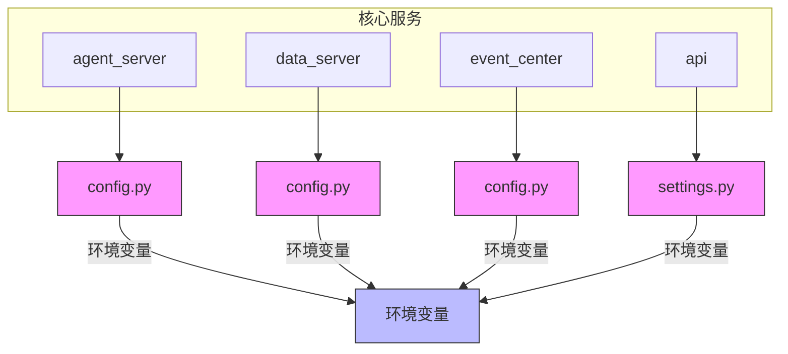
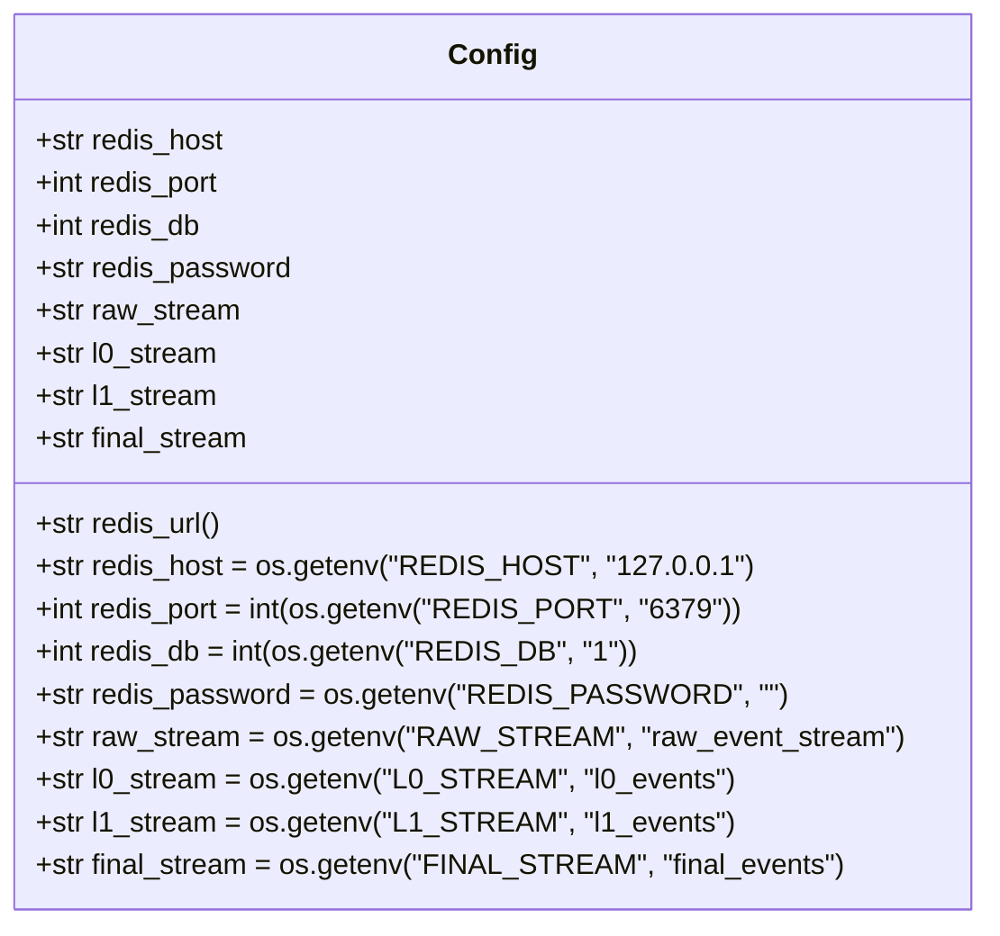
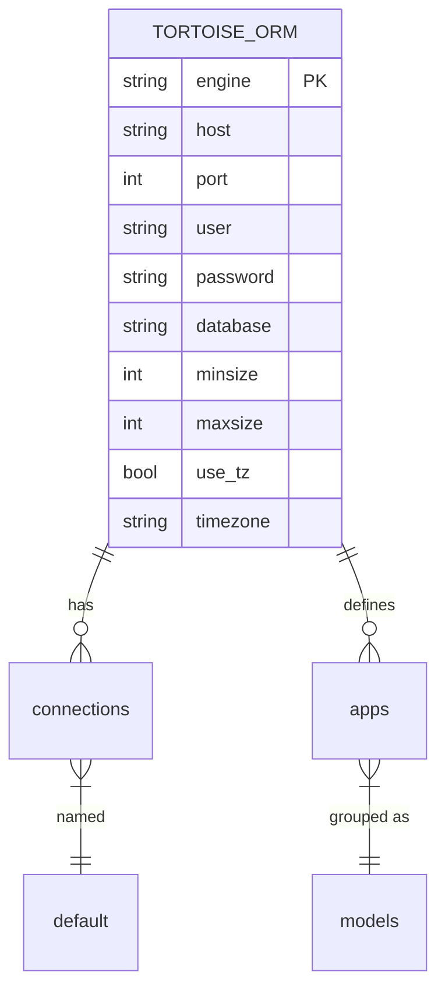
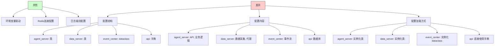
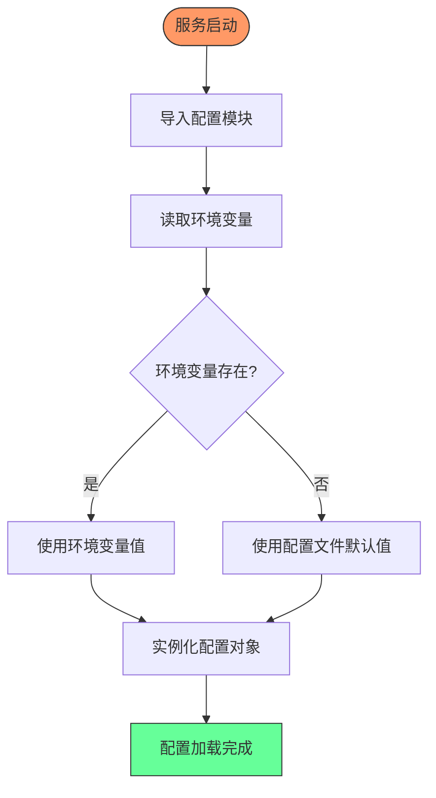

# 核心服务配置

<cite>
**本文档引用的文件**
- [agent_server/config.py](file://agent_server/config.py)
- [data_server/binance/rest_binance/app/config.py](file://data_server/binance/rest_binance/app/config.py)
- [event_center/config.py](file://event_center/config.py)
- [api/application/settings.py](file://api/application/settings.py)
- [api/main.py](file://api/main.py)
- [data_server/binance/rest_binance/app/main.py](file://data_server/binance/rest_binance/app/main.py)
</cite>

## 目录
1. [简介](#简介)
2. [服务配置结构概览](#服务配置结构概览)
3. [agent_server 配置详解](#agent_server-配置详解)
4. [data_server 配置详解](#data_server-配置详解)
5. [event_center 配置详解](#event_center-配置详解)
6. [api 服务配置详解](#api-服务配置详解)
7. [配置共性与差异分析](#配置共性与差异分析)
8. [配置最佳实践](#配置最佳实践)
9. [配置加载机制](#配置加载机制)
10. [结论](#结论)

## 简介
本文档详细说明了UTaker系统中四大核心服务（agent_server、data_server、event_center和api）的Python配置文件结构。文档将深入解析每个配置项的功能，包括Redis连接参数、日志级别、数据采集频率、API端口绑定和WebSocket重连策略等。通过代码实例展示配置加载机制，并指出各服务间配置的共性与差异，为用户提供配置最佳实践和环境变量映射关系的全面指导。

## 服务配置结构概览
UTaker系统的四大核心服务各自拥有独立的配置文件，采用Python类或字典结构定义配置项。这些配置文件主要通过环境变量进行值的覆盖，实现了配置的灵活性和可移植性。各服务的配置文件位于各自的服务目录下，如agent_server的配置位于`agent_server/config.py`，data_server的配置位于`data_server/binance/rest_binance/app/config.py`等。



**图示来源**
- [agent_server/config.py](file://agent_server/config.py)
- [data_server/binance/rest_binance/app/config.py](file://data_server/binance/rest_binance/app/config.py)
- [event_center/config.py](file://event_center/config.py)
- [api/application/settings.py](file://api/application/settings.py)

**本节来源**
- [agent_server/config.py](file://agent_server/config.py)
- [data_server/binance/rest_binance/app/config.py](file://data_server/binance/rest_binance/app/config.py)
- [event_center/config.py](file://event_center/config.py)
- [api/application/settings.py](file://api/application/settings.py)

## agent_server 配置详解
agent_server服务的配置文件位于`agent_server/config.py`，采用Python类`Settings`定义配置项。该配置类通过`os.environ.get()`方法从环境变量中获取配置值，若环境变量未设置则使用默认值。

主要配置项包括：
- **Redis连接参数**：`redis_host`、`redis_port`、`redis_db`和`redis_password`用于配置与Redis服务器的连接。
- **API基础URL**：`api_base_url`配置了API服务的基础URL。
- **速率限制**：`rate_limits_seconds`字典定义了不同时间间隔的请求速率限制。
- **HTTP超时**：`http_timeout_s`配置了HTTP请求的超时时间（秒）。
- **日志级别**：`log_level`配置了日志输出级别。

此外，配置文件还定义了多个全局字典，如`EVENT_TEAM_MAP`、`TEAM_TEMPLATES`、`SCORING_WEIGHTS`和`PIPELINE_OPTIONS`，用于配置事件处理团队映射、团队模板、评分权重和管道选项等业务逻辑。

```mermaid
classDiagram
class Settings {
+str redis_host
+str redis_password
+int redis_port
+int redis_db
+str api_base_url
+dict rate_limits_seconds
+int http_timeout_s
+str log_level
}
Settings : +str redis_host = os.environ.get('REDIS_HOST', '127.0.0.1')
Settings : +str redis_password = os.environ.get('REDIS_PASSWORD', None)
Settings : +int redis_port = int(os.environ.get('REDIS_PORT', 6379))
Settings : +int redis_db = int(os.environ.get('REDIS_BD', 1))
Settings : +str api_base_url = os.environ.get('API_BASE_URL', 'http : //localhost : 9931/api')
Settings : +dict rate_limits_seconds = {'1m' : 60, '5m' : 150, ...}
Settings : +int http_timeout_s = 10
Settings : +str log_level = "INFO"
```

**图示来源**
- [agent_server/config.py](file://agent_server/config.py#L5-L22)

**本节来源**
- [agent_server/config.py](file://agent_server/config.py#L1-L61)

## data_server 配置详解
data_server服务的配置文件位于`data_server/binance/rest_binance/app/config.py`，同样采用Python类`Settings`定义配置项。该配置类的结构与agent_server类似，但包含了一些特定于数据采集的配置。

主要配置项包括：
- **Redis连接参数**：与agent_server相同，用于配置Redis连接。
- **速率限制**：`rate_limits_seconds`字典定义了数据采集的速率限制，其值与agent_server有所不同，以适应不同的采集需求。
- **HTTP超时**：`http_timeout_s`配置了HTTP请求的超时时间。
- **日志级别**：`log_level`配置了日志输出级别。
- **HTTP代理**：`http_proxy`字典配置了HTTP代理服务器的地址。
- **代理模式**：`proxy_mode`布尔值用于控制是否启用本地调试代理。

data_server的配置特别关注数据采集的频率和网络连接的稳定性，通过`rate_limits_seconds`配置项精确控制不同时间间隔的数据采集频率，避免对交易所API造成过大的请求压力。

```mermaid
classDiagram
class Settings {
+str redis_host
+str redis_password
+int redis_port
+int redis_db
+dict rate_limits_seconds
+int http_timeout_s
+str log_level
+dict http_proxy
+bool proxy_mode
}
Settings : +str redis_host = os.environ.get('REDIS_HOST', '127.0.0.1')
Settings : +str redis_password = os.environ.get('REDIS_PASSWORD', None)
Settings : +int redis_port = int(os.environ.get('REDIS_PORT', 6379))
Settings : +int redis_db = int(os.environ.get('REDIS_BD', 1))
Settings : +dict rate_limits_seconds = {'1m' : 20, '5m' : 150, ...}
Settings : +int http_timeout_s = 10
Settings : +str log_level = "INFO"
Settings : +dict http_proxy = {"http" : "http : //127.0.0.1 : 1088"}
Settings : +bool proxy_mode = True
```

**图示来源**
- [data_server/binance/rest_binance/app/config.py](file://data_server/binance/rest_binance/app/config.py#L4-L20)

**本节来源**
- [data_server/binance/rest_binance/app/config.py](file://data_server/binance/rest_binance/app/config.py#L1-L26)

## event_center 配置详解
event_center服务的配置文件位于`event_center/config.py`，采用Python `dataclass`装饰的`Config`类定义配置项。该配置类通过`os.getenv()`方法从环境变量中获取配置值。

主要配置项包括：
- **Redis连接参数**：`redis_host`、`redis_port`、`redis_db`和`redis_password`用于配置与Redis服务器的连接。
- **Redis流名称**：`raw_stream`、`l0_stream`、`l1_stream`和`final_stream`配置了不同级别的事件流名称。
- **Redis URL**：`redis_url`属性方法根据配置项生成Redis连接URL。

event_center的配置特别关注事件流的管理和处理，通过不同的流名称配置，实现了事件的分级处理和存储。



**图示来源**
- [event_center/config.py](file://event_center/config.py#L5-L14)

**本节来源**
- [event_center/config.py](file://event_center/config.py#L1-L23)

## api 服务配置详解
api服务的配置文件位于`api/application/settings.py`，采用Python字典`TORTOISE_ORM`定义数据库配置。该配置文件主要配置了与PostgreSQL数据库的连接参数。

主要配置项包括：
- **数据库连接**：配置了数据库的主机、端口、用户名、密码、数据库名和连接池大小。
- **时区设置**：配置了应用程序的时区。

api服务的配置还通过`pyproject.toml`文件中的`[tool.aerich]`部分指定了Tortoise ORM配置的路径，实现了配置的集中管理。



**图示来源**
- [api/application/settings.py](file://api/application/settings.py#L3-L34)

**本节来源**
- [api/application/settings.py](file://api/application/settings.py#L1-L34)
- [api/main.py](file://api/main.py#L1-L14)

## 配置共性与差异分析
通过对四大核心服务的配置文件进行分析，可以发现它们在配置结构和使用方式上存在明显的共性和差异。

### 共性
1. **环境变量驱动**：所有服务的配置都优先从环境变量中获取值，若环境变量未设置则使用默认值。这种设计使得配置可以在不同环境中灵活调整，而无需修改代码。
2. **Redis连接配置**：agent_server、data_server和event_center都配置了Redis连接参数，包括主机、端口、数据库和密码。这表明Redis在系统中扮演着核心的数据存储和消息传递角色。
3. **日志级别配置**：agent_server和data_server都配置了日志级别，便于在不同环境下调整日志输出的详细程度。

### 差异
1. **配置结构**：agent_server和data_server使用Python类定义配置，而event_center使用`dataclass`，api服务则使用字典。这种差异反映了不同服务对配置复杂度的需求。
2. **配置内容**：各服务的配置内容根据其功能需求有所不同。agent_server关注API和业务逻辑配置，data_server关注数据采集和网络代理配置，event_center关注事件流管理，api服务关注数据库连接。
3. **配置加载方式**：agent_server和data_server通过实例化配置类来使用配置，event_center通过实例化`dataclass`来使用配置，api服务则直接使用字典配置。



**图示来源**
- [agent_server/config.py](file://agent_server/config.py)
- [data_server/binance/rest_binance/app/config.py](file://data_server/binance/rest_binance/app/config.py)
- [event_center/config.py](file://event_center/config.py)
- [api/application/settings.py](file://api/application/settings.py)

**本节来源**
- [agent_server/config.py](file://agent_server/config.py)
- [data_server/binance/rest_binance/app/config.py](file://data_server/binance/rest_binance/app/config.py)
- [event_center/config.py](file://event_center/config.py)
- [api/application/settings.py](file://api/application/settings.py)

## 配置最佳实践
为了确保系统的稳定运行和高效调试，以下是一些配置最佳实践：

### 数据采集频率设置
- **避免交易所限流**：在设置`rate_limits_seconds`时，应参考交易所的API速率限制文档，确保采集频率不会触发限流。例如，对于高频采集（如1分钟K线），应设置较长的采集间隔。
- **合理分配资源**：根据系统资源和业务需求，合理分配不同时间间隔的采集频率。对于低频数据（如日K线），可以设置较短的采集间隔，以确保数据的及时性。

### 日志级别调整
- **生产环境**：建议将`log_level`设置为"INFO"或"WARN"，以减少日志输出量，提高系统性能。
- **调试环境**：建议将`log_level`设置为"DEBUG"，以获取更详细的日志信息，便于问题排查。

### Redis连接优化
- **连接池大小**：根据并发需求调整Redis连接池大小，避免连接过多导致资源浪费或连接过少导致性能瓶颈。
- **密码安全**：在生产环境中，务必设置Redis密码，并通过环境变量传递，避免密码硬编码在配置文件中。

### 环境变量管理
- **统一管理**：建议使用`.env`文件统一管理环境变量，便于在不同环境中快速切换配置。
- **文档化**：应详细记录所有环境变量的含义和默认值，便于团队成员理解和使用。

**本节来源**
- [agent_server/config.py](file://agent_server/config.py)
- [data_server/binance/rest_binance/app/config.py](file://data_server/binance/rest_binance/app/config.py)
- [event_center/config.py](file://event_center/config.py)
- [api/application/settings.py](file://api/application/settings.py)

## 配置加载机制
UTaker系统的配置加载机制主要依赖于Python的模块导入和环境变量读取。各服务在启动时会导入各自的配置文件，并通过环境变量覆盖默认配置。

### 配置加载流程
1. **导入配置模块**：服务启动时，通过`import`语句导入配置模块。
2. **读取环境变量**：配置类或字典中的每个配置项都会调用`os.environ.get()`或`os.getenv()`方法，尝试从环境变量中读取值。
3. **使用默认值**：如果环境变量未设置，则使用配置中定义的默认值。
4. **实例化配置**：对于类或`dataclass`定义的配置，会实例化一个配置对象，供服务其他部分使用。

### 配置优先级
配置的优先级从高到低依次为：
1. **环境变量**：最高优先级，可以直接覆盖配置文件中的任何值。
2. **配置文件默认值**：次高优先级，在环境变量未设置时使用。
3. **硬编码默认值**：最低优先级，作为最后的备选值。

这种配置加载机制确保了配置的灵活性和可维护性，使得系统可以在不同环境中轻松部署和调整。



**图示来源**
- [agent_server/config.py](file://agent_server/config.py)
- [data_server/binance/rest_binance/app/config.py](file://data_server/binance/rest_binance/app/config.py)
- [event_center/config.py](file://event_center/config.py)
- [api/application/settings.py](file://api/application/settings.py)

**本节来源**
- [agent_server/config.py](file://agent_server/config.py)
- [data_server/binance/rest_binance/app/config.py](file://data_server/binance/rest_binance/app/config.py)
- [event_center/config.py](file://event_center/config.py)
- [api/application/settings.py](file://api/application/settings.py)

## 结论
本文档详细分析了UTaker系统中四大核心服务的配置文件结构，涵盖了配置项的功能、共性与差异、最佳实践和加载机制。通过环境变量驱动的配置方式，系统实现了高度的灵活性和可移植性。各服务根据其功能需求，采用了不同的配置结构和内容，但都遵循了统一的配置管理原则。建议在实际部署中，根据具体环境和需求，合理调整配置参数，以确保系统的稳定运行和高效性能。