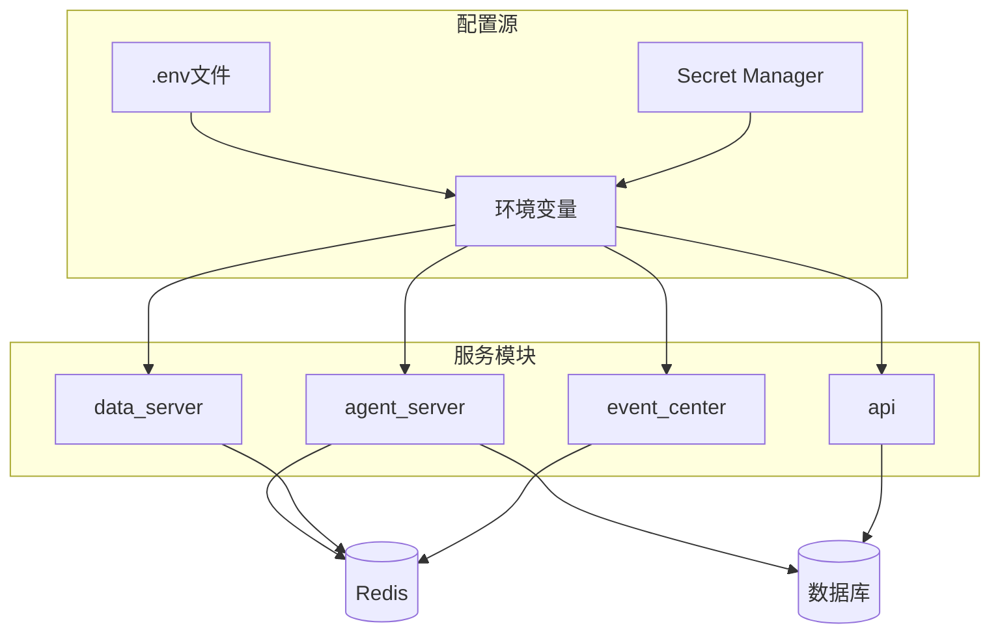
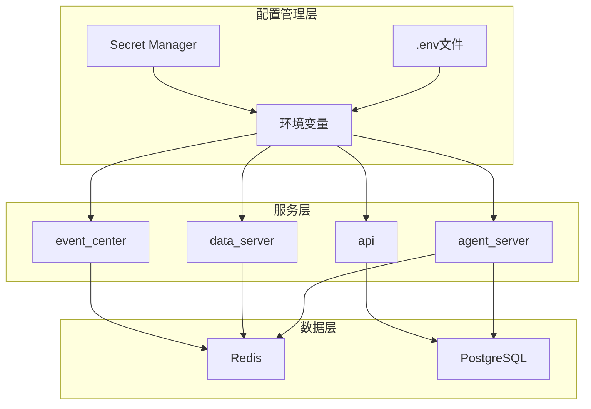
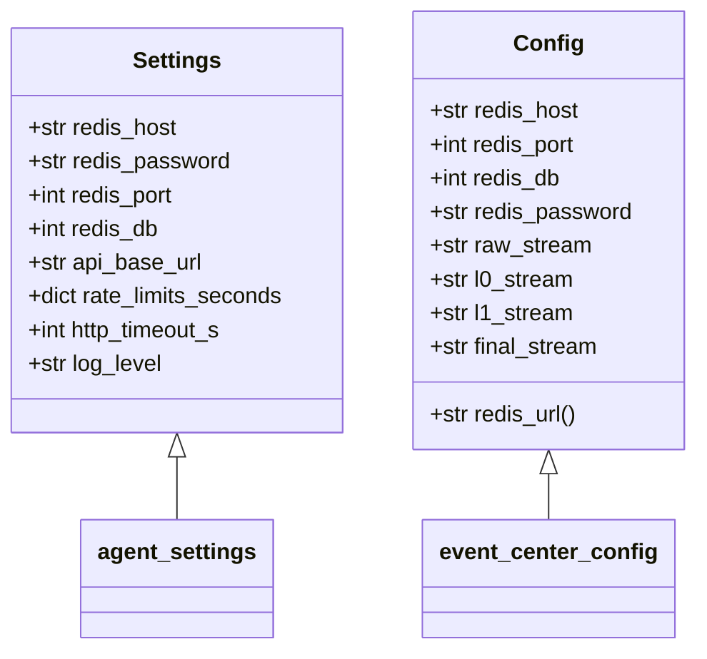
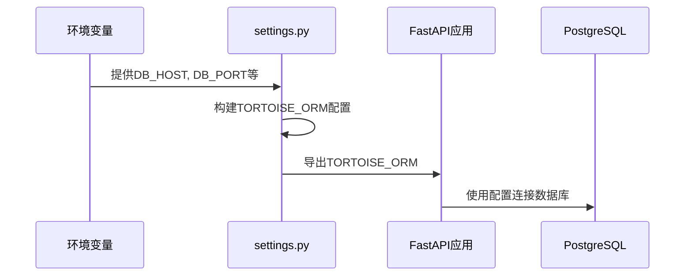
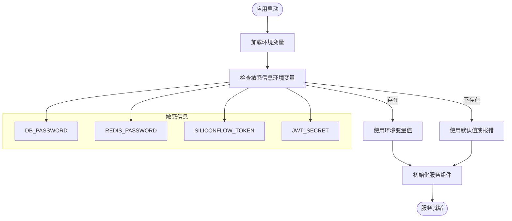
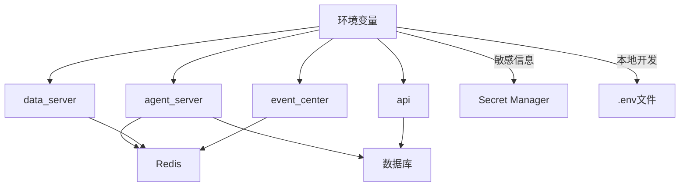

# 环境变量与敏感信息管理

<cite>
**本文档引用的文件**
- [agent_server/config.py](file://agent_server/config.py)
- [api/application/settings.py](file://api/application/settings.py)
- [data_server/binance/rest_binance/app/config.py](file://data_server/binance/rest_binance/app/config.py)
- [event_center/config.py](file://event_center/config.py)
- [agent_server/utils/db_utils.py](file://agent_server/utils/db_utils.py)
- [api/application/common/db_utils.py](file://api/application/common/db_utils.py)
- [agent_server/utils/watchers/final_events.py](file://agent_server/utils/watchers/final_events.py)
- [agent_server/agents/experts/analysis/news.py](file://agent_server/agents/experts/analysis/news.py)
- [agent_server/agents/experts/analysis/portfolio.py](file://agent_server/agents/experts/analysis/portfolio.py)
- [agent_server/agents/experts/analysis/technical.py](file://agent_server/agents/experts/analysis/technical.py)
- [api/application/apps/account/views.py](file://api/application/apps/account/views.py)
- [api/application/common/redis_client.py](file://api/application/common/redis_client.py)
- [data_server/binance/ws_binance/user_ws.py](file://data_server/binance/ws_binance/user_ws.py)
- [agent_server/configs/source.py](file://agent_server/configs/source.py)
</cite>

## 目录
1. [简介](#简介)
2. [项目结构与配置体系](#项目结构与配置体系)
3. [核心配置组件](#核心配置组件)
4. [架构概览](#架构概览)
5. [详细组件分析](#详细组件分析)
6. [依赖关系分析](#依赖关系分析)
7. [性能考量](#性能考量)
8. [故障排查指南](#故障排查指南)
9. [结论](#结论)

## 简介
本项目采用多服务架构，通过环境变量实现配置的灵活管理与敏感信息的安全处理。系统包含代理服务、API服务、数据服务和事件中心等多个组件，各服务通过统一的环境变量命名约定（如REDIS_HOST、DB_PASSWORD等）实现配置的外部化管理。敏感信息如API密钥、数据库凭证等均通过环境变量注入，避免在代码中硬编码。配置系统采用Python的os.environ.get和os.getenv方法实现默认值与环境覆盖机制，支持本地开发使用.env文件和生产环境使用Secret Manager的多种部署模式。

## 项目结构与配置体系
项目采用微服务架构，包含agent_server、api、data_server和event_center四个主要服务模块。每个服务模块都有独立的配置管理机制，但遵循统一的环境变量命名规范。配置体系以环境变量为核心，通过默认值机制确保服务在缺少环境变量时仍能正常启动。敏感信息如数据库密码、Redis密码、API密钥等均通过环境变量注入，实现了配置与代码的分离。

**图示来源**
- [agent_server/config.py](file://agent_server/config.py)
- [api/application/settings.py](file://api/application/settings.py)
- [data_server/binance/rest_binance/app/config.py](file://data_server/binance/rest_binance/app/config.py)
- [event_center/config.py](file://event_center/config.py)

**本节来源**
- [agent_server/config.py](file://agent_server/config.py)
- [api/application/settings.py](file://api/application/settings.py)

## 核心配置组件
系统通过多个配置类实现环境变量的管理。agent_server使用Settings类封装Redis和API配置，api服务通过TORTOISE_ORM字典配置数据库连接，data_server和event_center也实现了类似的配置机制。所有配置均采用"环境变量优先，配置文件默认值兜底"的原则，确保服务的灵活性和安全性。

**本节来源**
- [agent_server/config.py](file://agent_server/config.py#L5-L25)
- [api/application/settings.py](file://api/application/settings.py#L3-L34)
- [data_server/binance/rest_binance/app/config.py](file://data_server/binance/rest_binance/app/config.py#L4-L25)
- [event_center/config.py](file://event_center/config.py#L5-L23)

## 架构概览
系统采用分布式架构，各服务通过环境变量共享配置信息。Redis作为主要的消息中间件和缓存，其连接信息（主机、端口、密码、数据库）通过环境变量统一配置。数据库连接同样通过环境变量管理，确保不同环境（开发、测试、生产）可以使用不同的数据库实例。API密钥等敏感信息通过环境变量注入，避免在代码中暴露。

**图示来源**
- [agent_server/config.py](file://agent_server/config.py)
- [api/application/settings.py](file://api/application/settings.py)
- [data_server/binance/rest_binance/app/config.py](file://data_server/binance/rest_binance/app/config.py)
- [event_center/config.py](file://event_center/config.py)

## 详细组件分析

### 配置管理组件分析
系统各服务均实现了类似的配置管理模式，通过环境变量实现配置的外部化。这种设计模式提高了系统的灵活性和安全性，允许在不同部署环境中使用不同的配置而无需修改代码。

#### 配置类实现

**图示来源**
- [agent_server/config.py](file://agent_server/config.py#L5-L25)
- [event_center/config.py](file://event_center/config.py#L5-L23)

#### API服务配置流程

**图示来源**
- [api/application/settings.py](file://api/application/settings.py#L3-L34)
- [api/main.py](file://api/main.py#L1-L14)

#### 敏感信息处理流程

**图示来源**
- [agent_server/agents/experts/analysis/news.py](file://agent_server/agents/experts/analysis/news.py#L18)
- [api/application/apps/account/views.py](file://api/application/apps/account/views.py#L15)
- [agent_server/utils/db_utils.py](file://agent_server/utils/db_utils.py#L25-L29)

**本节来源**
- [agent_server/config.py](file://agent_server/config.py)
- [api/application/settings.py](file://api/application/settings.py)
- [event_center/config.py](file://event_center/config.py)
- [agent_server/utils/db_utils.py](file://agent_server/utils/db_utils.py)
- [api/application/common/db_utils.py](file://api/application/common/db_utils.py)

### 环境变量参考表
以下是系统中所有可被环境变量覆盖的配置项及其对应环境变量名的完整参考表：

| 配置项 | 环境变量名 | 默认值 | 服务模块 | 说明 |
|--------|------------|--------|---------|------|
| Redis主机 | REDIS_HOST | 127.0.0.1 | 所有服务 | Redis服务器地址 |
| Redis端口 | REDIS_PORT | 6379 | 所有服务 | Redis服务器端口 |
| Redis密码 | REDIS_PASSWORD | None | 所有服务 | Redis认证密码 |
| Redis数据库 | REDIS_DB | 1 | 所有服务 | Redis数据库编号 |
| 数据库主机 | DB_HOST | 127.0.0.1 | agent_server, api | PostgreSQL服务器地址 |
| 数据库端口 | DB_PORT | 5432 | agent_server, api | PostgreSQL服务器端口 |
| 数据库用户 | DB_USER | postgres | agent_server, api | 数据库连接用户名 |
| 数据库密码 | DB_PASSWORD | apeyes | agent_server, api | 数据库连接密码 |
| 数据库名称 | DB_DATABASE | utaker | agent_server, api | 数据库名称 |
| API基础URL | API_BASE_URL | http://localhost:9931/api | agent_server | API服务基础地址 |
| HTTP超时时间 | HTTP_TIMEOUT_S | 10 | agent_server, data_server | HTTP请求超时时间(秒) |
| 日志级别 | LOG_LEVEL | INFO | 所有服务 | 应用日志级别 |
| 最终事件流 | FINAL_STREAM | final_events | event_center, agent_server | 最终事件Redis流名称 |
| L0事件流 | L0_STREAM | l0_events | event_center | L0事件Redis流名称 |
| L1事件流 | L1_STREAM | l1_events | event_center | L1事件Redis流名称 |
| 原始事件流 | RAW_STREAM | raw_event_stream | event_center | 原始事件Redis流名称 |
| Web应用主机 | APP_HOST | 0.0.0.0 | api | Web应用监听主机 |
| Web应用端口 | APP_PORT | 8000 | api | Web应用监听端口 |
| 调试模式 | APP_DEBUG | False | api | 是否启用调试模式 |
| 时区 | APP_TIMEZONE | Asia/Shanghai | api | 应用时区 |
| 代理模式 | PROXY_MODE | True | data_server | 是否启用代理模式 |
| HTTP代理 | HTTP_PROXY | http://127.0.0.1:1088 | data_server | HTTP代理地址 |
| 最小最终优先级 | AGENT_MIN_FINAL_PRIORITY | medium | agent_server | 代理处理的最小事件优先级 |
| 仅升级事件 | AGENT_ONLY_UPGRADED | false | agent_server | 是否仅处理升级事件 |
| 冷却时间 | AGENT_FINAL_COOLDOWN_S | 600 | agent_server | 事件处理冷却时间(秒) |
| 去重时间 | AGENT_FINAL_DEDUP_S | 120 | agent_server | 事件去重时间窗口(秒) |
| JWT密钥 | JWT_SECRET | None | api | JWT令牌签名密钥 |
| LLM API密钥 | SILICONFLOW_TOKEN | None | agent_server | LLM服务API密钥 |

**本节来源**
- [agent_server/config.py](file://agent_server/config.py)
- [api/application/settings.py](file://api/application/settings.py)
- [data_server/binance/rest_binance/app/config.py](file://data_server/binance/rest_binance/app/config.py)
- [event_center/config.py](file://event_center/config.py)
- [agent_server/utils/watchers/final_events.py](file://agent_server/utils/watchers/final_events.py#L24-L27)
- [api/application/apps/account/views.py](file://api/application/apps/account/views.py#L15)

## 依赖关系分析
系统各服务通过环境变量共享配置信息，形成了松耦合的依赖关系。Redis和数据库作为共享资源，其连接配置通过环境变量统一管理。各服务独立部署但共享配置命名空间，确保了配置的一致性和可维护性。

**图示来源**
- [agent_server/config.py](file://agent_server/config.py)
- [api/application/settings.py](file://api/application/settings.py)
- [data_server/binance/rest_binance/app/config.py](file://data_server/binance/rest_binance/app/config.py)
- [event_center/config.py](file://event_center/config.py)

**本节来源**
- [agent_server/config.py](file://agent_server/config.py)
- [api/application/settings.py](file://api/application/settings.py)
- [requirements.txt](file://requirements.txt)

## 性能考量
环境变量的加载在应用启动时完成，对运行时性能影响极小。通过连接池管理数据库和Redis连接，减少了频繁建立连接的开销。配置的外部化使得服务可以快速适应不同环境，提高了部署效率。建议在生产环境中使用Secret Manager而非环境变量文件，以提高安全性而不影响性能。

## 故障排查指南
当遇到配置相关问题时，可按以下步骤排查：
1. 检查环境变量是否正确设置
2. 验证敏感信息（如密码、密钥）是否正确
3. 确认服务是否有权限访问Secret Manager（如使用）
4. 检查默认值是否符合预期
5. 验证配置文件中的环境变量名是否正确

**本节来源**
- [agent_server/config.py](file://agent_server/config.py)
- [api/application/settings.py](file://api/application/settings.py)
- [agent_server/utils/db_utils.py](file://agent_server/utils/db_utils.py)

## 结论
本系统通过环境变量实现了配置的灵活管理与敏感信息的安全处理。采用"环境变量优先，配置文件默认值兜底"的设计模式，既保证了安全性又提高了部署的灵活性。建议在生产环境中使用Secret Manager管理敏感信息，在本地开发时使用.env文件，并避免在代码中硬编码任何配置信息。配置热加载需要重启服务才能生效，因此在生产环境中修改配置后需要重新部署服务。