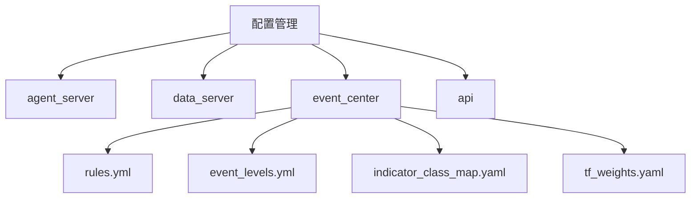

# 配置管理

<cite>
**本文档引用文件**  
- [agent_server/config.py](file://agent_server/config.py)
- [data_server/binance/rest_binance/app/config.py](file://data_server/binance/rest_binance/app/config.py)
- [event_center/config.py](file://event_center/config.py)
- [event_center/rules.yml](file://event_center/rules.yml)
- [event_center/event_levels.yml](file://event_center/event_levels.yml)
- [event_center/indicators_event/config/indicator_class_map.yaml](file://event_center/indicators_event/config/indicator_class_map.yaml)
- [event_center/indicators_event/config/tf_weights.yaml](file://event_center/indicators_event/config/tf_weights.yaml)
- [event_center/indicators_event_plugins/config/combo_params.yml](file://event_center/indicators_event_plugins/config/combo_params.yml)
- [event_center/indicators_event_plugins/config/meta_weights.yml](file://event_center/indicators_event_plugins/config/meta_weights.yml)
- [api/application/settings.py](file://api/application/settings.py)
</cite>

## 目录
1. [引言](#引言)
2. [服务配置概览](#服务配置概览)
3. [agent_server 配置详解](#agent_server-配置详解)
4. [data_server 配置详解](#data_server-配置详解)
5. [event_center 配置详解](#event_center-配置详解)
6. [api 服务配置详解](#api-服务配置详解)
7. [YAML 配置文件解析](#yaml-配置文件解析)
8. [环境变量覆盖机制](#环境变量覆盖机制)
9. [敏感信息安全管理](#敏感信息安全管理)
10. [配置热加载建议](#配置热加载建议)
11. [常见配置错误排查](#常见配置错误排查)

## 引言
UTaker 系统由多个核心服务组成，包括 agent_server、data_server、event_center 和 api 服务。每个服务通过独立的配置文件管理其运行参数。本文档系统性地介绍各服务的配置结构与关键参数含义，重点解析 event_center 中的 YAML 配置文件作用，并提供配置管理的最佳实践。

## 服务配置概览
UTaker 各服务均采用模块化配置方式，主要通过 Python 类或数据类定义默认配置，并支持通过环境变量进行动态覆盖。Redis 连接、日志级别、API 密钥等通用参数在各服务中均有体现，而特定业务逻辑则通过 YAML 文件进行精细化控制。

**图示来源**  
- [agent_server/config.py](file://agent_server/config.py)
- [data_server/binance/rest_binance/app/config.py](file://data_server/binance/rest_binance/app/config.py)
- [event_center/config.py](file://event_center/config.py)
- [event_center/rules.yml](file://event_center/rules.yml)

## agent_server 配置详解
agent_server 的配置文件 `config.py` 定义了 Redis 连接参数、API 基础 URL、速率限制、日志级别等核心参数。通过 `Settings` 类封装，支持环境变量覆盖。

关键配置项：
- **redis_host**: Redis 服务器地址，默认为 `127.0.0.1`
- **redis_port**: Redis 端口，默认为 `6379`
- **api_base_url**: API 服务基础地址，默认为 `http://localhost:9931/api`
- **rate_limits_seconds**: 不同时间框架的采集间隔限制
- **log_level**: 日志输出级别，默认为 `INFO`

此外，还定义了事件团队映射（EVENT_TEAM_MAP）、团队模板（TEAM_TEMPLATES）、评分权重（SCORING_WEIGHTS）和流水线选项（PIPELINE_OPTIONS），用于控制分析流程的行为模式。

**本节来源**  
- [agent_server/config.py](file://agent_server/config.py#L1-L61)

## data_server 配置详解
data_server 的配置文件位于 `data_server/binance/rest_binance/app/config.py`，结构与 agent_server 类似，但包含代理设置等特殊参数。

关键配置项：
- **redis_host/port/db/password**: Redis 连接信息
- **rate_limits_seconds**: 各时间框架的请求频率限制
- **http_timeout_s**: HTTP 请求超时时间（秒）
- **log_level**: 日志级别
- **http_proxy**: HTTP 代理设置，用于本地调试
- **proxy_mode**: 是否启用代理模式

该配置确保数据采集服务能够稳定地从 Binance 获取市场数据，并通过 Redis 流进行分发。

**本节来源**  
- [data_server/binance/rest_binance/app/config.py](file://data_server/binance/rest_binance/app/config.py#L1-L26)

## event_center 配置详解
event_center 的 `config.py` 使用 `@dataclass` 定义配置，包含 Redis 连接和多个 Redis Stream 的命名。

关键配置项：
- **redis_host/port/db/password**: Redis 连接参数
- **raw_stream**: 原始事件流名称，默认为 `raw_event_stream`
- **l0_stream**: L0 处理后事件流名称
- **l1_stream**: L1 聚合事件流名称
- **final_stream**: 最终事件流名称

通过 `redis_url` 属性动态生成 Redis 连接字符串，支持密码认证。

**本节来源**  
- [event_center/config.py](file://event_center/config.py#L1-L23)

## api 服务配置详解
api 服务的配置位于 `api/application/settings.py`，主要定义数据库连接参数。

关键配置项：
- **DB_HOST/PORT/USER/PASSWORD/DATABASE**: PostgreSQL 数据库连接信息
- **DB_POOL_MINSIZE/MAXSIZE**: 连接池大小
- **APP_TIMEZONE**: 应用时区，默认为 `Asia/Shanghai`

使用 Tortoise ORM 进行异步数据库操作，支持账户和交易相关数据的持久化。

**本节来源**  
- [api/application/settings.py](file://api/application/settings.py#L1-L34)

## YAML 配置文件解析
event_center 使用多个 YAML 文件实现事件规则和指标映射的灵活配置。

### rules.yml：事件生成规则
定义事件的即时触发规则（instant_rules）和聚合规则（aggregation_rules）。每条规则包含 ID、描述、匹配条件和优先级。例如：
- `l0_unrealized_20`: 单笔浮亏达到或超过 20% 时触发，优先级为 critical
- `a1_cumulative_losses`: 30 分钟内累计出现 3 次浮亏 ≥5%，触发 high 优先级事件

支持基于时间窗口的事件聚合与抑制策略（如 cooldown_same_rule）。

**本节来源**  
- [event_center/rules.yml](file://event_center/rules.yml#L1-L88)

### event_levels.yml：事件分级标准
定义基于统计百分位的事件强度分级标准。例如：
- **force_spike_sell**: 通过 `delta_sell_qty` 和 `delta_sell` 的 p80-p99 百分位确定事件等级
- **force_buy_dominance**: 结合 `dominance_buy_ratio` 绝对值和 `delta_buy_qty` 百分位进行综合判断

每个指标可配置多个阈值，支持最大值（max）组合策略。

**本节来源**  
- [event_center/event_levels.yml](file://event_center/event_levels.yml#L1-L47)

### indicator_class_map.yaml：指标类型映射
将技术指标按类别进行映射，便于统一处理：
- **trend**: MA、EMA、MACD 等趋势类指标
- **momentum**: RSI、KDJ、威廉姆斯 R 等动量类指标
- **volatility**: 布林带、ATR 等波动率类指标
- **structure**: 支撑阻力、形态、分形等结构类指标

同时支持插件级别的分类映射。

**本节来源**  
- [event_center/indicators_event/config/indicator_class_map.yaml](file://event_center/indicators_event/config/indicator_class_map.yaml#L1-L22)

### tf_weights.yaml：时间框架权重
为不同时间框架分配权重，反映其在综合分析中的重要性：
- `1m`: 1.0
- `5m`: 1.5
- `1h`: 3.0
- `1d`: 4.5

时间框架越长，权重越高，体现长期信号的更高可信度。

**本节来源**  
- [event_center/indicators_event/config/tf_weights.yaml](file://event_center/indicators_event/config/tf_weights.yaml#L1-L9)

### combo_params.yml 与 meta_weights.yml
- **combo_params.yml**: 定义组合信号插件的参数阈值，如 ATR 比率、ADX 阈值、最小强度等
- **meta_weights.yml**: 定义触发因子和模式因子的权重，支持方向一致性奖励（direction_bonus）和冲突惩罚（direction_penalty）

这些配置实现了复杂信号组合的精细化控制。

**本节来源**  
- [event_center/indicators_event_plugins/config/combo_params.yml](file://event_center/indicators_event_plugins/config/combo_params.yml#L1-L88)
- [event_center/indicators_event_plugins/config/meta_weights.yml](file://event_center/indicators_event_plugins/config/meta_weights.yml#L1-L102)

## 环境变量覆盖机制
所有服务均支持通过环境变量覆盖默认配置。例如：
- `REDIS_HOST`: 覆盖 Redis 主机地址
- `REDIS_PORT`: 覆盖 Redis 端口
- `DB_PASSWORD`: 覆盖数据库密码
- `APP_TIMEZONE`: 覆盖应用时区

这种机制使得同一套代码可以在不同环境中灵活部署，无需修改源码。

**本节来源**  
- [agent_server/config.py](file://agent_server/config.py#L6)
- [data_server/binance/rest_binance/app/config.py](file://data_server/binance/rest_binance/app/config.py#L5)
- [event_center/config.py](file://event_center/config.py#L7)
- [api/application/settings.py](file://api/application/settings.py#L8)

## 敏感信息安全管理
建议将敏感信息（如 Redis 密码、数据库密码、API 密钥）通过环境变量注入，而非硬编码在配置文件中。可使用 `.env` 文件或容器编排平台的 Secret 机制进行管理。

生产环境中应限制配置文件的读取权限，并避免将包含敏感信息的配置提交至版本控制系统。

**本节来源**  
- [agent_server/config.py](file://agent_server/config.py#L7)
- [event_center/config.py](file://event_center/config.py#L10)
- [api/application/settings.py](file://api/application/settings.py#L11)

## 配置热加载建议
目前配置在服务启动时加载，不支持运行时动态刷新。如需实现热加载，建议：
1. 使用外部配置中心（如 Consul、Etcd）
2. 监听文件系统变化，重新加载 YAML 配置
3. 提供 HTTP 接口触发配置重载

对于 event_center 的规则文件，可通过监听 `rules.yml` 和 `event_levels.yml` 的修改实现事件规则的动态更新。

**本节来源**  
- [event_center/rules.yml](file://event_center/rules.yml)
- [event_center/event_levels.yml](file://event_center/event_levels.yml)

## 常见配置错误排查
1. **Redis 连接失败**：检查 `REDIS_HOST`、`REDIS_PORT`、`REDIS_PASSWORD` 是否正确
2. **数据库连接异常**：验证 `DB_HOST`、`DB_USER`、`DB_PASSWORD` 配置
3. **事件未触发**：确认 `rules.yml` 中的匹配条件与实际事件结构一致
4. **日志级别过高**：调整 `log_level` 为 `DEBUG` 以获取更多调试信息
5. **代理导致采集失败**：在生产环境关闭 `proxy_mode`

建议使用配置验证脚本在部署前检查配置文件的语法和逻辑正确性。

**本节来源**  
- [agent_server/config.py](file://agent_server/config.py)
- [event_center/config.py](file://event_center/config.py)
- [event_center/rules.yml](file://event_center/rules.yml)
- [api/application/settings.py](file://api/application/settings.py)