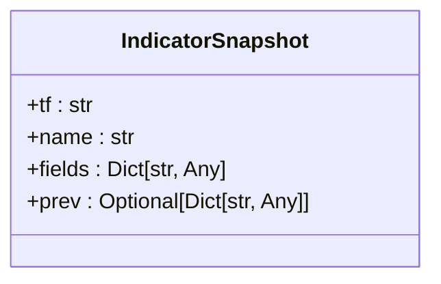
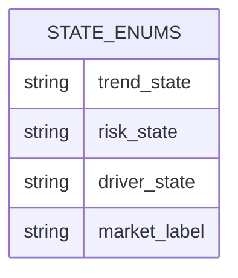
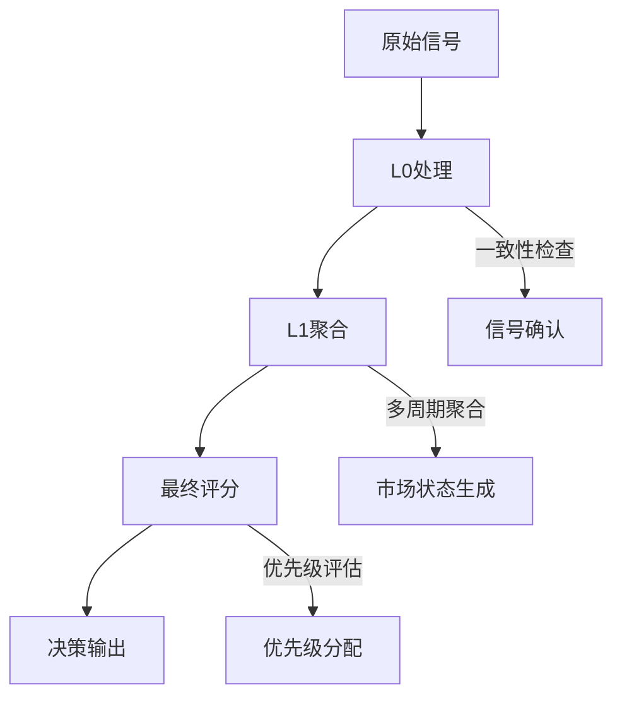
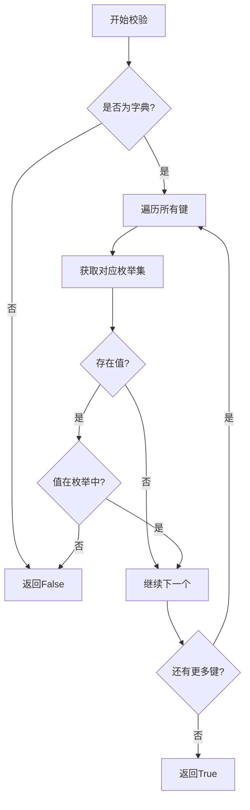

# 数据模型定义

<cite>
**本文档中引用的文件**  
- [event.py](file://event_center/indicators_event/models/event.py)
- [indicator.py](file://event_center/indicators_event/models/indicator.py)
- [schema.py](file://agent_server/memory/schema.py)
- [score_mapper.py](file://event_center/indicators_event/scoring/score_mapper.py)
- [l1_aggregator.py](file://event_center/pipeline/l1_aggregator.py)
- [l0_processor.py](file://event_center/pipeline/l0_processor.py)
- [final_grader.py](file://event_center/pipeline/final_grader.py)
- [tf_weights.yaml](file://event_center/indicators_event/config/tf_weights.yaml)
- [strength_weights.yaml](file://event_center/indicators_event/config/strength_weights.yaml)
- [indicator_class_map.yaml](file://event_center/indicators_event/config/indicator_class_map.yaml)
- [trade_event_recorder.py](file://agent_server/utils/trade_event_recorder.py)
</cite>

## 目录
1. [简介](#简介)
2. [事件模型结构](#事件模型结构)
3. [IndicatorSnapshot模型设计](#indicatorsnapshot模型设计)
4. [市场状态枚举与校验](#市场状态枚举与校验)
5. [事件生命周期与分类逻辑](#事件生命周期与分类逻辑)
6. [数据校验机制](#数据校验机制)
7. [典型数据实例](#典型数据实例)
8. [结论](#结论)

## 简介
本文档详细描述了系统中的核心数据模型，包括Event和IndicatorSnapshot两个关键实体的结构设计、字段语义以及业务含义。同时，基于schema.py中定义的状态枚举，说明了MarketState的合法状态值及其转换规则，并阐述了validate_state函数在数据校验中的作用。

## 事件模型结构

事件模型是系统中用于表示市场信号的核心数据结构，包含方向、优先级、分数和时间窗口等关键字段。这些字段共同决定了事件的业务意义和处理流程。

### 方向（direction）
- **数据类型**：字符串
- **合法值**：`bullish`（看涨）、`bearish`（看跌）、`neutral`（中性）
- **业务含义**：表示市场趋势的方向判断，是生成交易信号的基础依据。

### 优先级（priority）
- **数据类型**：字符串
- **合法值**：`low`、`medium`、`high`
- **业务含义**：根据市场状态自动分配，`trend`状态对应`high`，`range`对应`medium`，其他为`low`，影响事件处理的紧急程度。

### 分数（score）
- **数据类型**：浮点数
- **计算方式**：由时间框架权重（tf_weight）和强度权重（strength_weight）共同决定
- **业务含义**：量化信号的强弱程度，绝对值越大表示信号越强。

### 时间窗口（window）
- **数据类型**：对象数组
- **结构**：包含时间戳（ts）、插件类型（plugin）、方向（dir）、分数（score）、时间框架桶（bucket）等字段
- **业务含义**：维护一段时间内的信号历史，用于确认信号的一致性和稳定性。

**Section sources**
- [l1_aggregator.py](file://event_center/pipeline/l1_aggregator.py#L317-L369)
- [l0_processor.py](file://event_center/pipeline/l0_processor.py#L102-L130)
- [score_mapper.py](file://event_center/indicators_event/scoring/score_mapper.py#L35-L57)

## IndicatorSnapshot模型设计

IndicatorSnapshot模型用于记录技术指标的快照信息，支持前后值对比和序列化存储。

### 时间框架（tf）
- **数据类型**：字符串
- **示例值**：`1m`、`5m`、`1h`、`1d`
- **设计目的**：标识指标所属的时间周期，不同周期的指标具有不同的权重。

### 指标名称（name）
- **数据类型**：字符串
- **设计目的**：明确指标的类型，如`ma`、`rsi`、`boll`等，便于分类处理。

### 指标字段（fields）
- **数据类型**：键值对字典（Dict[str, Any]）
- **设计目的**：存储指标的具体数值和元数据，支持灵活扩展。
- **序列化方式**：使用JSON格式进行序列化存储。

### 前值（prev）
- **数据类型**：可选字典（Optional[Dict[str, Any]]）
- **设计目的**：记录上一次的指标值，用于计算变化率和趋势判断。
- **序列化方式**：与fields相同，采用JSON格式。



**Diagram sources**
- [indicator.py](file://event_center/indicators_event/models/indicator.py#L4-L9)

**Section sources**
- [indicator.py](file://event_center/indicators_event/models/indicator.py#L1-L10)

## 市场状态枚举与校验

基于schema.py中定义的STATE_ENUMS，MarketState包含多个维度的状态枚举。

### 合法枚举值

| 状态类型 | 合法值 |
|---------|-------|
| trend_state | unknown, bullish, bearish, neutral, weak_bullish, weak_bearish |
| risk_state | unknown, normal, elevated, high, extreme |
| driver_state | unknown, momentum_recovery, liquidity_recovery, funding_rise, macro_calm |
| market_label | unknown, vol_compression, trend_acceleration, range_bound |

### 状态转换规则
- 所有状态必须从枚举集合中选取，不允许自定义值
- `unknown`作为初始状态，表示尚未确定
- 状态转换需通过业务逻辑驱动，不能随意跳变



**Diagram sources**
- [schema.py](file://agent_server/memory/schema.py#L4-L8)

**Section sources**
- [schema.py](file://agent_server/memory/schema.py#L1-L19)

## 事件生命周期与分类逻辑

事件的生命周期从原始信号生成开始，经过多级处理最终形成决策依据。

### 分类逻辑
事件根据总分（total_score）被分为四个等级：
- **raw (1)**：绝对值 < 2，表示弱信号
- **l0 (2)**：绝对值 ≥ 2 且 < 4，表示初步确认信号
- **l1 (3)**：绝对值 ≥ 4 且 < 7，表示强信号
- **final (4)**：绝对值 ≥ 7，表示最终决策信号

该逻辑实现在`classify_event`函数中。

### 生命周期流程


**Diagram sources**
- [event.py](file://event_center/indicators_event/models/event.py#L1-L9)
- [l0_processor.py](file://event_center/pipeline/l0_processor.py#L102-L130)
- [l1_aggregator.py](file://event_center/pipeline/l1_aggregator.py#L317-L369)
- [final_grader.py](file://event_center/pipeline/final_grader.py#L236-L261)

**Section sources**
- [event.py](file://event_center/indicators_event/models/event.py#L1-L9)
- [l0_processor.py](file://event_center/pipeline/l0_processor.py#L102-L130)

## 数据校验机制

系统通过`validate_state`函数确保状态数据的合法性。

### 调用时机
- 在写入数据库前进行校验
- 在接收外部输入时进行验证
- 在状态转换时进行检查

### 异常处理策略
- 返回`False`表示校验失败
- 不抛出异常，由调用方决定后续处理
- 记录警告日志以便追踪问题数据



**Diagram sources**
- [schema.py](file://agent_server/memory/schema.py#L12-L19)

**Section sources**
- [schema.py](file://agent_server/memory/schema.py#L12-L19)

## 典型数据实例

### Event实例
```json
{
  "symbol": "BTCUSDT",
  "direction": "bullish",
  "signal_strength": 5.2,
  "level": 3,
  "priority": "high",
  "window": [
    {
      "ts": 1700000000000,
      "dir": "bullish",
      "score": 1.8,
      "bucket": "short"
    }
  ]
}
```

### IndicatorSnapshot实例
```json
{
  "tf": "1h",
  "name": "rsi",
  "fields": {
    "value": 65.5,
    "overbought": 70,
    "oversold": 30
  },
  "prev": {
    "value": 62.1
  }
}
```

### MarketState实例
```json
{
  "trend_state": "bullish",
  "risk_state": "normal",
  "driver_state": "momentum_recovery",
  "market_label": "trend_acceleration"
}
```

**Section sources**
- [l1_aggregator.py](file://event_center/pipeline/l1_aggregator.py#L341-L363)
- [final_grader.py](file://event_center/pipeline/final_grader.py#L243-L261)
- [trade_event_recorder.py](file://agent_server/utils/trade_event_recorder.py#L258-L291)

## 结论
本文档全面解析了系统中的核心数据模型，涵盖了事件模型的关键字段语义、IndicatorSnapshot的结构设计、市场状态的枚举规则以及数据校验机制。这些模型共同构成了系统的决策基础，确保了信号处理的准确性和一致性。