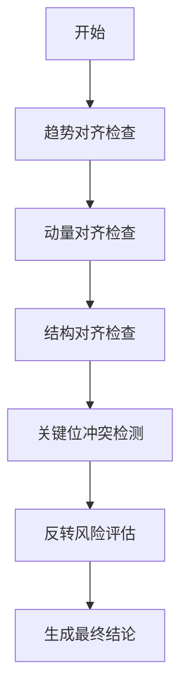

# 术语表

<cite>
**本文档中引用的文件**  
- [event.py](file://event_center/indicators_event/models/event.py)
- [force_stats.py](file://agent_server/agents/experts/analysis/force_stats.py)
- [tf_validation.py](file://agent_server/tools/tf_validation.py)
- [market_state.py](file://agent_server/agents/experts/background/market_state.py)
- [schema.py](file://agent_server/memory/schema.py)
- [l0_processor.py](file://event_center/pipeline/l0_processor.py)
- [l1_aggregator.py](file://event_center/pipeline/l1_aggregator.py)
- [final_grader.py](file://event_center/pipeline/final_grader.py)
- [indicator_class_map.yaml](file://event_center/indicators_event/config/indicator_class_map.yaml)
</cite>

## 目录
1. [L0/L1/Final事件分级体系](#l0l1final事件分级体系)
2. [ForceStats（资金流统计）](#forcestats资金流统计)
3. [Crowd State（人群状态）](#crowd-state人群状态)
4. [TF Validation（时间框架验证）](#tf-validation时间框架验证)
5. [Market State（市场状态）](#market-state市场状态)

## L0/L1/Final事件分级体系

本系统采用三级事件分级机制，通过信号强度评分实现从原始信号到最终决策信号的逐级过滤与升级。

### 事件等级定义
- **Raw（原始事件）**：来自各信号源的初始信号，未经验证或聚合
- **L0（一级事件）**：经过短期一致性验证的信号，具备基本方向性
- **L1（二级事件）**：跨时间框架聚合后的结构化市场状态信号
- **Final（最终事件）**：通过优先级门控和去抖动处理的可执行信号

### 评分阈值与等级映射关系
根据`event.py`中的`classify_event`函数，事件等级基于绝对评分进行划分：

```mermaid
flowchart TD
A[总评分] --> B{abs(评分) < 2?}
B --> |是| C[Raw事件]
B --> |否| D{abs(评分) < 4?}
D --> |是| E[L0事件]
D --> |否| F{abs(评分) < 7?}
F --> |是| G[L1事件]
F --> |否| H[Final事件]
```

**图示来源**  
- [event.py](file://event_center/indicators_event/models/event.py#L1-L10)

**本节来源**  
- [event.py](file://event_center/indicators_event/models/event.py#L1-L10)
- [l0_processor.py](file://event_center/pipeline/l0_processor.py#L1-L305)
- [l1_aggregator.py](file://event_center/pipeline/l1_aggregator.py#L1-L415)
- [final_grader.py](file://event_center/pipeline/final_grader.py#L1-L305)

## ForceStats（资金流统计）

ForceStats是基于订单流和资金流动态分析买卖压力的核心指标系统。

### 核心功能
- **买卖压力分析**：通过实时订单簿数据计算买方与卖方的力量对比
- **强度评估**：量化市场参与者的资金投入强度
- **主导性判断**：识别市场中占据主导地位的一方（买方或卖方）

### 实现机制
ForceStats专家系统通过大语言模型分析市场数据，生成结构化的资金流动态报告。系统配置在`configs/prompts/kline.py`中定义分析模板，输出结果存储于Redis中供后续处理。

**本节来源**  
- [force_stats.py](file://agent_server/agents/experts/analysis/force_stats.py#L1-L84)

## Crowd State（人群状态）

Crowd State作为市场情绪聚合指标，反映市场参与者整体行为模式。

### 定义与计算
人群状态通过多维度数据聚合生成，包括：
- 订单流行为模式
- 杠杆使用情况
- 仓位集中度
- 交易频率变化

### 风险评估应用
在风险管理系统中，Crowd State用于：
- 识别过度拥挤的交易方向
- 检测潜在的轧空或踩踏风险
- 评估市场反转的可能性
- 量化群体行为的极端程度

当人群状态显示高度一致的单向押注时，系统会提高相应风险等级，提示潜在的反向波动风险。

**本节来源**  
- [crowd_state_compactor.py](file://agent_server/agents/experts/background/crowd_state_compactor.py)
- [crowd_state_compactor.py](file://api/application/apps/background/crowd_state_compactor.py)

## TF Validation（时间框架验证）

时间框架验证是多周期信号一致性检验的关键流程。

### 验证流程
1. **数据加载**：从Redis读取指定交易对在多个时间周期的技术指标数据
2. **趋势对齐**：验证各周期均线系统是否呈现一致排列
3. **动量对齐**：检查MACD、RSI等动量指标的方向一致性
4. **结构对齐**：分析布林带位置等结构特征的支持程度
5. **关键位冲突检测**：识别价格是否接近重要支撑/阻力位
6. **反转风险评估**：综合波动率和位置判断潜在反转风险

### 结论生成
最终验证结论分为四种状态：
- **support**：多维度信号支持当前方向
- **partial_support**：部分信号支持
- **neutral**：信号中性
- **conflict**：存在明显冲突信号



**图示来源**  
- [tf_validation.py](file://agent_server/tools/tf_validation.py#L240-L257)

**本节来源**  
- [tf_validation.py](file://agent_server/tools/tf_validation.py#L1-L271)

## Market State（市场状态）

Market State描述市场的整体运行特征和状态枚举。

### 状态枚举定义
根据`schema.py`中的`STATE_ENUMS`定义，主要状态类别包括：

#### 趋势状态 (trend_state)
- **unknown**：未知状态
- **bullish**：明确的上升趋势
- **bearish**：明确的下降趋势
- **neutral**：无明显方向
- **weak_bullish**：偏强但未确认的上升态势
- **weak_bearish**：偏弱但未确认的下降态势

#### 风险状态 (risk_state)
- **unknown**：风险水平未知
- **normal**：正常风险水平
- **elevated**：风险升高
- **high**：高风险
- **extreme**：极端风险

#### 驱动状态 (driver_state)
- **unknown**：驱动因素不明
- **momentum_recovery**：动量恢复
- **liquidity_recovery**：流动性恢复
- **funding_rise**：资金费率上升
- **macro_calm**：宏观环境平静

#### 市场标签 (market_label)
- **unknown**：标签未知
- **vol_compression**：波动率压缩
- **trend_acceleration**：趋势加速
- **range_bound**：区间震荡

### 业务意义
这些状态枚举值为自动化交易系统提供了标准化的市场认知框架，使不同组件能够基于统一的状态语言进行协作。例如，当`risk_state`为"high"时，风控模块会自动收紧仓位限制；当`market_label`为"trend_acceleration"时，趋势跟踪策略会增加参与度。

**本节来源**  
- [schema.py](file://agent_server/memory/schema.py#L1-L19)
- [market_state.py](file://agent_server/agents/experts/background/market_state.py)