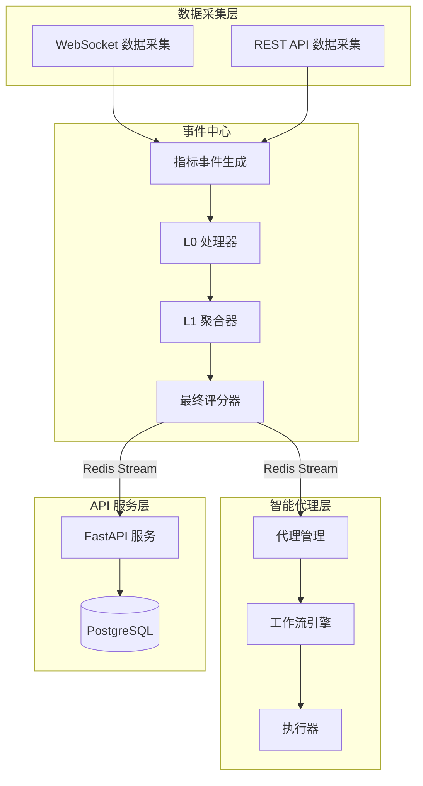
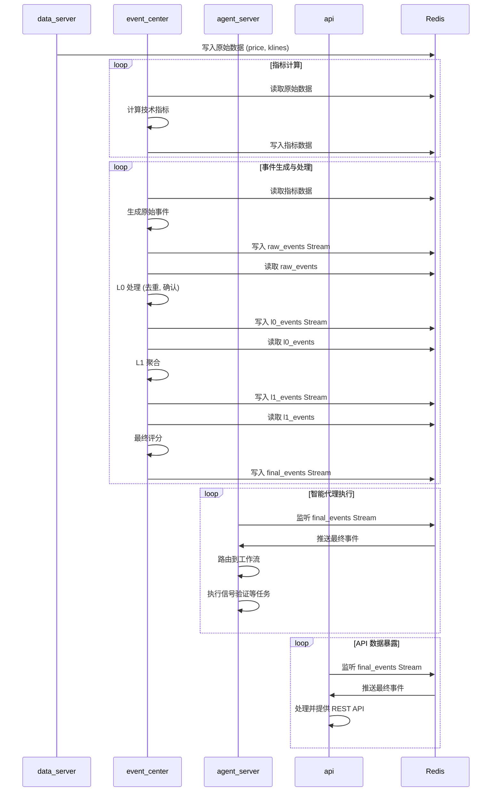
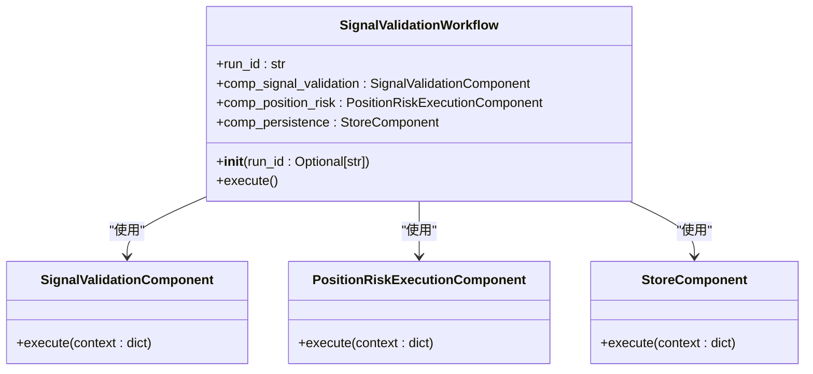
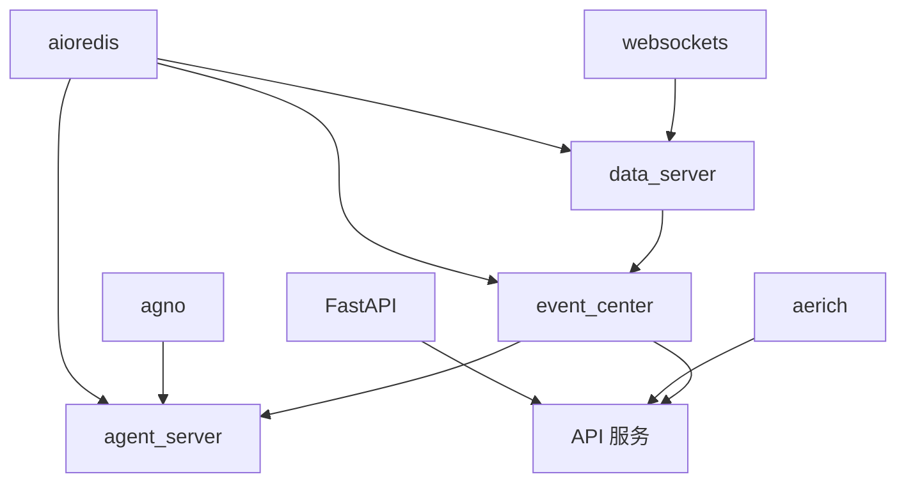

# 项目概述

<cite>
**本文档引用的文件**
- [main.go](file://agent_server/main.py)
- [api/main.py](file://api/main.py)
- [market_ws.py](file://data_server/binance/ws_binance/market_ws.py)
- [event_center/main.py](file://event_center/main.py)
- [background_main.py](file://agent_server/background_main.py)
- [final_listen_main.py](file://agent_server/final_listen_main.py)
- [indicators_event_generator.py](file://event_center/indicators_event_generator.py)
- [l0_processor.py](file://event_center/pipeline/l0_processor.py)
- [signal_validation_workflow.py](file://agent_server/agent_workflow/signal_validation_workflow.py)
- [config.py](file://agent_server/config.py)
- [settings.py](file://api/application/settings.py)
</cite>

## 目录
1. [简介](#简介)
2. [项目结构](#项目结构)
3. [核心组件](#核心组件)
4. [架构概览](#架构概览)
5. [详细组件分析](#详细组件分析)
6. [依赖分析](#依赖分析)
7. [性能考量](#性能考量)
8. [故障排除指南](#故障排除指南)
9. [结论](#结论)

## 简介
UTaker 是一个为金融交易场景设计的智能化分析系统，旨在通过事件驱动架构和智能代理协同机制，为量化交易提供辅助决策支持。系统从 Binance 等交易所实时采集数据，经过技术指标计算、事件生成和智能分析，最终通过 API 暴露分析结果。其核心设计哲学是解耦、异步和可扩展性，通过 Redis Stream 实现服务间的异步通信与状态共享。系统采用 FastAPI、Redis 和 Asyncio 等现代技术栈，确保了高性能和高并发处理能力。

## 项目结构
UTaker 项目采用微服务架构，主要由 `agent_server`、`api`、`data_server` 和 `event_center` 四大核心服务组成，各司其职，协同工作。

**图示来源**
- [market_ws.py](file://data_server/binance/ws_binance/market_ws.py#L348-L379)
- [indicators_event_generator.py](file://event_center/indicators_event_generator.py#L160-L248)
- [l0_processor.py](file://event_center/pipeline/l0_processor.py#L266-L300)
- [signal_validation_workflow.py](file://agent_server/agent_workflow/signal_validation_workflow.py#L10-L33)

**本节来源**
- [agent_server](file://agent_server)
- [api](file://api)
- [data_server](file://data_server)
- [event_center](file://event_center)

## 核心组件
UTaker 的核心组件包括数据采集、事件生成、信号处理和 API 服务。`data_server` 负责从 Binance 交易所通过 WebSocket 和 REST API 采集原始市场数据（如 K线、深度、强平信息）。`event_center` 是系统的大脑，它消费原始数据，计算技术指标，生成事件，并通过 L0、L1 和最终评分器进行多级处理和聚合。`agent_server` 作为智能代理层，监听最终事件流，执行信号验证和持仓风控等复杂工作流。`api` 服务则为外部应用提供 RESTful 接口，暴露市场状态、分析结果和用户账户信息。

**本节来源**
- [market_ws.py](file://data_server/binance/ws_binance/market_ws.py)
- [indicators_event_generator.py](file://event_center/indicators_event_generator.py)
- [l0_processor.py](file://event_center/pipeline/l0_processor.py)
- [signal_validation_workflow.py](file://agent_server/agent_workflow/signal_validation_workflow.py)
- [main.py](file://api/main.py)

## 架构概览
UTaker 采用事件驱动的微服务架构，四大核心服务通过 Redis Stream 进行松耦合通信。`data_server` 作为数据源头，将采集到的原始数据（如价格、K线）写入 Redis。`event_center` 监听这些数据，进行技术指标计算和事件生成，然后将原始事件写入 `raw_events` Stream。事件经过 L0 处理器（去重、确认信号）、L1 聚合器（跨指标聚合）和最终评分器（综合评分）的流水线处理后，生成最终的高价值事件，写入 `final_events` Stream。`agent_server` 监听 `final_events` Stream，根据事件类型（如指标信号、交易信号）路由到不同的智能代理工作流（如信号验证工作流）进行执行。同时，`api` 服务也消费 `final_events` Stream 和其他 Redis 数据，为前端应用提供实时的市场分析和账户信息。

**图示来源**
- [market_ws.py](file://data_server/binance/ws_binance/market_ws.py#L348-L379)
- [indicators_event_generator.py](file://event_center/indicators_event_generator.py#L155-L248)
- [l0_processor.py](file://event_center/pipeline/l0_processor.py#L274-L300)
- [final_listen_main.py](file://agent_server/final_listen_main.py#L31-L131)
- [main.py](file://api/main.py#L8-L14)

## 详细组件分析
### 信号验证工作流分析
`SignalValidationWorkflow` 是 `agent_server` 中的一个关键工作流，负责对来自 `event_center` 的交易信号进行验证和风险评估。该工作流是一个有序的执行管道，包含三个核心组件：信号验证、持仓风控执行和持久化。

**图示来源**
- [signal_validation_workflow.py](file://agent_server/agent_workflow/signal_validation_workflow.py#L10-L33)
- [signal_validation_execution.py](file://agent_server/agent_workflow/components/executors/signal_validation_execution.py)
- [position_risk_execution.py](file://agent_server/agent_workflow/components/executors/position_risk_execution.py)
- [store.py](file://agent_server/agent_workflow/components/store.py)

**本节来源**
- [signal_validation_workflow.py](file://agent_server/agent_workflow/signal_validation_workflow.py)
- [agent_server/agent_workflow/components](file://agent_server/agent_workflow/components)

### 数据流路径分析
系统的数据流路径清晰，从数据采集到最终分析，形成一个完整的闭环。首先，`data_server` 通过 WebSocket 实时采集 Binance 的聚合交易、深度和强平数据，并将其存储在 Redis 中。接着，`event_center` 的 `indicators_event_generator` 定期从 Redis 读取 K线数据，计算各种技术指标（如 EMA、MACD、RSI），并根据预设的插件规则生成原始事件。这些原始事件被写入 `raw_events` Stream。`event_center` 的 `L0Processor` 消费 `raw_events`，对事件进行时间窗口内的去重和信号确认，生成 L0 事件。`L1Aggregator` 进一步聚合来自不同指标的 L0 事件，形成更高级别的市场信号。`FinalGrader` 对 L1 事件进行综合评分和分级，生成最终的决策事件，写入 `final_events` Stream。最后，`agent_server` 和 `api` 服务分别消费 `final_events`，执行智能代理任务或对外提供 API。

**本节来源**
- [market_ws.py](file://data_server/binance/ws_binance/market_ws.py)
- [indicators_event_generator.py](file://event_center/indicators_event_generator.py)
- [l0_processor.py](file://event_center/pipeline/l0_processor.py)
- [pipeline](file://event_center/pipeline)
- [final_listen_main.py](file://agent_server/final_listen_main.py)

## 依赖分析
UTaker 项目依赖于多个外部库和内部模块，形成了一个复杂的依赖网络。外部依赖主要包括 `fastapi` 用于构建 API 服务，`aioredis` 用于异步 Redis 操作，`websockets` 用于建立 WebSocket 连接，`aerich` 用于数据库迁移，以及 `agno` 作为工作流引擎。内部模块之间通过清晰的接口进行交互，例如 `agent_server` 依赖于 `event_center` 生成的事件，`event_center` 依赖于 `data_server` 提供的原始数据。这种模块化设计使得各组件可以独立开发和部署。

**图示来源**
- [requirements.txt](file://requirements.txt)
- [main.py](file://api/main.py)
- [main.py](file://event_center/main.py)
- [main.py](file://agent_server/main.py)
- [market_ws.py](file://data_server/binance/ws_binance/market_ws.py)

**本节来源**
- [requirements.txt](file://requirements.txt)
- [pyproject.toml](file://pyproject.toml)

## 性能考量
UTaker 系统在设计上充分考虑了性能和可扩展性。首先，系统采用异步编程模型（Asyncio），能够高效处理大量并发的 I/O 操作，如网络请求和数据库访问。其次，Redis 作为内存数据库和消息队列，提供了极高的读写速度和低延迟的消息传递，是系统高性能的关键。`event_center` 中的 `L0Processor` 使用 Redis Pipeline 来批量执行命令，显著减少了网络往返次数。此外，`data_server` 的 WebSocket 客户端实现了动态订阅和连接重连机制，确保了数据采集的稳定性和效率。`indicators_event_generator` 中的事件去重和频率限制机制也防止了系统产生过多的冗余事件。

## 故障排除指南
当系统出现故障时，可以从以下几个方面进行排查：
1.  **检查 Redis 服务**：确保 Redis 服务正在运行，并且 `agent_server`、`api`、`data_server` 和 `event_center` 都能正常连接。
2.  **检查日志**：查看各服务的日志文件，特别是 `event_center` 和 `data_server` 的日志，寻找错误信息。
3.  **检查数据流**：使用 Redis 客户端工具（如 `redis-cli`）检查关键的 Stream（如 `raw_events`、`final_events`）是否有消息流入和流出。
4.  **检查配置**：确认 `config.py` 和环境变量中的配置（如 Redis 地址、端口）是否正确。
5.  **检查网络连接**：确保 `data_server` 能够成功连接到 Binance 的 WebSocket 服务器。

**本节来源**
- [config.py](file://agent_server/config.py)
- [event_center/config.py](file://event_center/config.py)
- [api/application/settings.py](file://api/application/settings.py)

## 结论
UTaker 是一个设计精良的金融交易智能化分析系统。它通过事件驱动的微服务架构，实现了数据采集、分析和决策的分离，具有高内聚、低耦合的特点。系统利用 Redis Stream 作为核心的通信和状态共享机制，确保了各服务间的松耦合和高吞吐量。FastAPI、Redis 和 Asyncio 的技术栈选择，为系统提供了高性能和良好的开发体验。对于初学者，该系统提供了一个高层次的、易于理解的量化分析框架；对于高级开发者，其模块化的设计和清晰的代码结构，为二次开发和功能扩展提供了坚实的基础。