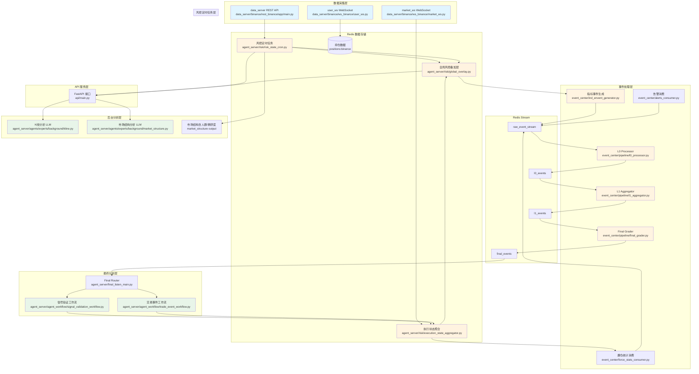
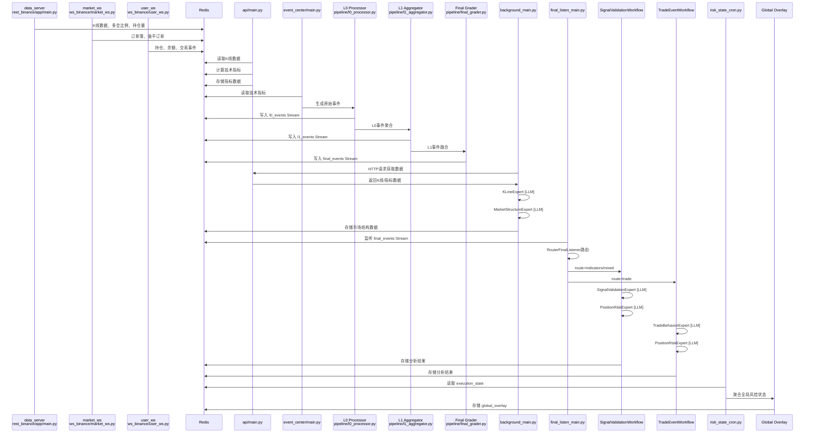

# 快速入门

<cite>
**本文档中引用的文件**  
- [requirements.txt](file://requirements.txt)
- [pyproject.toml](file://pyproject.toml)
- [agent_server/config.py](file://agent_server/config.py)
- [event_center/config.py](file://event_center/config.py)
- [data_server/binance/rest_binance/app/config.py](file://data_server/binance/rest_binance/app/config.py)
- [api/main.py](file://api/main.py)
- [agent_server/main.py](file://agent_server/main.py)
- [agent_server/final_listen_main.py](file://agent_server/final_listen_main.py)
- [event_center/main.py](file://event_center/main.py)
- [data_server/binance/rest_binance/app/main.py](file://data_server/binance/rest_binance/app/main.py)
- [api/application/apps/background/views.py](file://api/application/apps/background/views.py)
- [api/application/apps/trade_data/models.py](file://api/application/apps/trade_data/models.py)
- [data_server/binance/ws_binance/market_ws.py](file://data_server/binance/ws_binance/market_ws.py)
- [data_server/binance/ws_binance/user_ws.py](file://data_server/binance/ws_binance/user_ws.py)
- [agent_server/tools/get_position.py](file://agent_server/tools/get_position.py)
- [agent_server/agent_workflow/trade_event_workflow.py](file://agent_server/agent_workflow/trade_event_workflow.py)
- [agent_server/agents/experts/analysis/trade_behavior.py](file://agent_server/agents/experts/analysis/trade_behavior.py)
</cite>

## 目录
1. [简介](#简介)
2. [系统架构总览](#系统架构总览)
   - [整体架构图](#整体架构图)
   - [核心设计理念](#核心设计理念)
   - [系统流程图](#系统流程图)
3. [完整数据流程](#完整数据流程)
   - [阶段一：数据采集](#阶段一数据-collection)
   - [阶段二：技术指标计算与 API 服务](#阶段二技术指标计算与-api-服务-technical-indicators--api)
   - [阶段三：事件生成与处理](#阶段三事件生成与处理-event-processing)
   - [阶段四：后台市场分析](#阶段四后台市场分析-background-analysis)
   - [阶段五：最终事件分析](#阶段五最终事件分析-final-event-analysis)
   - [阶段六：风控定时任务](#阶段六风控定时任务-risk-state-cron)
   - [阶段七：可选分析 Agent](#阶段七可选分析-agent)
4. [数据流总结](#数据流总结)
   - [LLM 使用总结](#llm-使用总结)
   - [非 LLM 功能总结](#非-llm-功能总结)
5. [项目结构](#项目结构)
6. [运行步骤](#运行步骤)（含 [运行命令汇总](#0-运行命令汇总)）
7. [最小化运行示例](#最小化运行示例)
8. [验证API接口](#验证api接口)
9. [查询账户仓位](#查询账户仓位)
10. [管理监控币种](#管理监控币种)
11. [单独运行分析 Agent](#单独运行分析-agent)
12. [关键注意事项](#关键注意事项)
13. [总结](#总结)

## 简介
UTaker 是一个基于事件驱动的量化分析系统，集成了市场数据采集、技术指标生成、事件检测与智能代理分析等功能；**当前版本已接入交易 Agent**：在最终事件（指标信号、交易事件）上运行信号验证工作流与交易事件工作流，包含决策层、持仓风控与风险状态聚合，并写入数据库与 Redis 全局风控。本指南旨在帮助开发者快速搭建并运行 UTaker 系统，理解其基本工作流程与运行命令。

系统主要由以下几个核心服务组成：
- **data_server**：负责从 Binance 等交易所获取 K线、资金费率等原始数据（REST + WebSocket），并存储到 Redis；用户 WebSocket 可上报持仓与交易事件。
- **event_center**：监听 Redis 中的技术指标与告警/爆仓流，通过预设规则生成市场事件（如 MACD 金叉），经 L0/L1/Final 流水线产出 `final_events`。
- **agent_server**：消费 `final_events`，按路由（indicators/mixed → 信号验证工作流，trade → 交易事件工作流）调用大模型进行信号验证、交易行为分析、决策与持仓风控，并聚合执行状态与全局风控。
- **api**：提供 RESTful 接口，支持用户注册、登录及市场状态/人群状态等查询，集成 Swagger UI；交易相关数据模型位于 `trade_data` 应用。

本指南将引导您完成从克隆仓库、启动各服务到验证 API 与运行命令的完整流程。

## 系统架构总览

UTaker 采用**事件驱动 + 分层处理 + 智能分析**的架构设计，整个系统分为四个核心服务层，通过 Redis 实现数据共享和事件传递。

### 整体架构图

```
┌─────────────────────────────────────────────────────────────────┐
│                         UTaker 系统架构                          │
└─────────────────────────────────────────────────────────────────┘

数据采集层 (Data Layer)
    │
    ├─ data_server (REST API 采集)
    │   ├─ K线数据 (1m/5m/15m/30m/1h/2h/4h/6h/12h/1d)
    │   ├─ 多空比例数据 (taker/account/top/global)
    │   ├─ 持仓量数据 (openInterest/openInterestHist)
    │   ├─ 资金费率 (fundingRate)
    │   └─ 24小时统计 (ticker24hr)
    │
    ├─ market_ws (WebSocket 市场数据)
    │   ├─ 实时价格深度 (orderbook)
    │   ├─ 强平订单流 (forceOrder)
    │   └─ 价格波动检测 (spike detection)
    │
    └─ user_ws (WebSocket 用户数据)
        ├─ 持仓信息 (positions)
        └─ 账户余额 (balance)
    │
    ▼ 写入 Redis
    │
事件处理层 (Event Layer)
    │
    ├─ event_center
    │   ├─ L0 Processor (原始事件聚合)
    │   ├─ L1 Aggregator (多周期事件融合)
    │   ├─ Final Grader (最终事件分级)
    │   ├─ 指标事件生成 (indicators_event)
    │   ├─ 告警消费 (alerts_consumer)
    │   └─ 爆仓统计消费 (force_stats_consumer)
    │
    ▼ 生成 final_events Stream
    │
智能分析层 (Agent Layer)
    │
    ├─ agent_server (background)
    │   ├─ K线分析 (KLineExpert) [LLM]
    │   └─ 市场结构分析 (MarketStructureExpert) [LLM]
    │
    ├─ agent_server (final_listen)
    │   ├─ 信号验证工作流 (SignalValidationWorkflow)
    │   │   ├─ 信号验证 (SignalValidationExpert) [LLM]
    │   │   ├─ 决策层 (DecisionExecutionComponent) [LLM]
    │   │   ├─ 持仓风控 (PositionRiskExpert) [LLM]
    │   │   ├─ 风险状态聚合 (RiskStateAggregationComponent) [非LLM]
    │   │   └─ 市场结构分析执行 (MarketStructureExecutionComponent) [可选]
    │   │
    │   └─ 交易事件工作流 (TradeEventWorkflow)
    │       ├─ 交易行为分析 (TradeBehaviorExpert) [LLM]
    │       ├─ 决策层 (DecisionExecutionComponent) [LLM]
    │       ├─ 持仓风控 (PositionRiskExpert) [LLM]
    │       ├─ 风险状态聚合 (RiskStateAggregationComponent) [非LLM]
    │       └─ 市场结构分析执行 (MarketStructureExecutionComponent) [可选]
    │
    ├─ agent_server (risk_state_cron)
    │   ├─ 全局风控叠加层更新 (Global Overlay) [非LLM]
    │   ├─ 执行状态聚合 (Execution State Aggregation) [非LLM]
    │   └─ 账户级风控状态 (Account Risk State) [非LLM]
    │
    ├─ 可选：单独运行 Agent
    │   ├─ ForceStatsExpert [LLM] - 爆仓统计分析
    │   ├─ HumanMarketNarratorExpert [LLM] - 市场叙事生成
    │   ├─ NewsExpert [LLM] - 新闻分析
    │   ├─ TechnicalExpert [LLM] - 技术分析
    │   ├─ PortfolioExpert [LLM] - 投资组合分析
    │   ├─ ReflectionExpert [非LLM] - 反思评分
    │   ├─ FusionExpert [非LLM] - 多专家融合
    │   ├─ MemoryExpert [LLM] - 记忆管理
    │   ├─ EventSummaryExpert [LLM] - 事件摘要
    │   ├─ TradeSummaryExpert [LLM] - 交易摘要
    │   └─ DecisionExpert [LLM] - 决策专家
    │
    ▼ 分析结果存储到 Redis/DB
    │
接口服务层 (API Layer)
    │
    └─ api (FastAPI)
        ├─ 账户管理 (account)
        │   ├─ POST /api/register - 用户注册
        │   └─ POST /api/login - 用户登录
        ├─ 市场数据 (background)
        │   ├─ POST /api/market_raw/analyze - 市场原始数据分析
        │   ├─ POST /api/indicators/read - K线指标读取
        │   ├─ POST /api/indicators/multi_period - 多周期指标读取
        │   ├─ POST /api/background/read - K线背景读取
        │   ├─ POST /api/background/multi_period - 多周期背景读取
        │   ├─ POST /api/market_state/read_full - 完整市场状态查询
        │   ├─ POST /api/crowd_state/read - 人群状态读取
        │   └─ POST /api/crowd_state/scan - 人群状态扫描
        ├─ 交易数据模块 (trade_data)
        │   └─ 交易记录/事件数据模型与存储（见 api/application/apps/trade_data/models.py）
        └─ Swagger UI 文档 (http://localhost:8000/docs)
```

### 核心设计理念

1. **数据与计算分离**：数据采集层专注原始数据获取，事件处理层专注规则判断，智能分析层专注 LLM 推理
2. **事件驱动架构**：通过 Redis Stream 实现异步事件传递，各服务解耦独立运行
3. **分层事件处理**：L0 → L1 → Final 三级事件处理，逐步提炼和过滤
4. **周期分割机制**：short_term/mid_term/long_term 三层周期分析，支持不同持仓策略
5. **LLM 与非 LLM 结合**：结构化数据处理用传统算法，复杂推理用 LLM

### 系统流程图



## 完整数据流程

### 阶段一：数据采集 (Data Collection)

**服务**：`data_server` (REST + WebSocket)

**功能模块**：

#### 1. REST API 数据采集 (`data_server/binance/rest_binance`)

**代码位置**：
- **主入口**：`data_server/binance/rest_binance/app/main.py`
- **配置**：`data_server/binance/rest_binance/app/config.py`
- **数据采集函数**：`data_server/binance/rest_binance/app/fetchers.py`
- **任务管理**：`data_server/binance/rest_binance/app/manager.py`
- **符号监听**：`data_server/binance/rest_binance/app/utils/redis_watch.py`

**作用**：定期从 Binance REST API 获取历史数据

**采集内容**：
- **K线数据**：多周期 K线（1m/5m/15m/30m/1h/2h/4h/6h/12h/1d）
- **多空比例**：takerLongShortRatio、topLongShortAccountRatio、topLongShortPositionRatio、globalLongShortAccountRatio
- **持仓量数据**：openInterest（实时）、openInterestHist（历史）
- **资金费率**：fundingRate
- **24小时统计**：ticker24hr

**技术实现**：
- **不使用 LLM**：纯 REST API 调用
- **动态监控**：监听 Redis `symbol:binance` Set，自动启动/停止币种采集
- **限流控制**：按周期设置采集间隔（1m=60s, 5m=150s, 1h=900s 等）
- **数据存储**：写入 Redis，键名格式如 `klines:binance:BTCUSDT:1m`

**为后续提供**：
- 原始 K线数据 → 技术指标计算
- 多空比例数据 → 人群结构分析
- 持仓量数据 → 市场结构分析

#### 2. WebSocket 市场数据 (`data_server/binance/ws_binance/market_ws`)

**代码位置**：
- **主入口**：`data_server/binance/ws_binance/market_ws.py`
- **强平订单处理**：`data_server/binance/ws_binance/utils/force_order.py`
- **价格波动检测**：`data_server/binance/ws_binance/utils/spike_trigger.py`
- **订单簿处理**：`data_server/binance/ws_binance/utils/depth.py`
- **Redis 客户端**：`data_server/binance/ws_binance/utils/reids_connect.py`

**核心功能**：实时采集 Binance 期货市场数据（价格、订单簿、强平订单），并写入 Redis 供后续分析使用。

**主要组件**：

##### 2.1 WebSocket 连接管理 (`BinanceMarketWS` 类)

- **连接地址**：`wss://fstream.binance.com`（Binance 期货 WebSocket）
- **功能特性**：
  - 建立并维护 WebSocket 连接
  - 自动重连机制（连接断开时自动重连）
  - 动态订阅/取消订阅数据流（支持运行时修改订阅列表）
  - 支持多流合并订阅（通过 `/stream?streams=...` 接口）

##### 2.2 订阅的数据流类型

每个币种订阅三种数据流：

- **`{symbol}@aggTrade`**：聚合交易数据
  - 包含：价格、数量、时间戳、买卖方向（is_buyer_maker）
  - 更新频率：实时（每笔成交）
  
- **`{symbol}@depth20@500ms`**：20 档订单簿深度
  - 包含：买卖盘前 20 档价格和数量
  - 更新频率：500ms（每 500 毫秒更新一次）
  
- **`{symbol}@forceOrder`**：强平订单流
  - 包含：强平方向（BUY/SELL）、价格、数量、时间戳
  - 更新频率：实时（每次强平时）

##### 2.3 数据处理流程 (`on_msg` 函数)

**处理 `depthUpdate`（订单簿更新）**：
1. 提取买卖盘数据（`bids` 和 `asks`）
2. 计算买卖盘流动性（汇总前 10 档数量）
3. 缓存流动性数据到 `_depth_liq_cache`
4. 调用 `update_depth()` 写入 Redis Stream `depth:binance:{symbol}`
5. 如果有价格缓存，触发价格波动检测器（传入价格和流动性数据）

**处理 `aggTrade`（聚合交易）**：
1. 提取价格、数量、时间戳、买卖方向
2. 写入 Redis Hash：`price:binance:{symbol}`（存储最新价格和时间戳）
3. 写入 Redis Stream：`aggtrades:binance:{symbol}`（成交行为流，保留 50000 条）
4. 缓存价格到 `_price_cache`
5. 获取最新流动性数据，触发价格波动检测器

**处理 `forceOrder`（强平订单）**：
1. 调用 `handle_force_order()` 处理强平订单
2. 写入 Redis Stream：`force_stream:binance:{symbol}`（强平订单流）
3. 累加统计数据到 Redis String：`force_stats:binance:{symbol}`（包含 BUY/SELL 次数和数量）

##### 2.4 价格波动检测 (`SpikeDetector`)

**检测类型**：
- **暴涨暴跌**：价格在短时间内大幅波动（百分比阈值 + Z-Score）
- **单边行情**：连续上涨/下跌且总幅度达标
- **流动性崩塌**：买卖盘深度相对历史均值显著下降

**检测参数**：
- 百分比阈值：1%（价格变化超过 1%）
- Z-Score 阈值：5.0（基于收益的 Z 分数异常）
- 去抖时间：1000ms（避免高频误报）
- 冷却时间：10s（检测到异常后的冷却期）
- 连续确认：4 tick（需要连续 4 个 tick 确认）
- 最小深度门槛：5.0（流动性最低要求）
- 聚合窗口：2000ms（合并流动性崩塌事件）

**输出**：检测到异常时，写入 Redis Stream `alerts:binance:{symbol}`，供事件中心处理

##### 2.5 动态符号监控 (`monitor_symbols` 函数)

- **监听 Redis Set**：`symbol:binance`
- **自动订阅**：当 Redis 中新增币种时，自动订阅该币种的三种数据流
- **自动取消订阅**：当 Redis 中移除币种时，自动取消订阅并清理相关 Redis 键
- **轮询间隔**：1 秒检查一次

##### 2.6 数据清理 (`_cleanup_symbol_keys` 函数)

取消订阅币种时，自动清理该币种的所有 Redis 键：
- `price:binance:{symbol}`
- `depth:binance:{symbol}`
- `ticks:binance:{symbol}`
- `aggtrades:binance:{symbol}`
- `alerts:binance:{symbol}`
- `force_stream:binance:{symbol}`
- `stats:binance:{symbol}`

**技术实现**：
- **不使用 LLM**：纯 WebSocket 实时数据流处理
- **本地缓存**：使用 `_price_cache` 和 `_depth_liq_cache` 减少 Redis 查询
- **异常处理**：各环节都有异常捕获，保证服务稳定运行
- **资源管理**：取消订阅时自动清理相关数据，避免内存泄漏

**数据输出到 Redis**：

| Redis 键 | 数据类型 | 用途 | 保留策略 |
|---------|---------|------|---------|
| `price:binance:{symbol}` | Hash | 最新价格和时间戳（由 market_ws 的 REST 任务每 0.8s 写入，来源 `/fapi/v1/trades` 第一条） | 永久 |
| `aggtrades:binance:{symbol}` | Stream | 成交行为流（供行为分析） | 保留 50000 条 |
| `depth:binance:{symbol}` | Stream | 订单簿深度流（供市场结构分析） | 保留 300 条 |
| `force_stream:binance:{symbol}` | Stream | 强平订单流 | 保留 100 条 |
| `force_stats:binance:{symbol}` | String | 强平统计数据（JSON） | 3 分钟过期 |
| `alerts:binance:{symbol}` | Stream | 价格波动告警事件 | 保留固定长度 |

**为后续提供**：
- **订单簿数据** → 市场结构分析（订单簿结构、流动性分析）
- **成交行为数据** → 行为分析模块（交易意图推断）
- **强平数据** → ForceStats Agent 分析（爆仓统计分析）
- **价格波动告警** → 事件中心生成市场事件（异常波动事件）
- **实时价格** → 各模块实时价格查询

**在系统中的作用**：
1. **实时数据源**：为整个系统提供实时价格、订单簿、强平数据
2. **事件触发**：价格波动检测生成告警事件，供事件中心处理
3. **行为数据**：成交流供行为分析模块使用，推断市场意图
4. **市场结构**：订单簿数据供市场结构分析使用，分析买卖盘结构
5. **强平分析**：强平数据供 ForceStats Expert 分析，生成爆仓统计报告

#### 3. WebSocket 用户数据 (`data_server/binance/ws_binance/user_ws`)

**代码位置**：
- **主入口**：`data_server/binance/ws_binance/user_ws.py`
- **持仓分析**：`data_server/binance/ws_binance/utils/binance_pos_analysis.py`
- **交易记录**：`data_server/binance/ws_binance/utils/trade_recorder.py`
- **交易事件发布**：`data_server/binance/ws_binance/utils/trade_event_publisher.py`

**作用**：实时获取账户持仓和余额信息

**采集内容**：
- **持仓信息**：当前持仓、持仓方向、持仓数量、盈亏
- **账户余额**：可用余额、冻结余额

**技术实现**：
- **不使用 LLM**：WebSocket 实时数据流处理
- **数据存储**：写入 Redis `positions:binance` 和 `balance:binance`
- **交易事件发布**：检测到开仓/平仓/加仓/减仓时，发布交易事件到 Redis Stream

**为后续提供**：
- 持仓数据 → 持仓风控分析
- 交易事件 → TradeEventWorkflow 分析

---

### 阶段二：技术指标计算与 API 服务 (Technical Indicators & API)

**服务**：`api` (FastAPI Web 服务)

**代码位置**：
- **API 主入口**：`api/main.py`
- **应用创建**：`api/application/__init__.py`
- **账户管理接口**：`api/application/apps/account/views.py`
- **市场数据接口**：`api/application/apps/background/views.py`
- **指标计算引擎**：`api/application/apps/kline/indicators/`（目录下各指标计算模块）
- **市场原始数据分析**：`api/application/apps/background/market_raw_analysis.py`
- **K线指标读取**：`api/application/apps/background/kline_indicators.py`
- **市场状态视图**：`api/application/apps/background/market_state_view.py`
- **人群状态压缩**：`api/application/apps/background/crowd_state_compactor.py`

**功能模块**：

#### 1. 账户管理模块 (`account`)

**API 接口**：
- **POST /api/register**：用户注册
  - 请求参数：`username`, `email`, `password`
  - 返回：注册结果和用户信息
- **POST /api/login**：用户登录
  - 请求参数：`username`, `password`
  - 返回：登录令牌和用户信息

**技术实现**：
- **数据库**：使用 Tortoise ORM 管理用户数据
- **认证**：JWT Token 认证（待完善）

#### 2. 市场数据模块 (`background`)

**API 接口**：

- **POST /api/market_raw/analyze**：市场原始数据分析
  - 请求参数：`exchange`, `symbol`
  - 返回：参与者结构、ticker、资金费率分析

- **POST /api/indicators/read**：K线指标读取
  - 请求参数：`exchange`, `symbol`, `interval`
  - 返回：指定周期的技术指标数据

- **POST /api/indicators/multi_period**：多周期指标读取
  - 请求参数：`exchange`, `symbol`, `intervals[]`
  - 返回：多个周期的技术指标数据

- **POST /api/background/read**：K线背景读取
  - 请求参数：`exchange`, `symbol`, `interval`
  - 返回：K线背景分析数据

- **POST /api/background/multi_period**：多周期背景读取
  - 请求参数：`exchange`, `symbol`, `intervals[]`
  - 返回：多个周期的K线背景数据

- **POST /api/market_state/read_full**：完整市场状态查询
  - 请求参数：`exchange`, `symbol`
  - 返回：完整的市场状态（包括原始数据、指标、背景、市场结构等）

- **POST /api/crowd_state/read**：人群状态读取
  - 请求参数：`exchange`, `symbol`
  - 返回：人群状态和市场结构数据

- **POST /api/crowd_state/scan**：人群状态扫描
  - 请求参数：`exchange`
  - 返回：该交易所下所有币种的人群状态列表

**技术指标计算**：
- **趋势指标**：EMA、MA、MACD
- **动量指标**：RSI、KDJ、Williams %R
- **波动指标**：Bollinger Bands、ATR
- **支撑阻力**：Support/Resistance 计算

**技术实现**：
- **不使用 LLM**：纯数学计算（TA-Lib 或自定义算法）
- **多周期计算**：为每个周期（1m/5m/15m/30m/1h/2h/4h/6h/12h/1d）独立计算
- **数据来源**：从 Redis 读取 K线数据，计算后返回（不直接写入 Redis）
- **CORS 支持**：配置了 CORS 中间件，支持跨域访问

**为后续提供**：
- HTTP API 接口 → agent_server 调用获取数据
- 技术指标数据 → 事件中心生成指标事件（通过 agent_server 调用）
- 指标数据 → Agent 分析上下文

---

### 阶段三：事件生成与处理 (Event Processing)

**服务**：`event_center`

**代码位置**：
- **主入口**：`event_center/main.py`
- **配置**：`event_center/config.py`

**多交易所支持**：
- **自动发现**：系统会自动扫描 Redis 中的 `symbols:*`、`indicators:*:*:*`、`alerts:*:*`、`force_stats_stream:*:*` 键，自动发现交易所
- **并发处理**：每个交易所独立运行指标事件生成、告警消费、爆仓统计消费任务
- **默认交易所**：如果未发现任何交易所，默认使用 `binance`（可通过环境变量 `IND_EVENT_EXCHANGE` 配置）

**功能模块**：

#### 1. 指标事件生成 (`indicators_event`)

**代码位置**：
- **主循环**：`event_center/ind_envent_generator.py`
- **事件引擎**：`event_center/indicators_event/engine/event_engine.py`
- **规则配置**：`event_center/indicators_event/config/`（YAML 配置文件）
- **评分聚合**：`event_center/indicators_event/scoring/score_aggregator.py`

**作用**：基于技术指标生成市场事件

**事件类型**：
- MACD 金叉/死叉
- EMA 金叉/死叉
- RSI 超买/超卖
- Bollinger Bands 突破
- 支撑/阻力位突破

**技术实现**：
- **不使用 LLM**：基于规则判断（YAML 配置文件定义规则）
- **多周期扫描**：定期扫描各周期的技术指标
- **事件发布**：发布到 Redis Stream `raw_event_stream`

**为后续提供**：
- 原始事件 → L0 Processor 聚合

#### 2. L0 Processor (原始事件聚合)

**代码位置**：
- **主文件**：`event_center/pipeline/l0_processor.py`

**作用**：对同一币种、同一指标、同一周期的多个事件进行时间窗口聚合

**处理逻辑**：
- **时间窗口**：300秒窗口内的事件聚合
- **方向一致性**：判断事件方向是否一致
- **强度计算**：基于事件数量和强度计算聚合分数
- **去重过滤**：过滤低质量事件

**技术实现**：
- **不使用 LLM**：基于时间窗口和统计聚合
- **数据存储**：写入 Redis Stream `l0_events`

**为后续提供**：
- L0 事件 → L1 Aggregator 融合

#### 3. L1 Aggregator (多周期事件融合)

**代码位置**：
- **主文件**：`event_center/pipeline/l1_aggregator.py`
- **周期配置**：`event_center/indicators_event/config/tf_buckets.yaml`

**作用**：将多个周期的 L0 事件融合为统一的市场信号

**处理逻辑**：
- **周期分类**：short_term (1m/5m)、mid_term (15m/30m/1h)、long_term (2h/4h/1d)
- **方向融合**：判断多周期方向是否一致
- **强度计算**：加权计算总分数
- **优先级判定**：根据分数和一致性判定优先级（low/medium/high/critical）

**技术实现**：
- **不使用 LLM**：基于加权融合算法
- **周期提示生成**：生成 `tf_hint`（时间周期提示，如 ["15m", "30m", "1h"]）
- **数据存储**：写入 Redis Stream `l1_events`

**为后续提供**：
- L1 事件 → Final Grader 分级

#### 4. Final Grader (最终事件分级)

**代码位置**：
- **主文件**：`event_center/pipeline/final_grader.py`

**作用**：对 L1 事件进行最终分级和去抖

**处理逻辑**：
- **优先级门控**：过滤低于最低优先级的事件
- **背景就绪检查**：确保市场结构数据已就绪
- **状态去抖**：相同状态的事件在时间窗口内只保留一次
- **周期提示生成**：根据 short_bias/mid_bias 生成 `tf_hint`

**技术实现**：
- **不使用 LLM**：基于规则和状态机
- **数据存储**：写入 Redis Stream `final_events`

**为后续提供**：
- Final 事件 → Agent Server 分析

#### 5. 告警消费 (`alerts_consumer`)

**代码位置**：
- **主文件**：`event_center/alerts_consumer.py`

**作用**：消费外部告警事件（如价格告警）

**技术实现**：
- **不使用 LLM**：事件转发
- **数据来源**：Redis Stream `alerts:binance:*`

#### 6. 爆仓统计消费 (`force_stats_consumer`)

**代码位置**：
- **主文件**：`event_center/force_stats_consumer.py`

**作用**：消费强平订单流，生成爆仓统计事件

**处理逻辑**：
- **统计聚合**：累加强平订单数量和数量
- **阈值检测**：检测是否超过动态阈值
- **事件生成**：生成 `force_spike_buy`/`force_spike_sell` 事件

**技术实现**：
- **不使用 LLM**：基于统计和阈值判断
- **数据存储**：写入 Redis Stream `force_stats_stream:binance:*`

**为后续提供**：
- 爆仓事件 → ForceStats Agent 分析

---

### 阶段四：后台市场分析 (Background Analysis)

**服务**：`agent_server` (background_main)

**代码位置**：
- **主入口**：`agent_server/main.py`（同时运行 background 和 final_listen）
- **Background 主循环**：`agent_server/background_main.py`
- **后台任务定义**：`agent_server/utils/background_tasks.py`
- **任务管理器**：`agent_server/utils/manager.py`
- **符号监听**：`agent_server/utils/watchers/symbols.py`

**功能模块**：

#### 1. K线分析 (`KLineExpert`)

**代码位置**：
- **Expert 实现**：`agent_server/agents/experts/background/kline.py`
- **Prompt 配置**：`agent_server/configs/prompts/kline.py`
- **Agent 配置**：`agent_server/configs/source.py`

**作用**：分析多周期 K线形态和市场环境

**分析内容**：
- **周期趋势分析**：各周期的趋势方向（up/down/flat）
- **市场结构识别**：突破、假突破、盘整、支撑阻力
- **市场环境态势**：趋势/回调/盘整、波动强度

**技术实现**：
- **使用 LLM**：`Qwen/Qwen3-VL-235B-A22B-Instruct`
- **输入**：多周期 K线数据和技术指标
- **输出**：结构化的趋势背景摘要
- **数据存储**：写入 Redis `background:binance:BTCUSDT:kline_background`

**为后续提供**：
- K线背景数据 → 市场结构分析
- K线背景数据 → Agent 分析上下文

#### 2. 市场结构分析 (`MarketStructureExpert`)

**代码位置**：
- **Expert 实现**：`agent_server/agents/experts/background/market_structure.py`
- **Prompt 配置**：`agent_server/configs/prompts/market_structure.py`
- **市场结构构建**：`agent_server/agent_context/market_structure/output.py`
- **周期聚合**：`agent_server/agent_context/market_structure/horizons/build_context.py`
- **周期配置**：`agent_server/agent_context/market_structure/horizon_schema.py`
- **订单簿分析**：`agent_server/agent_context/market_structure/orderbook/service.py`
- **持仓量分析**：`agent_server/agent_context/market_structure/open_interest/analysis.py`
- **行为分析**：`agent_server/agent_context/market_structure/behavioral/behavior_aggregate.py`

**作用**：综合分析订单簿、持仓量、行为数据，生成市场结构

**分析内容**：
- **订单簿结构**：买卖盘深度、流动性分布、真空区域
- **持仓量结构**：多空持仓分布、持仓变化趋势
- **行为意图**：基于交易行为推断市场意图
- **周期分层**：short_term/mid_term/long_term 三层结构

**技术实现**：
- **使用 LLM**：`Qwen/Qwen3-VL-235B-A22B-Instruct`
- **输入**：订单簿、持仓量、多空比例、K线背景
- **输出**：结构化的市场结构数据
- **数据存储**：写入 Redis `background:binance:BTCUSDT:market_structure`

**为后续提供**：
- 市场结构数据 → Final Grader 背景检查
- 市场结构数据 → Agent 分析上下文

#### 3. 人群/拥挤度（市场结构内）

**代码位置**：
- **市场结构输出**：`agent_server/agent_context/market_structure/output.py`（`crowding_percentile`、`crowding_zone`、`structural_context`）
- **周期聚合**：`agent_server/agent_context/market_structure/horizons/build_context.py`（`participant_state`、`crowding`）

**作用**：人群与拥挤度分析已整合进市场结构（MarketStructureExpert）输出，不再作为独立模块。市场结构中的 `structural_context.crowding_percentile`、`participant_state` 等字段为信号验证与决策层提供拥挤度与人群结构信息。

**为后续提供**：
- 拥挤度/人群结构 → Agent 分析上下文（`uses_crowd_state`）
- 信号验证、决策、持仓风控均可引用市场结构中的 crowding 相关字段

---

### 阶段五：最终事件分析 (Final Event Analysis)

**服务**：`agent_server` (final_listen_main)

**代码位置**：
- **主入口**：`agent_server/main.py`（同时运行 background 和 final_listen）
- **Final 监听主循环**：`agent_server/final_listen_main.py`

**功能模块**：

#### 1. Final Events Router (`RouterFinalListener`)

**代码位置**：
- **主文件**：`agent_server/final_listen_main.py`（RouterFinalListener 类）
- **事件记录器**：`agent_server/utils/trade_event_recorder.py`
- **分析验证器**：`agent_server/utils/analysis_verifier.py`
- **价格获取**：`agent_server/tools/price_fetcher.py`

**作用**：监听 `final_events` Stream，根据事件类型路由到不同工作流

**路由逻辑**：
- **route = "indicators" 或 "mixed"** → `SignalValidationWorkflow`
- **route = "trade"** → `TradeEventWorkflow`

**技术实现**：
- **不使用 LLM**：基于事件字段的路由判断
- **事件解析**：解析 `meta`、`analysis_context`、`structure`、`trade_details`
- **周期判断**：提取 `tf_hint` 和 `is_short_term`

**为后续提供**：
- 路由信息 → 相应工作流

#### 2. 信号验证工作流 (`SignalValidationWorkflow`)

**代码位置**：
- **工作流定义**：`agent_server/agent_workflow/signal_validation_workflow.py`
- **信号验证组件**：`agent_server/agent_workflow/components/executors/signal_validation_execution.py`
- **持仓风控组件**：`agent_server/agent_workflow/components/executors/position_risk_execution.py`
- **SignalValidation Expert**：`agent_server/agents/experts/analysis/signal_validation.py`
- **Prompt 配置**：`agent_server/configs/prompts/signal_validation.py`
- **周期验证工具**：`agent_server/agents/experts/analysis/utils/tf_validation.py`
- **Agent 上下文构建**：`agent_server/agent_context/builder.py`

**作用**：验证指标信号的合理性和有效性

**工作流步骤**（共 5 步）：

**步骤1：信号验证 (`SignalValidationExpert`)**

- **使用 LLM**：`Qwen/Qwen3-VL-235B-A22B-Instruct`
- **输入**：
  - Final 事件信息（方向、置信度、周期提示）
  - 市场结构数据（short_term/mid_term/long_term，含 crowding 等）
  - 技术指标验证（tf_validation）
- **分析内容**：
  - 信号有效性判断（VALID/WEAK_VALID/INVALID）
  - 结构一致性判断（ALIGNED/CONFLICT/STRONGLY_CONFLICT）
  - 方向判断（long/short/neutral）
  - 置信度调整
- **输出**：结构化的信号验证结果

**步骤2：决策层 (`DecisionExecutionComponent` / DecisionExpert)**

- **使用 LLM**：基于上游信号验证/交易行为分析结果生成决策建议（trade_intent_range、risk_bias、forbidden_actions 等）。

**步骤3：持仓风控 (`PositionRiskExpert`)**

- **代码位置**：
  - **Expert 实现**：`agent_server/agents/experts/analysis/position_risk.py`
  - **Prompt 配置**：`agent_server/configs/prompts/position_risk.py`
  - **持仓上下文**：`agent_server/agent_context/market_structure/holding_context.py`
- **使用 LLM**：`Qwen/Qwen3-VL-235B-A22B-Instruct`
- **输入**：
  - 当前持仓状态
  - 信号验证结果
  - 市场结构数据
- **分析内容**：
  - 持仓风险评估
  - 开仓/平仓/加仓/减仓建议
  - 风险等级判定
- **输出**：持仓风控决策

**步骤4：风险状态聚合 (`RiskStateAggregationComponent`)**

- **非 LLM**：将持仓风控输出转换为 `execution_state`（allow_open/allow_add/allow_hold/allow_reduce/allow_close、冷却等），写入 DB 并刷新 Redis 全局风控叠加层。

**步骤5：市场结构分析执行 (`MarketStructureExecutionComponent`)**

- **可选**：系统认知与复盘，非关键路径。

**技术实现**：
- **周期分割**：根据 `tf_hint` 和 `HORIZONS` 配置进行周期分析
- **数据存储**：分析结果存储到数据库和 Redis

#### 3. 交易事件工作流 (`TradeEventWorkflow`)

**代码位置**：
- **工作流定义**：`agent_server/agent_workflow/trade_event_workflow.py`
- **交易事件组件**：`agent_server/agent_workflow/components/executors/trade_event_execution.py`
- **TradeBehavior Expert**：`agent_server/agents/experts/analysis/trade_behavior.py`
- **Prompt 配置**：`agent_server/configs/prompts/trade_behavior.py`
- **交易数据抽象**：`agent_server/agents/experts/analysis/utils/trade_core_data.py`

**作用**：分析交易行为（开仓/平仓/加仓/减仓）与市场结构的一致性，并输出决策与风控建议。

**工作流步骤**（共 5 步）：

**步骤1：交易行为分析 (`TradeBehaviorExpert`)**

- **使用 LLM**：`Qwen/Qwen3-VL-235B-A22B-Instruct`
- **输入**：
  - 交易详情（trade_details：开仓/平仓/加仓/减仓）
  - 持仓状态（当前持仓、盈亏）
  - 市场结构数据（含 crowding、participant_state 等）
- **分析内容**：
  - 周期权重与主导周期（dominant_cycle、cycle_weights）
  - 方向/杠杆周期一致性（audit_breakdown、conflict_evidence）
  - 风险暴露标签（risk_exposure_flags，如 crowding_risk、liquidity_vacuum）
- **输出**：结构化的交易行为审计结果

**步骤2：决策层 (`DecisionExecutionComponent`)**

- 同信号验证工作流，基于上游 trade_behavior 输出生成决策建议。

**步骤3：持仓风控 (`PositionRiskExpert`)**

- 同信号验证工作流的步骤3。

**步骤4：风险状态聚合、步骤5：市场结构分析执行**

- 同信号验证工作流。

**技术实现**：
- **短线/开平仓跳过**：若 `is_short_term=True` 或事件为 open/close，可跳过 LLM 分析以节省成本
- **数据存储**：交易事件与分析结果存储到数据库（含 `api/application/apps/trade_data` 模型）

---

### 阶段六：风控定时任务 (Risk State Cron)

**服务**：`agent_server` (risk_state_cron)

**代码位置**：
- **主入口**：`agent_server/main.py`（同时运行 background、final_listen 和 risk_state_cron）
- **风控定时任务**：`agent_server/risk/risk_state_cron.py`
- **全局风控叠加层**：`agent_server/risk/global_overlay.py`
- **执行状态聚合**：`agent_server/risk/execution_state_aggregator.py`

**功能模块**：

#### 1. 风控定时任务 (`risk_state_cron`)

**代码位置**：
- **主文件**：`agent_server/risk/risk_state_cron.py`
- **交易所监听**：`agent_server/utils/watchers/exchanges.py`

**作用**：定期更新全局风控叠加层（Global Overlay），聚合所有仓位的执行状态

**处理逻辑**：
- **更新频率**：每 60 秒更新一次
- **多交易所支持**：自动监听 Redis 中的交易所，为每个交易所独立运行风控更新循环
- **状态聚合**：读取所有仓位的 `execution_state`，生成全局风控状态
- **冷却管理**：管理全局冷却状态，退出操作触发 15 分钟冷却期

**技术实现**：
- **不使用 LLM**：基于规则和状态聚合算法
- **数据来源**：从数据库读取各仓位的 `execution_state`
- **数据存储**：写入 Redis `global_overlay:{exchange}`

**为后续提供**：
- 全局风控状态 → Signal Validation Agent（信号确认时判断账户风险环境）
- 全局风控状态 → Order Executor / Trade Router（执行层校验账户级权限）

#### 2. 执行状态聚合 (`execution_state_aggregator`)

**代码位置**：
- **主文件**：`agent_server/risk/execution_state_aggregator.py`

**作用**：将 Position Risk Agent 的输出转换为执行状态（execution_state）

**处理逻辑**：
- **权限映射**：根据 `risk_action`（exit/reduce/hold/scale_in_small）映射到操作权限（allow_open/allow_add/allow_hold/allow_reduce/allow_close）
- **冷却处理**：继承先前的冷却状态，退出操作触发新的冷却
- **风险体制标签**：从 Signal Validation 输出中提取风险体制（risk_regime）

**技术实现**：
- **不使用 LLM**：基于确定性映射表和规则
- **冷却时间**：15 分钟（退出操作后）

#### 3. 全局风控叠加层 (`global_overlay`)

**代码位置**：
- **主文件**：`agent_server/risk/global_overlay.py`

**作用**：聚合多个仓位的执行状态，生成全局账户风控状态

**处理逻辑**：
- **状态收敛**：只会收紧，不会放松（保守策略）
- **风险体制聚合**：取所有仓位中最高的风险体制等级（normal < elevated < critical）
- **冷却状态聚合**：如果任一仓位处于冷却期，全局也处于冷却期
- **权限聚合**：全局权限是所有仓位权限的交集（最严格）

**技术实现**：
- **不使用 LLM**：基于状态聚合算法
- **数据存储**：写入 Redis `global_overlay:{exchange}`

**为后续提供**：
- 全局风控状态 → 信号验证（判断信号在当前账户风险环境下是否值得执行）
- 全局风控状态 → 开仓类 Agent（判断是否允许开仓）
- 全局风控状态 → 执行层（校验账户级权限）

**特点**：
- **定时更新**：每 60 秒更新一次，冷却解除存在 ≤60s 延迟（有意的稳定性 trade-off）
- **多交易所支持**：自动监听并处理多个交易所的风控状态
- **保守策略**：全局状态只会收紧，不会放松，确保账户安全

---

### 阶段七：可选分析 Agent

#### 1. ForceStats Expert (`force_stats`)

**代码位置**：
- **Expert 实现**：`agent_server/agents/experts/analysis/force_stats.py`
- **Prompt 配置**：`agent_server/configs/prompts/force_stats.py`
- **Agent 配置**：`agent_server/configs/source.py`

**作用**：分析爆仓统计数据，生成爆仓事件解读

**使用场景**：单独运行，分析强平订单数据

**技术实现**：
- **使用 LLM**：`deepseek-ai/DeepSeek-V3`
- **输入**：
  - 爆仓统计数据（BUY/SELL、BUY_QTY/SELL_QTY）
  - 市场状态背景
- **分析内容**：
  - 爆仓事件结构识别
  - 微结构意义判断（顺势加速/逆势扫损/末端衰竭）
  - 时间周期对齐（1m/5m/15m）
  - 风险等级判定
- **输出**：结构化的爆仓分析结果

**启动命令**：
```bash
python -m agent_server.agents.experts.analysis.force_stats
```

#### 2. HumanMarketNarrator Expert (`human_market_narrator`)

**代码位置**：
- **Expert 实现**：`agent_server/agents/experts/background/human_market_narrator.py`
- **Prompt 配置**：`agent_server/configs/prompts/human_market_narrator.py`
- **Agent 配置**：`agent_server/configs/source.py`

**作用**：生成人类可读的市场叙事，用于前端展示

**使用场景**：单独运行，生成市场解读报告

**技术实现**：
- **使用 LLM**：`Qwen/Qwen3-VL-235B-A22B-Instruct`
- **输入**：
  - 市场结构数据
  - 多周期 K线指标
- **分析内容**：
  - 市场故事叙述（自然语言）
  - 阅读辅助层（short_term/mid_term/long_term 方向印象）
- **输出**：人类可读的市场叙事 JSON

**特点**：
- **仅用于展示**：不参与交易决策，不用于回测
- **纯展示层**：帮助用户理解市场状态

**启动命令**：
```bash
python -m agent_server.agents.experts.background.human_market_narrator
```

#### 3. News Expert (`news`)

**代码位置**：
- **Expert 实现**：`agent_server/agents/experts/analysis/news.py`
- **Agent 配置**：`agent_server/configs/source.py`

**作用**：分析市场相关新闻，生成新闻摘要和影响分析

**使用场景**：单独运行，分析市场新闻对交易的影响

**技术实现**：
- **使用 LLM**：`deepseek-ai/DeepSeek-V3`
- **输入**：市场新闻、事件信息
- **分析内容**：
  - 新闻摘要生成
  - 市场影响评估
  - 相关性分析
- **输出**：结构化的新闻分析结果

**启动命令**：
```bash
python -m agent_server.agents.experts.analysis.news
```

#### 4. Technical Expert (`technical`)

**代码位置**：
- **Expert 实现**：`agent_server/agents/experts/analysis/technical.py`
- **Agent 配置**：`agent_server/configs/source.py`

**作用**：进行技术指标分析，生成技术分析报告

**使用场景**：单独运行，进行深度技术分析

**技术实现**：
- **使用 LLM**：`deepseek-ai/DeepSeek-V3`
- **输入**：技术指标、价格数据
- **分析内容**：
  - 技术指标解读
  - 趋势判断
  - 买卖信号识别
- **输出**：技术分析报告

**启动命令**：
```bash
python -m agent_server.agents.experts.analysis.technical
```

#### 5. Portfolio Expert (`portfolio`)

**代码位置**：
- **Expert 实现**：`agent_server/agents/experts/analysis/portfolio.py`
- **Agent 配置**：`agent_server/configs/source.py`

**作用**：分析投资组合，提出持仓调整建议

**使用场景**：单独运行，进行投资组合优化分析

**技术实现**：
- **使用 LLM**：`deepseek-ai/DeepSeek-V3`
- **输入**：持仓组合、市场数据
- **分析内容**：
  - 组合风险评估
  - 持仓调整建议
  - 资产配置优化
- **输出**：投资组合分析报告

**启动命令**：
```bash
python -m agent_server.agents.experts.analysis.portfolio
```

#### 6. Reflection Expert (`reflection`)

**代码位置**：
- **Expert 实现**：`agent_server/agents/experts/orchestration/reflection.py`

**作用**：对多个 Expert 的输出进行反思和评分

**使用场景**：编排层使用，评估各 Expert 的输出质量

**技术实现**：
- **不使用 LLM**：基于输出长度和内容的简单评分算法
- **输入**：多个 Expert 的名称和输出
- **分析内容**：
  - 输出质量评分（基于长度，0-1 范围）
  - 关键洞察提取
- **输出**：反思评分和洞察摘要

**特点**：
- **非 LLM**：纯算法实现，快速高效
- **评分机制**：基于输出长度计算质量分数

#### 7. Fusion Expert (`fusion`)

**代码位置**：
- **Expert 实现**：`agent_server/agents/experts/orchestration/fusion.py`

**作用**：融合多个 Expert 的输出，生成加权融合结果

**使用场景**：编排层使用，将多个 Expert 的分析结果进行融合

**技术实现**：
- **不使用 LLM**：基于权重和评分的融合算法
- **输入**：
  - 多个 Expert 的名称和输出
  - 基础权重（base_weights）
  - 反思评分（reflection_scores）
  - 自动评分（auto_scores）
- **融合公式**：`combined = base_weight * (0.5 * reflection_score + 0.5 * auto_score)`
- **输出**：融合后的文本和权重分布

**特点**：
- **非 LLM**：纯算法实现，快速高效
- **权重融合**：综合考虑基础权重、反思评分和自动评分

#### 8. Memory Expert (`memory`)

**代码位置**：
- **Expert 实现**：`agent_server/agents/experts/orchestration/memory.py`
- **Agent 配置**：`agent_server/configs/source.py`

**作用**：管理历史事件和交易记录的记忆，生成记忆摘要

**使用场景**：编排层使用，维护长期记忆

**技术实现**：
- **使用 LLM**：`Qwen/Qwen3-VL-235B-A22B-Instruct`
- **输入**：历史事件、交易记录
- **分析内容**：
  - 记忆摘要生成
  - 关键事件提取
  - 模式识别
- **输出**：记忆摘要

#### 9. Event Summary Expert (`event_summary`)

**代码位置**：
- **Expert 实现**：`agent_server/agents/experts/orchestration/event_summary.py`
- **Agent 配置**：`agent_server/configs/source.py`

**作用**：对多个事件进行摘要，生成事件摘要报告

**使用场景**：编排层使用，汇总多个事件

**技术实现**：
- **使用 LLM**：`Qwen/Qwen3-VL-235B-A22B-Instruct`
- **输入**：多个事件信息
- **分析内容**：
  - 事件摘要生成
  - 关键事件识别
  - 事件关联分析
- **输出**：事件摘要报告

#### 10. Trade Summary Expert (`trade_summary`)

**代码位置**：
- **Expert 实现**：`agent_server/agents/experts/orchestration/trade_summary.py`
- **Agent 配置**：`agent_server/configs/source.py`

**作用**：对交易记录进行摘要，生成交易摘要报告

**使用场景**：编排层使用，汇总交易记录

**技术实现**：
- **使用 LLM**：`Qwen/Qwen3-VL-235B-A22B-Instruct`
- **输入**：交易记录
- **分析内容**：
  - 交易摘要生成
  - 盈亏分析
  - 交易模式识别
- **输出**：交易摘要报告

#### 11. Decision Expert (`decision`)

**代码位置**：
- **Expert 实现**：`agent_server/agents/experts/orchestration/decision.py`
- **Agent 配置**：`agent_server/configs/source.py`

**作用**：基于综合分析结果，生成最终决策建议

**使用场景**：编排层使用，生成最终交易决策

**技术实现**：
- **使用 LLM**：`Qwen/Qwen3-VL-235B-A22B-Instruct`
- **输入**：综合分析结果（多个 Expert 的输出）
- **分析内容**：
  - 决策建议生成
  - 风险评估
  - 执行计划制定
- **输出**：最终决策报告

---

### 数据流总结

#### 简化数据流

```
原始数据采集
    ↓ (REST API + WebSocket)
Redis 原始数据存储
    ↓ (技术指标计算)
Redis 技术指标存储
    ↓ (事件生成)
L0 事件聚合
    ↓ (多周期融合)
L1 事件融合
    ↓ (最终分级)
Final 事件
    ↓ (后台分析)
市场结构数据
    ↓ (Final 监听)
Agent 工作流分析
    ↓ (LLM 推理)
分析结果存储
    ↓ (执行状态聚合)
执行状态 (execution_state)
    ↓ (全局风控聚合)
全局风控叠加层 (Global Overlay)
    ↓ (定时更新)
账户级风控状态
```

#### 详细数据流（含代码位置）



### LLM 使用总结

| Agent | 模型 | 用途 | 输入 | 输出 | 代码位置 |
|-------|------|------|------|------|---------|
| **后台分析 Expert** |
| KLineExpert | Qwen/Qwen3-VL-235B-A22B-Instruct | K线形态分析 | K线数据、技术指标 | 趋势背景摘要 | `agent_server/agents/experts/background/kline.py` |
| MarketStructureExpert | Qwen/Qwen3-VL-235B-A22B-Instruct | 市场结构分析 | 订单簿、持仓量、行为数据 | 市场结构数据 | `agent_server/agents/experts/background/market_structure.py` |
| HumanMarketNarratorExpert | Qwen/Qwen3-VL-235B-A22B-Instruct | 市场叙事 | 市场结构、K线指标 | 人类可读叙事 | `agent_server/agents/experts/background/human_market_narrator.py` |
| **事件分析 Expert** |
| SignalValidationExpert | Qwen/Qwen3-VL-235B-A22B-Instruct | 信号验证 | 事件信息、市场结构、人群结构 | 信号验证结果 | `agent_server/agents/experts/analysis/signal_validation.py` |
| TradeBehaviorExpert | Qwen/Qwen3-VL-235B-A22B-Instruct | 交易行为分析 | 交易详情、市场结构 | 交易行为审计结果 | `agent_server/agents/experts/analysis/trade_behavior.py` |
| PositionRiskExpert | Qwen/Qwen3-VL-235B-A22B-Instruct | 持仓风控 | 持仓状态、市场结构 | 风控决策 | `agent_server/agents/experts/analysis/position_risk.py` |
| ForceStatsExpert | deepseek-ai/DeepSeek-V3 | 爆仓分析 | 爆仓统计数据 | 爆仓解读 | `agent_server/agents/experts/analysis/force_stats.py` |
| NewsExpert | deepseek-ai/DeepSeek-V3 | 新闻分析 | 市场新闻、事件 | 新闻摘要和影响分析 | `agent_server/agents/experts/analysis/news.py` |
| TechnicalExpert | deepseek-ai/DeepSeek-V3 | 技术分析 | 技术指标、价格数据 | 技术分析报告 | `agent_server/agents/experts/analysis/technical.py` |
| PortfolioExpert | deepseek-ai/DeepSeek-V3 | 投资组合分析 | 持仓组合、市场数据 | 组合调整建议 | `agent_server/agents/experts/analysis/portfolio.py` |
| **编排 Expert** |
| MemoryExpert | Qwen/Qwen3-VL-235B-A22B-Instruct | 记忆管理 | 历史事件、交易记录 | 记忆摘要 | `agent_server/agents/experts/orchestration/memory.py` |
| EventSummaryExpert | Qwen/Qwen3-VL-235B-A22B-Instruct | 事件摘要 | 多个事件 | 事件摘要 | `agent_server/agents/experts/orchestration/event_summary.py` |
| TradeSummaryExpert | Qwen/Qwen3-VL-235B-A22B-Instruct | 交易摘要 | 交易记录 | 交易摘要 | `agent_server/agents/experts/orchestration/trade_summary.py` |
| DecisionExpert | Qwen/Qwen3-VL-235B-A22B-Instruct | 决策专家 | 综合分析结果 | 最终决策 | `agent_server/agents/experts/orchestration/decision.py` |
| **非 LLM Expert** |
| ReflectionExpert | - | 反思评分 | 多个 Expert 输出 | 评分和洞察 | `agent_server/agents/experts/orchestration/reflection.py` |
| FusionExpert | - | 多专家融合 | 多个 Expert 输出、权重 | 融合结果 | `agent_server/agents/experts/orchestration/fusion.py` |

### 非 LLM 功能总结

| 功能模块 | 技术实现 | 作用 | 为后续提供 |
|---------|---------|------|-----------|
| REST API 采集 | HTTP 请求 | 获取历史数据 | 原始数据 |
| WebSocket 采集 | WebSocket 流 | 获取实时数据 | 实时数据流 |
| 技术指标计算 | 数学计算 | 计算技术指标 | 指标数据 |
| 事件生成 | 规则判断 | 生成市场事件 | 原始事件 |
| L0/L1/Final 处理 | 统计聚合 | 事件融合和分级 | 最终事件 |
| 人群趋势分析 | 统计计算 | Z-Score、趋势分析 | 人群数据 |
| 周期分割 | HORIZONS 配置 | 三层周期聚合 | 周期结构 |
| 执行状态聚合 | 规则映射 | risk_action → 操作权限 | 执行状态 |
| 全局风控叠加层 | 状态聚合 | 多仓位状态收敛 | 全局风控状态 |
| 风控定时任务 | 定时更新 | 每 60 秒更新全局风控 | 全局风控状态 |

## 项目结构
UTaker 采用模块化设计，各服务独立运行但通过 Redis 共享数据。主要目录结构如下：

```
UTaker/
├── agent_server/        # 智能代理服务
├── api/                 # Web API 服务（FastAPI）
├── data_server/         # 数据采集服务（Binance）
├── event_center/        # 事件中心（指标事件生成）
├── tests/               # 测试用例
├── tools/               # 辅助工具脚本
├── requirements.txt     # Python 依赖
└── pyproject.toml       # 项目配置
```

每个服务都有独立的 `main.py` 作为入口点，并通过环境变量或配置文件管理 Redis 连接等参数。

**Section sources**
- [requirements.txt](file://requirements.txt)
- [pyproject.toml](file://pyproject.toml)

## 运行步骤
以下是运行 UTaker 系统的完整步骤，建议按顺序执行。

### 0. 运行命令汇总

以下命令均在**项目根目录**执行（除非注明 `cd` 到子目录）。推荐先启动 Redis，再按表中顺序启动各服务。

#### 数据层 (data_server)

| 服务/用途 | 运行命令 | 说明 |
|-----------|----------|------|
| **数据采集 REST** | `cd data_server/binance/rest_binance && python app/main.py` | 从 Binance 拉取 K 线、多空比、持仓量等，写入 Redis |
| **市场 WebSocket** | `python -m data_server.binance.ws_binance.market_ws` | 实时订单簿、强平、aggtrades、ticks；`price:binance` 由 REST 定时（0.8s）写入，需先有 `symbol:binance` |
| **用户 WebSocket** | `python -m data_server.binance.ws_binance.user_ws` | 持仓、余额、交易事件，需配置 `BINANCE_API_KEY` / `BINANCE_API_SECRET` |

#### 事件层 (event_center) + API

| 服务/用途 | 运行命令 | 说明 |
|-----------|----------|------|
| **事件中心** | `python -m event_center.main` | 指标事件生成 + L0/L1/Final 流水线 + 告警/爆仓消费 |
| **API 服务** | `python -m api.main` | FastAPI，默认 `http://localhost:8000`，Swagger: `/docs` |

#### Agent 服务 (agent_server) — 主入口与子服务

| 服务/用途 | 运行命令 | 说明 |
|-----------|----------|------|
| **Agent 服务（一体）** | `python -m agent_server.main` | 同时跑 background + final_listen + risk_state_cron（推荐） |
| **仅后台分析** | `python -m agent_server.background_main` | K 线分析 + 市场结构分析，监听 `symbol:*` 动态调度 |
| **仅 Final 监听** | `python -m agent_server.final_listen_main` | 消费 `final_events`，跑信号验证与交易事件工作流 |
| **仅风控定时** | `python -m agent_server.risk.risk_state_cron` | 每 60 秒更新全局风控叠加层，监听 `symbol:*` 为各交易所独立运行 |

#### Agent 可选子服务

| 服务/用途 | 运行命令 | 说明 |
|-----------|----------|------|
| **交易决策服务** | `python -m agent_server.trade_decision_main` | 监听 `l1_events`，执行交易决策并推送 `TASK_ADD_TRADE` |
| **行为聚合 Daemon** | `python -m agent_server.agent_context.market_structure.behavioral.behavior_daemon` | 消费 `aggtrades` 流，生成行为结构供市场分析 |
| **Internal API** | `python -m agent_server.internal_api_main` | 内部 HTTP 接口（若项目启用） |

#### 工具与单独 Agent 测试

| 服务/用途 | 运行命令 | 说明 |
|-----------|----------|------|
| **查询仓位** | `python -m agent_server.tools.get_position` | 默认查 binance ETHUSDT |
| **价格对比测试** | `python test_ws_price.py BTCUSDT` | 对比 Redis `price:binance` 与 REST 价格 |
| **爆仓分析 Agent** | `python -m agent_server.agents.experts.analysis.force_stats` | 单独运行爆仓统计 LLM 分析 |
| **市场叙事 Agent** | `python -m agent_server.agents.experts.background.human_market_narrator` | 单独运行市场叙事生成 |
| **信号验证 Agent** | `python -m agent_server.agents.experts.analysis.signal_validation` | 单独运行信号验证（需上下文） |
| **交易行为 Agent** | `python -m agent_server.agents.experts.analysis.trade_behavior` | 单独运行交易行为分析（需上下文） |
| **持仓风控 Agent** | `python -m agent_server.agents.experts.analysis.position_risk` | 单独运行持仓风控（需上下文） |

**依赖关系简要**：`data_server` → `event_center`（依赖 Redis 指标）→ `api`（依赖 Redis 数据）→ `agent_server`（依赖 api HTTP + Redis final_events）。用户数据与交易事件需 `user_ws` 运行。风控定时任务依赖 Redis 中存在 `symbol:binance` 等交易所集合。

### 1. 克隆仓库
```bash
git clone https://github.com/your-repo/UTaker.git
cd UTaker
```

### 2. 安装 Python 依赖
系统使用 Python 3.11+ 和 `pip` 管理依赖。建议使用虚拟环境：

```bash
python3 -m venv venv
source venv/bin/activate  # Linux/Mac
# 或 venv\Scripts\activate  # Windows

pip install -r requirements.txt
```

### 3. 配置 Redis 连接
系统通过 Redis 实现服务间通信。所有服务均通过环境变量或配置文件读取 Redis 参数。

默认配置（可在各服务的 `config.py` 中修改）：
- **主机**: `127.0.0.1`
- **端口**: `6379`
- **数据库**: `1`
- **密码**: 无

如需自定义，请在运行前设置环境变量：
```bash
export REDIS_HOST=127.0.0.1
export REDIS_PORT=6379
export REDIS_DB=1
# export REDIS_PASSWORD=yourpassword  # 如有密码
```

**Section sources**
- [agent_server/config.py](file://agent_server/config.py)
- [event_center/config.py](file://event_center/config.py)
- [data_server/binance/rest_binance/app/config.py](file://data_server/binance/rest_binance/app/config.py)

### 4. 配置 LLM（大语言模型）
`agent_server` 服务使用 LLM 进行智能分析，需要配置 LLM API 密钥。

#### 配置方式

**方式1：通过环境变量（推荐）**
```bash
export SILICONFLOW_TOKEN=your_api_key_here
```

**方式2：修改配置文件**
编辑 `agent_server/configs/source.py` 文件，修改各代理的 `llm_api_key` 字段。

#### LLM 服务配置

系统默认使用 **SiliconFlow** 作为 LLM 服务提供商：
- **API 地址**: `https://api.siliconflow.cn/v1`
- **配置文件**: `agent_server/configs/source.py`

#### 使用的模型

系统为不同的代理专家配置了不同的模型：

| 代理类型 | 模型 | 用途 |
|---------|------|------|
| news, technical, risk, portfolio, reflection, fusion | `deepseek-ai/DeepSeek-V3` | 文本分析、决策建议 |
| memory, kline, market_structure, signal_validation, position_risk | `Qwen/Qwen3-VL-235B-A22B-Instruct` | 复杂分析、信号验证 |

#### 获取 API Key

1. 访问 [SiliconFlow](https://siliconflow.cn) 注册账号
2. 在控制台创建 API Key
3. 将 API Key 设置为环境变量或写入配置文件

**注意**：请妥善保管 API Key，不要将其提交到代码仓库。

**Section sources**
- [agent_server/configs/source.py](file://agent_server/configs/source.py)
- [agent_server/agents/experts/analysis/technical.py](file://agent_server/agents/experts/analysis/technical.py)

### 4.5 配置 Binance API（模拟盘/实盘）

用户 WebSocket（`user_ws`）、交易记录、REST 交易等均依赖 Binance API 凭证；并通过 `BINANCE_TESTNET` 切换**模拟盘（测试网）**与**实盘**。

#### 方式一：Conda 环境变量（推荐，测试环境 / 模拟盘）

在 conda 环境 `utaker` 中一次性设置，激活该环境后自动生效（适合模拟盘）：

```bash
conda env config vars set -n utaker \
  BINANCE_API_KEY='你的API_KEY' \
  BINANCE_API_SECRET='你的API_SECRET' \
  BINANCE_TESTNET='true'
```

**模拟盘示例**（测试环境，`BINANCE_TESTNET=true`）：

```bash
conda env config vars set -n utaker \
  BINANCE_API_KEY='2JnqPOBOLxxqLb35TLcCCwALGuHUQjMxpMb1bxav9pyuIMMzBqkAz3IzOv9NrZFs' \
  BINANCE_API_SECRET='cEJ1oXlWZrSsETRaWuPySfJOYVO4nohDrP1GSQb7m3FIvF9zkRk8iZBtIpMun7ne' \
  BINANCE_TESTNET='true'
BINANCE_API_KEY=wA8cH8LFrsmivEVH1EWi86jhD0NzZz7IzyU6uQuHBU9JPZGUyfv7pEvpj3YPkbqt
BINANCE_API_SECRET=SIy5s5l8BwQ0ccMf6driu7AiJaP0ZleFufuDae3UHZx6Ui3EKZ3GW82lTpHMaVjA
# 模拟盘开关：true=测试网(模拟盘)，false 或不设置=实盘
BINANCE_TESTNET=true

  conda env config vars set -n utaker \
  BINANCE_API_KEY='wA8cH8LFrsmivEVH1EWi86jhD0NzZz7IzyU6uQuHBU9JPZGUyfv7pEvpj3YPkbqt' \
  BINANCE_API_SECRET='SIy5s5l8BwQ0ccMf6driu7AiJaP0ZleFufuDae3UHZx6Ui3EKZ3GW82lTpHMaVjA' \
  BINANCE_TESTNET='true'
```

- 查看已设置变量：`conda env config vars list -n utaker`
- 修改后需**重新激活**环境才生效：`conda deactivate` 再 `conda activate utaker`

#### 方式二：.env 文件（实盘示例）

在项目根目录 `.env` 中配置（注意 `.env` 已在 `.gitignore`，不会提交）：

**实盘**（`BINANCE_TESTNET=false`）：

```bash
# Binance API 实盘
BINANCE_API_KEY=你的实盘KEY
BINANCE_API_SECRET=你的实盘SECRET
BINANCE_TESTNET=false
```

**模拟盘**（`BINANCE_TESTNET=true`）：

```bash
BINANCE_API_KEY=你的KEY
BINANCE_API_SECRET=你的SECRET
BINANCE_TESTNET=true
```

运行前需让进程加载 `.env`（如使用 `python-dotenv` 在入口调用 `load_dotenv()`，或在 shell 里 `export $(grep -v '^#' .env | xargs)`），否则需在终端里手动 `export` 上述变量。

| 环境   | `BINANCE_TESTNET` | 说明 |
|--------|-------------------|------|
| 模拟盘 | `true`            | 测试网，WebSocket：`wss://testnet.binancefuture.com/ws-fapi/v1`，REST：`https://testnet.binancefuture.com` |
| 实盘   | `false`           | 实盘，WebSocket：`wss://ws-fapi.binance.com/ws-fapi/v1`，REST：`https://fapi.binance.com` |

### 5. 启动各服务（按顺序）
服务之间存在依赖关系，请严格按照以下顺序启动。

#### (1) 启动 data_server（数据采集）
该服务负责从 Binance 获取 K线数据。

**代码位置**：`data_server/binance/rest_binance/app/main.py`

**前台启动**（用于调试）：
```bash
cd data_server/binance/rest_binance
python app/main.py
```

**后台启动**（生产环境推荐）：
```bash
cd data_server/binance/rest_binance
mkdir -p logs
nohup python app/main.py > logs/rest_binance.log 2>&1 &
echo $! > logs/rest_binance.pid  # 保存进程ID
```

**日志管理**：
```bash
# 实时查看日志
tail -f logs/rest_binance.log

# 查看最后 100 行日志
tail -n 100 logs/rest_binance.log

# 查看错误日志
tail -f logs/rest_binance.log | grep ERROR

# 查看进程状态
ps aux | grep "python app/main.py"

# 停止进程（使用保存的进程ID）
kill $(cat logs/rest_binance.pid)
# 或使用进程名
pkill -f "python app/main.py"
```

**启动成功标志**：
看到以下日志表示启动成功：
```
============================================================
启动 data_server (rest_binance)
Redis 配置: host=... port=... db=...
Redis 连接成功
当前监控符号: [] (共 0 个)
开始监听符号变化...
提示: 使用 redis-cli 执行 'SADD symbol:binance BTCUSDT' 添加监控符号
============================================================
```

**可选：启动 WebSocket 服务**

**市场数据 WebSocket**（代码位置：`data_server/binance/ws_binance/market_ws.py`）：

- **功能**：实时订单簿（depth）、强平流（forceOrder）、成交流（aggTrade）、ticks、价格波动检测（spike）
- **价格写入**：`price:binance:{symbol}` 由**独立线程**每 0.8 秒从 REST `/fapi/v1/trades?limit=1` 拉取最新成交价写入，不依赖 WS，避免延迟
- **前置条件**：需先有 `redis-cli SADD symbol:binance BTCUSDT`，否则无订阅

前台启动：
```bash
python -m data_server.binance.ws_binance.market_ws
```

后台启动：
```bash
mkdir -p logs
nohup python -m data_server.binance.ws_binance.market_ws > logs/market_ws.log 2>&1 &
echo $! > logs/market_ws.pid
```

**价格校验**：运行 `python test_ws_price.py BTCUSDT --loop` 可对比 Redis 与 REST 价格是否一致。

**用户数据 WebSocket**（代码位置：`data_server/binance/ws_binance/user_ws.py`）：

前台启动：
```bash
python -m data_server.binance.ws_binance.user_ws
```

后台启动：
```bash
mkdir -p logs
nohup python -m data_server.binance.ws_binance.user_ws > logs/user_ws.log 2>&1 &
echo $! > logs/user_ws.pid
```

#### (2) 启动 event_center（事件中心）
该服务监听 Redis 中的指标数据，生成市场事件。

**代码位置**：`event_center/main.py`

**前台启动**（用于调试）：
```bash
cd ../../..  # 回到项目根目录
python -m event_center.main
```

**后台启动**（生产环境推荐）：
```bash
cd ../../..  # 回到项目根目录
mkdir -p logs
nohup python -m event_center.main > logs/event_center.log 2>&1 &
echo $! > logs/event_center.pid
```

**日志管理**：
```bash
tail -f logs/event_center.log  # 实时查看日志
kill $(cat logs/event_center.pid)  # 停止进程
```

#### (3) 启动 api（Web 服务）
启动 FastAPI 服务，提供 HTTP 接口。**注意：api 服务应该在 agent_server 之前启动**，因为 agent_server 需要调用它的接口。

**代码位置**：`api/main.py`

**前台启动**（用于调试）：
```bash
# 方式1：从项目根目录运行（推荐）
python -m api.main

# 方式2：进入 api 目录运行
cd api
python main.py
```

**后台启动**（生产环境推荐）：
```bash
# 从项目根目录运行
mkdir -p logs
cd api
nohup python main.py > ../logs/api.log 2>&1 &
echo $! > ../logs/api.pid
```

**日志管理**：
```bash
tail -f logs/api.log  # 实时查看日志
# API 服务默认运行在 http://localhost:8000
# 访问 http://localhost:8000/docs 查看 Swagger UI
kill $(cat logs/api.pid)  # 停止进程
```

#### (4) 启动 agent_server（智能代理）

agent_server 是系统的智能分析核心，**主入口** `agent_server.main` 会同时启动三个子服务：后台分析、Final 事件监听、风控定时任务。

**代码位置**：
- **主入口**：`agent_server/main.py`
- **Background 服务**：`agent_server/background_main.py`
- **Final 监听服务**：`agent_server/final_listen_main.py`
- **风控定时任务**：`agent_server/risk/risk_state_cron.py`

**注意**：
- agent_server 依赖 **api 服务**，通过 HTTP 请求调用 api 获取市场数据
- **Windows 兼容性**：系统已自动处理 Windows 平台的信号处理兼容性问题

**前台启动**（用于调试）：
```bash
# 确保在项目根目录
python -m agent_server.main
```

**后台启动**（生产环境推荐）：
```bash
# 确保在项目根目录
mkdir -p logs
nohup python -m agent_server.main > logs/agent_server.log 2>&1 &
echo $! > logs/agent_server.pid
```

**日志管理**：
```bash
tail -f logs/agent_server.log  # 实时查看日志
tail -f logs/agent_server.log | grep ERROR  # 查看错误日志
kill $(cat logs/agent_server.pid)  # 停止进程
```

**agent_server 完整功能全貌**：

| 子服务 | 功能 | 数据来源 | 输出 |
|--------|------|----------|------|
| **background_main** | K 线分析 + 市场结构分析 | 监听 `symbol:*`，调用 api 获取 K 线/指标/市场结构 | 写入 Redis `background:*:kline_background`、`background:*:market_structure` |
| **final_listen_main** | 消费 `final_events`，按 route 路由 | Redis `final_events` Stream | 信号验证工作流 / 交易事件工作流 → DB + Redis 执行状态 |
| **risk_state_cron** | 每 60 秒更新全局风控 | 监听 `symbol:*`，读取各仓位 execution_state | 写入 Redis `global_overlay:{exchange}` |

**三个子服务说明**：

1. **background_main**：监听 Redis 中的 `symbol:binance` 等交易所集合，为每个交易所启动符号监听；定期调用 api 获取 K 线、指标、市场结构，运行 KLineExpert 和 MarketStructureExpert（LLM）。
2. **final_listen_main**：消费 `final_events` Stream；`route=indicators/mixed` → 信号验证工作流；`route=trade` → 交易事件工作流；包含 SignalValidation/TradeBehavior、Decision、PositionRisk、RiskStateAggregation 等组件。
3. **risk_state_cron**：监听 Redis `symbol:*` 获取活跃交易所；为每个交易所每 60 秒执行：Position Time Semantics 更新 + 全局风控叠加层聚合；写入 `global_overlay:{exchange}`。

**单独启动各子服务**（用于调试或拆分部署）：

```bash
# 仅后台分析（K 线 + 市场结构）
python -m agent_server.background_main

# 仅 Final 监听（信号验证 + 交易事件工作流）
python -m agent_server.final_listen_main

# 仅风控定时任务（每 60 秒更新全局风控）
python -m agent_server.risk.risk_state_cron
```

**风控定时任务 (risk_state_cron) 单独启动说明**：

- **前置条件**：Redis 中需存在 `symbol:binance` 等交易所集合（`SADD symbol:binance BTCUSDT` 即可创建），否则不会启动任何交易所的风控循环。
- **运行逻辑**：扫描 `symbol:*` 获取交易所列表，为每个交易所启动独立的 60 秒更新循环；执行 `process_positions`（Position Time Semantics）和 `aggregate_and_store_global_overlay`（全局风控叠加层）。
- **日志**：启动成功会看到 `风控定时服务已启动。等待交易所...`，有交易所后会看到 `已注册交易所的风控任务: binance`。

**服务关系说明**：
- **api 服务**：提供 RESTful HTTP 接口，从 Redis 读取市场数据（K线、指标、市场结构等）并返回
- **agent_server**：作为客户端，定期通过 HTTP 请求调用 api 服务的接口获取数据，然后使用 LLM 进行分析
- **调用关系**：agent_server → HTTP 请求 → api 服务 → Redis → 返回数据
- **主要接口**：
  - `/api/kline/indicators/read` - 读取技术指标
  - `/api/kline/background/read_multi` - 读取多周期背景数据
  - `/api/crowd_state/read` - 读取市场结构
  - `/api/market_raw/analyze` - 分析市场原始数据

### 5. 验证服务状态
可通过日志观察各服务是否正常运行。例如，`data_server` 应定期输出类似：
```
task_trigger name=spider_1m interval=1m time=...
```
表示正在采集 1 分钟 K线。

### 6. 服务管理快速参考

**一键启动所有服务（后台模式）**：
```bash
# 在项目根目录执行
mkdir -p logs

# 0. 添加监控符号（可选，若尚未添加）
# redis-cli SADD symbol:binance BTCUSDT

# 1. 启动 data_server REST
cd data_server/binance/rest_binance
nohup python app/main.py > ../../../../logs/rest_binance.log 2>&1 &
echo $! > ../../../../logs/rest_binance.pid
cd ../../../../

# 2. 启动 market_ws（实时订单簿、价格、aggtrades；price:binance 由 REST 定时写入）
nohup python -m data_server.binance.ws_binance.market_ws > logs/market_ws.log 2>&1 &
echo $! > logs/market_ws.pid

# 3. 启动 event_center
nohup python -m event_center.main > logs/event_center.log 2>&1 &
echo $! > logs/event_center.pid

# 4. 启动 api
nohup python -m api.main > logs/api.log 2>&1 &
echo $! > logs/api.pid

# 5. 启动 agent_server（含 background + final_listen + risk_state_cron）
nohup python -m agent_server.main > logs/agent_server.log 2>&1 &
echo $! > logs/agent_server.pid
```

**可选：用户 WebSocket**（持仓、交易事件，需配置 BINANCE_API_KEY）：
```bash
nohup python -m data_server.binance.ws_binance.user_ws > logs/user_ws.log 2>&1 &
echo $! > logs/user_ws.pid
```

**查看所有服务状态**：
```bash
# 查看所有 Python 进程
ps aux | grep python | grep -E "(rest_binance|market_ws|event_center|api|agent_server)"

# 查看所有日志（实时）
tail -f logs/*.log

# 查看特定服务的日志
tail -f logs/rest_binance.log
tail -f logs/market_ws.log
tail -f logs/event_center.log
tail -f logs/api.log
tail -f logs/agent_server.log
```

**停止所有服务**：
```bash
# 方式1：使用保存的进程ID
kill $(cat logs/rest_binance.pid) 2>/dev/null
kill $(cat logs/market_ws.pid) 2>/dev/null
kill $(cat logs/event_center.pid) 2>/dev/null
kill $(cat logs/api.pid) 2>/dev/null
kill $(cat logs/agent_server.pid) 2>/dev/null

# 方式2：使用进程名
pkill -f "python.*rest_binance"
pkill -f "python.*market_ws"
pkill -f "python.*event_center"
pkill -f "python.*api.main"
pkill -f "python.*agent_server.main"
```

**日志轮转建议**（生产环境）：
```bash
# 使用 logrotate 管理日志（需要 root 权限）
# 创建 /etc/logrotate.d/utaker
cat > /etc/logrotate.d/utaker << EOF
/path/to/utaker/logs/*.log {
    daily
    rotate 7
    compress
    delaycompress
    missingok
    notifempty
    create 0644 user user
}
EOF
```

## 最小化运行示例
本示例演示如何启动系统并观察 BTC/USDT 的 MACD 金叉事件。

### 1. 配置采集 BTC/USDT 1m K线
确保 `data_server` 正在运行，并在 Redis 中添加监控符号：
```bash
redis-cli
> SADD "symbol:binance" "BTCUSDT"
```
`data_server` 会自动检测到该符号并开始采集 1m K线数据。

### 2. 观察 event_center 生成 MACD 金叉事件
`event_center` 会定期扫描 Redis 中的指标数据。当检测到 MACD 金叉时，会在日志中输出类似：
```
[EVENT] MACD crossover detected for BTCUSDT@binance (1m)
```
该事件会被发布到 Redis Stream `l1_events` 或 `final_events`。

### 3. 查看 agent_server 的分析输出
`agent_server` 会消费 `final_events` 流，调用大模型进行分析。日志中会出现类似：
```
[AGENT] Processing event: market_spike (BTCUSDT)
[AGENT] Analysis result: ...
```
表示智能代理已对事件做出响应。

## 验证API接口
系统提供 Swagger UI 界面，便于测试 API。

### 1. 访问 API 文档
启动 `api` 服务后，打开浏览器访问：
```
http://localhost:8000/docs
```
您将看到 Swagger UI 界面，列出所有可用的 API 端点。

### 2. 执行第一个 HTTP 请求
以下步骤获取市场状态：

#### (1) 注册用户（可选）
使用 `/register` 端点注册一个账户：
```bash
curl -X 'POST' \
  'http://localhost:8000/register' \
  -H 'Content-Type: application/json' \
  -d '{
    "username": "testuser",
    "email": "test@example.com",
    "password": "password123"
  }'
```

#### (2) 获取市场状态
调用 `/market_state/read_full` 获取 BTC/USDT 的完整市场状态：
```bash
curl -X 'POST' \
  'http://localhost:8000/market_state/read_full' \
  -H 'Content-Type: application/json' \
  -d '{
    "exchange": "binance",
    "symbol": "BTCUSDT"
  }'
```
成功响应将返回包含 K线、指标、市场结构等信息的 JSON 数据。

**Section sources**
- [api/main.py](file://api/main.py)
- [api/application/apps/background/views.py](file://api/application/apps/background/views.py)

## 查询账户仓位

系统通过 WebSocket 实时获取 Binance 账户持仓信息，数据自动写入 Redis。

### 实盘与模拟盘

- **实盘**：连接真实账户，使用真实资金，WebSocket 地址 `wss://ws-fapi.binance.com/ws-fapi/v1`
- **测试网（模拟盘）**：连接测试网，使用虚拟资金，WebSocket 地址 `wss://testnet.binancefuture.com/ws-fapi/v1`

### 配置环境变量

Binance 凭证与模拟盘/实盘开关的配置方式见上文 [4.5 配置 Binance API（模拟盘/实盘）](#45-配置-binance-api模拟盘实盘)。此处仅列命令行临时设置示例：

```bash
# 必需：Binance API 凭证
export BINANCE_API_KEY=你的API_KEY
export BINANCE_API_SECRET=你的API_SECRET

# 模拟盘/实盘：true=测试网（模拟盘），false=实盘
export BINANCE_TESTNET=true   # 模拟盘
# export BINANCE_TESTNET=false  # 实盘
```

### 启动服务

```bash
python -m data_server.binance.ws_binance.user_ws
```

服务会自动连接 Binance，获取持仓和余额信息并写入 Redis（`positions:binance` 和 `balance:binance`）。

### 查询仓位

```bash
# 方式1：使用 Python 脚本（默认查询 ETHUSDT）
python -m agent_server.tools.get_position

# 方式2：直接查询 Redis
redis-cli
> GET positions:binance
> GET balance:binance
```

**Section sources**
- [data_server/binance/ws_binance/user_ws.py](file://data_server/binance/ws_binance/user_ws.py)
- [agent_server/tools/get_position.py](file://agent_server/tools/get_position.py)

## 管理监控币种

系统通过 Redis Set 来管理需要监控的交易对。所有服务会自动检测 Redis 中 `symbol:binance` 集合的变化，动态启动或停止数据采集。

### 添加监控币种

使用 Redis 命令添加交易对到监控列表：

```bash
# 连接 Redis
redis-cli

# 添加单个币种（例如：BTCUSDT）
SADD symbol:binance BTCUSDT
SADD symbol:binance MERLUSDT

# 添加多个币种
SADD symbol:binance PIPPINUSDT VVVUSDT BTCUSDT ETHUSDT
SADD symbol:binance TAKEUSDT PLAYUSDT POWERUSDT APRUSDT

# 查看当前监控的币种列表
SMEMBERS symbol:binance
```

**注意**：
- 币种名称必须使用**大写**，如 `BTCUSDT`、`ETHUSDT`
- 添加后，`data_server` 会自动检测到新币种并开始采集数据
- `event_center` 会自动开始为新区块生成事件
- `agent_server` 会自动开始分析新币种的市场数据

### 删除监控币种

使用 Redis 命令从监控列表中移除交易对：

```bash
# 连接 Redis
redis-cli

# 删除单个币种
SREM symbol:binance BTCUSDT

# 删除多个币种
SREM symbol:binance ETHUSDT BNBUSDT

# 查看当前监控的币种列表
SMEMBERS symbol:binance
```

**注意**：
- 删除后，`data_server` 会自动停止该币种的数据采集任务
- `event_center` 会停止为该币种生成新事件
- `agent_server` 会停止分析该币种
- 相关的 Redis 数据键会被自动清理

### 批量操作示例

```bash
# 清空所有监控币种
redis-cli DEL symbol:binance

# 重新添加多个币种
redis-cli SADD symbol:binance BTCUSDT ETHUSDT BNBUSDT SOLUSDT

# 查看数量
redis-cli SCARD symbol:binance
```

### 自动化管理

系统支持动态监控，无需重启服务：
- **实时生效**：添加或删除币种后，系统会在 1 秒内自动检测并响应
- **无需重启**：所有服务都会自动适应变化，无需手动重启
- **日志提示**：服务日志会显示币种的添加/移除信息

**示例日志输出**：
```
检测到新符号: ['BTCUSDT'] (总数: 1)
检测到符号移除: ['ETHUSDT'] (剩余: 2)
```

**Section sources**
- [data_server/binance/rest_binance/app/main.py](file://data_server/binance/rest_binance/app/main.py)
- [data_server/binance/ws_binance/market_ws.py](file://data_server/binance/ws_binance/market_ws.py)
- [agent_server/utils/watchers/symbols.py](file://agent_server/utils/watchers/symbols.py)

## 单独运行分析 Agent

系统支持单独运行特定的分析 Agent，用于调试、测试或独立分析场景。

### ForceStats Expert（爆仓统计分析）

**作用**：分析爆仓统计数据，生成爆仓事件的结构化解读

**前置条件**：
- `data_server` 的 `market_ws` 服务正在运行（用于采集强平订单）
- Redis 中存在 `force_stats:binance:BTCUSDT` 数据（如果没有，会使用示例数据）

**启动命令**：
```bash
python -m agent_server.agents.experts.analysis.force_stats
```

**工作原理**：
1. 从 Redis 读取爆仓统计数据（`force_stats:binance:BTCUSDT`）
2. 从 Redis 读取市场状态（`background:binance:BTCUSDT:market_state`）
3. 调用 LLM（`deepseek-ai/DeepSeek-V3`）进行爆仓分析
4. 输出结构化的爆仓解读结果

**输出内容**：
- 爆仓事件结构识别（单边主导/双向交替）
- 微结构意义判断（顺势加速/逆势扫损/末端衰竭）
- 时间周期对齐（1m/5m/15m）
- 风险等级判定

**注意**：此 Agent 的分析结果不参与最终交易决策，主要用于理解爆仓事件的市场意义。

**Section sources**
- [agent_server/agents/experts/analysis/force_stats.py](file://agent_server/agents/experts/analysis/force_stats.py)
- [agent_server/configs/prompts/force_stats.py](file://agent_server/configs/prompts/force_stats.py)

### HumanMarketNarrator Expert（市场叙事生成）

**作用**：将高度结构化的市场数据转换为人类可读的市场叙事，用于前端展示和用户理解

**前置条件**：
- `data_server`、`event_center`、`api` 服务正常运行
- Redis 中存在市场结构数据（`background:binance:BTCUSDT:market_structure`）

**启动命令**：
```bash
python -m agent_server.agents.experts.background.human_market_narrator
```

**工作原理**：
1. 从 API 读取多周期 K线背景数据
2. 构建市场结构上下文
3. 调用 LLM（`Qwen/Qwen3-VL-235B-A22B-Instruct`）生成市场叙事
4. 输出人类可读的市场故事和阅读辅助层

**输出内容**：
- `market_story`：自然语言市场解读（类似分析员讲解）
- `reading_bias_overlay`：阅读后的主观方向印象（short_term/mid_term/long_term）

**特点**：
- **仅用于展示**：明确标注 `not_for_decision=True`、`not_for_backtest=True`
- **不参与决策**：输出不会被任何 Agent、策略、回测系统消费
- **纯展示层**：帮助用户理解市场状态，而非指导交易

**默认测试币种**：`ETHUSDT`（可在代码中修改）

**Section sources**
- [agent_server/agents/experts/background/human_market_narrator.py](file://agent_server/agents/experts/background/human_market_narrator.py)
- [agent_server/configs/prompts/human_market_narrator.py](file://agent_server/configs/prompts/human_market_narrator.py)

### 其他可单独运行的 Agent

系统还支持单独运行其他 Agent，用于调试和测试：

```bash
# 信号验证 Agent
python -m agent_server.agents.experts.analysis.signal_validation

# 交易行为分析 Agent
python -m agent_server.agents.experts.analysis.trade_behavior

# 持仓风控 Agent
python -m agent_server.agents.experts.analysis.position_risk

# K线分析 Agent
python -m agent_server.agents.experts.background.kline

# 市场结构分析 Agent
python -m agent_server.agents.experts.background.market_structure
```

## 关键注意事项
为避免常见初始化问题，请注意以下事项：

### 1. 确保 Redis 服务已运行
UTaker 依赖 Redis 作为核心消息中间件。请确保 Redis 服务已在 `6379` 端口启动：
```bash
redis-server --port 6379
```
可通过 `redis-cli PING` 验证连接。

### 2. 时区设置正确
系统默认使用 `Asia/Shanghai` 时区。请确保环境变量 `APP_TIMEZONE` 设置正确：
```bash
export APP_TIMEZONE=Asia/Shanghai
```
错误的时区可能导致 K线时间戳错乱。

### 3. LLM API 密钥配置
`agent_server` 服务需要 LLM API 密钥才能进行智能分析。请确保：
- 设置环境变量 `SILICONFLOW_TOKEN`，或
- 在 `agent_server/configs/source.py` 中配置 `llm_api_key`

如果未配置，部分代理功能可能无法正常工作。

### 4. API 服务密钥配置
虽然当前示例未涉及交易，但若需调用需要认证的接口，请确保在 `.env` 文件中配置 `JWT_SECRET`。

### 5. 服务器部署：数据库环境变量
在**服务器**上运行 `user_ws` 或依赖 `TradeRecorder` / `PostgresDB` 的模块时，必须配置 PostgreSQL 连接。若未设置，会报错「主机: None:None」并退回到本地 socket 导致连接失败。请在服务器上任选一种方式配置：

- **方式一**：在项目根目录放置 `.env`，包含：
  ```bash
  DB_HOST=你的数据库IP
  DB_PORT=5432
  DB_USER=你的用户名
  DB_PASSWORD=你的密码
  DB_DATABASE=utaker
  ```
- **方式二**：使用 conda 环境变量：`conda env config vars set -n utaker DB_HOST=... DB_PORT=5432 DB_USER=... DB_PASSWORD=... DB_DATABASE=utaker`，然后重新激活环境。
- **方式三**：启动前在终端 `export DB_HOST=... DB_PORT=5432 ...`。

确保数据库服务已启动且服务器能访问（防火墙、安全组放行 5432）。

### 6. 服务启动顺序
必须按 **`data_server → event_center → api → agent_server`** 的顺序启动（api 需在 agent_server 之前，因 agent_server 通过 HTTP 调用 api 获取市场数据），否则可能导致数据流中断。

### 7. 日志监控
各服务的日志是排查问题的关键。请关注 `ERROR` 和 `WARNING` 级别的日志输出。

## 总结

通过本指南，您已全面了解了 UTaker 系统的架构、数据流程和各个功能模块。UTaker 是一个功能完整的量化分析系统，包含：

### 核心服务
1. **data_server**：数据采集服务（REST API + WebSocket）
2. **event_center**：事件处理中心（支持多交易所自动发现）
3. **agent_server**：智能分析服务（后台分析 + 最终事件分析 + 风控定时任务）
4. **api**：Web API 服务（账户管理 + 市场数据查询）

### 智能分析能力
系统包含 **15+ 个 Expert**，分为三大类：
- **后台分析 Expert**：K线分析、市场结构分析、市场叙事生成
- **事件分析 Expert**：信号验证、交易行为分析、持仓风控、爆仓分析、新闻分析、技术分析、投资组合分析
- **编排 Expert**：记忆管理、事件摘要、交易摘要、决策专家、反思评分、多专家融合

### 数据流程
完整的数据流程从原始数据采集 → 技术指标计算 → 事件生成与处理 → 后台市场分析 → 最终事件分析 → 风控状态更新，形成了闭环的量化分析体系。

### 下一步建议
1. **探索 API 接口**：访问 `http://localhost:8000/docs` 查看完整的 Swagger UI 文档
2. **修改事件规则**：编辑 `event_center/rules.yml` 和 `event_center/indicators_event/config/` 下的 YAML 配置文件
3. **扩展智能代理**：在 `agent_server/agents/experts/` 目录下添加新的 Expert
4. **单独运行 Agent**：使用提供的启动命令单独测试各个 Expert
5. **配置多交易所**：通过 Redis 配置多个交易所，系统会自动发现和处理

### 系统特点
- **事件驱动架构**：通过 Redis Stream 实现异步事件传递
- **模块化设计**：各服务独立运行，易于扩展和维护
- **多交易所支持**：自动发现和并发处理多个交易所
- **LLM 与非 LLM 结合**：结构化数据处理用传统算法，复杂推理用 LLM
- **周期分割机制**：short_term/mid_term/long_term 三层周期分析
- **全局风控管理**：定时聚合所有仓位的执行状态，生成全局风控叠加层
- **Windows 兼容性**：自动处理 Windows 平台的信号处理兼容性问题

UTaker 的模块化设计使其易于扩展和定制，欢迎您深入探索其更多功能。

**Section sources**
- [data_server/binance/ws_binance/market_ws.py](file://data_server/binance/ws_binance/market_ws.py)
- [event_center/main.py](file://event_center/main.py)
- [agent_server/main.py](file://agent_server/main.py)