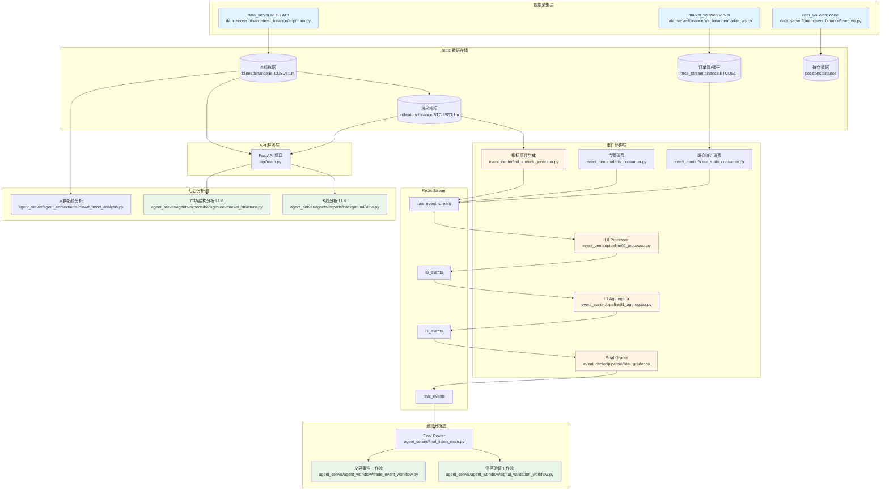
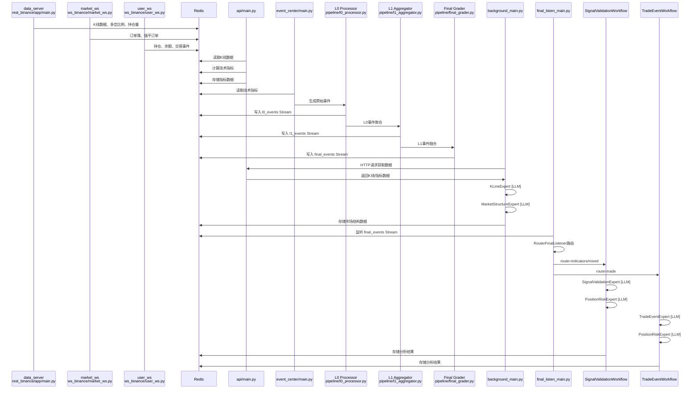

# 快速入门

<cite>
**本文档中引用的文件**  
- [requirements.txt](file://requirements.txt)
- [pyproject.toml](file://pyproject.toml)
- [agent_server/config.py](file://agent_server/config.py)
- [event_center/config.py](file://event_center/config.py)
- [data_server/binance/rest_binance/app/config.py](file://data_server/binance/rest_binance/app/config.py)
- [api/main.py](file://api/main.py)
- [agent_server/main.py](file://agent_server/main.py)
- [event_center/main.py](file://event_center/main.py)
- [data_server/binance/rest_binance/app/main.py](file://data_server/binance/rest_binance/app/main.py)
- [api/application/apps/background/views.py](file://api/application/apps/background/views.py)
- [data_server/binance/ws_binance/market_ws.py](file://data_server/binance/ws_binance/market_ws.py)
- [data_server/binance/ws_binance/user_ws.py](file://data_server/binance/ws_binance/user_ws.py)
- [agent_server/tools/get_position.py](file://agent_server/tools/get_position.py)
</cite>

## 目录
1. [简介](#简介)
2. [系统架构总览](#系统架构总览)
3. [完整数据流程](#完整数据流程)
4. [项目结构](#项目结构)
5. [运行步骤](#运行步骤)
6. [最小化运行示例](#最小化运行示例)
7. [验证API接口](#验证api接口)
8. [查询账户仓位](#查询账户仓位)
9. [管理监控币种](#管理监控币种)
10. [单独运行分析 Agent](#单独运行分析-agent)
11. [关键注意事项](#关键注意事项)
12. [总结](#总结)

## 简介
UTaker 是一个基于事件驱动的量化分析系统，集成了市场数据采集、技术指标生成、事件检测与智能代理分析等功能。本指南旨在帮助新手开发者快速搭建并运行 UTaker 系统，理解其基本工作流程。

系统主要由以下几个核心服务组成：
- **data_server**：负责从 Binance 等交易所获取 K线、资金费率等原始数据，并存储到 Redis。
- **event_center**：监听 Redis 中的技术指标，通过预设规则生成市场事件（如 MACD 金叉）。
- **agent_server**：接收最终事件，调用大模型进行多维度分析（技术面、新闻、风险等），输出决策建议。
- **api**：提供 RESTful 接口，支持用户注册、登录及查询市场状态，集成 Swagger UI 文档界面。

本指南将引导您完成从克隆仓库到验证 API 的完整流程。

## 系统架构总览

UTaker 采用**事件驱动 + 分层处理 + 智能分析**的架构设计，整个系统分为四个核心服务层，通过 Redis 实现数据共享和事件传递。

### 整体架构图

```
┌─────────────────────────────────────────────────────────────────┐
│                         UTaker 系统架构                          │
└─────────────────────────────────────────────────────────────────┘

数据采集层 (Data Layer)
    │
    ├─ data_server (REST API 采集)
    │   ├─ K线数据 (1m/5m/15m/30m/1h/2h/4h/6h/12h/1d)
    │   ├─ 多空比例数据 (taker/account/top/global)
    │   ├─ 持仓量数据 (openInterest/openInterestHist)
    │   ├─ 资金费率 (fundingRate)
    │   └─ 24小时统计 (ticker24hr)
    │
    ├─ market_ws (WebSocket 市场数据)
    │   ├─ 实时价格深度 (orderbook)
    │   ├─ 强平订单流 (forceOrder)
    │   └─ 价格波动检测 (spike detection)
    │
    └─ user_ws (WebSocket 用户数据)
        ├─ 持仓信息 (positions)
        └─ 账户余额 (balance)
    │
    ▼ 写入 Redis
    │
事件处理层 (Event Layer)
    │
    ├─ event_center
    │   ├─ L0 Processor (原始事件聚合)
    │   ├─ L1 Aggregator (多周期事件融合)
    │   ├─ Final Grader (最终事件分级)
    │   ├─ 指标事件生成 (indicators_event)
    │   ├─ 告警消费 (alerts_consumer)
    │   └─ 爆仓统计消费 (force_stats_consumer)
    │
    ▼ 生成 final_events Stream
    │
智能分析层 (Agent Layer)
    │
    ├─ agent_server (background)
    │   ├─ K线分析 (KLineExpert) [LLM]
    │   ├─ 市场结构分析 (MarketStructureExpert) [LLM]
    │   └─ 人群趋势分析 (crowd_trend_analysis) [非LLM]
    │
    ├─ agent_server (final_listen)
    │   ├─ 信号验证工作流 (SignalValidationWorkflow)
    │   │   ├─ 信号验证 (SignalValidationExpert) [LLM]
    │   │   └─ 持仓风控 (PositionRiskExpert) [LLM]
    │   │
    │   └─ 交易事件工作流 (TradeEventWorkflow)
    │       ├─ 交易事件分析 (TradeEventExpert) [LLM]
    │       └─ 持仓风控 (PositionRiskExpert) [LLM]
    │
    └─ 可选：单独运行 Agent
        ├─ ForceStatsExpert [LLM] - 爆仓统计分析
        └─ HumanMarketNarratorExpert [LLM] - 市场叙事生成
    │
    ▼ 分析结果存储到 Redis/DB
    │
接口服务层 (API Layer)
    │
    └─ api (FastAPI)
        ├─ 市场数据查询接口
        ├─ K线指标读取接口
        ├─ 市场结构读取接口
        └─ Swagger UI 文档
```

### 核心设计理念

1. **数据与计算分离**：数据采集层专注原始数据获取，事件处理层专注规则判断，智能分析层专注 LLM 推理
2. **事件驱动架构**：通过 Redis Stream 实现异步事件传递，各服务解耦独立运行
3. **分层事件处理**：L0 → L1 → Final 三级事件处理，逐步提炼和过滤
4. **周期分割机制**：short_term/mid_term/long_term 三层周期分析，支持不同持仓策略
5. **LLM 与非 LLM 结合**：结构化数据处理用传统算法，复杂推理用 LLM

### 系统流程图



## 完整数据流程

### 阶段一：数据采集 (Data Collection)

**服务**：`data_server` (REST + WebSocket)

**功能模块**：

#### 1. REST API 数据采集 (`data_server/binance/rest_binance`)

**代码位置**：
- **主入口**：`data_server/binance/rest_binance/app/main.py`
- **配置**：`data_server/binance/rest_binance/app/config.py`
- **数据采集函数**：`data_server/binance/rest_binance/app/fetchers.py`
- **任务管理**：`data_server/binance/rest_binance/app/manager.py`
- **符号监听**：`data_server/binance/rest_binance/app/utils/redis_watch.py`

**作用**：定期从 Binance REST API 获取历史数据

**采集内容**：
- **K线数据**：多周期 K线（1m/5m/15m/30m/1h/2h/4h/6h/12h/1d）
- **多空比例**：takerLongShortRatio、topLongShortAccountRatio、topLongShortPositionRatio、globalLongShortAccountRatio
- **持仓量数据**：openInterest（实时）、openInterestHist（历史）
- **资金费率**：fundingRate
- **24小时统计**：ticker24hr

**技术实现**：
- **不使用 LLM**：纯 REST API 调用
- **动态监控**：监听 Redis `symbol:binance` Set，自动启动/停止币种采集
- **限流控制**：按周期设置采集间隔（1m=60s, 5m=150s, 1h=900s 等）
- **数据存储**：写入 Redis，键名格式如 `klines:binance:BTCUSDT:1m`

**为后续提供**：
- 原始 K线数据 → 技术指标计算
- 多空比例数据 → 人群结构分析
- 持仓量数据 → 市场结构分析

#### 2. WebSocket 市场数据 (`data_server/binance/ws_binance/market_ws`)

**代码位置**：
- **主入口**：`data_server/binance/ws_binance/market_ws.py`
- **强平订单处理**：`data_server/binance/ws_binance/utils/force_order.py`
- **价格波动检测**：`data_server/binance/ws_binance/utils/spike_trigger.py`
- **订单簿处理**：`data_server/binance/ws_binance/utils/depth.py`
- **Redis 客户端**：`data_server/binance/ws_binance/utils/reids_connect.py`

**核心功能**：实时采集 Binance 期货市场数据（价格、订单簿、强平订单），并写入 Redis 供后续分析使用。

**主要组件**：

##### 2.1 WebSocket 连接管理 (`BinanceMarketWS` 类)

- **连接地址**：`wss://fstream.binance.com`（Binance 期货 WebSocket）
- **功能特性**：
  - 建立并维护 WebSocket 连接
  - 自动重连机制（连接断开时自动重连）
  - 动态订阅/取消订阅数据流（支持运行时修改订阅列表）
  - 支持多流合并订阅（通过 `/stream?streams=...` 接口）

##### 2.2 订阅的数据流类型

每个币种订阅三种数据流：

- **`{symbol}@aggTrade`**：聚合交易数据
  - 包含：价格、数量、时间戳、买卖方向（is_buyer_maker）
  - 更新频率：实时（每笔成交）
  
- **`{symbol}@depth20@500ms`**：20 档订单簿深度
  - 包含：买卖盘前 20 档价格和数量
  - 更新频率：500ms（每 500 毫秒更新一次）
  
- **`{symbol}@forceOrder`**：强平订单流
  - 包含：强平方向（BUY/SELL）、价格、数量、时间戳
  - 更新频率：实时（每次强平时）

##### 2.3 数据处理流程 (`on_msg` 函数)

**处理 `depthUpdate`（订单簿更新）**：
1. 提取买卖盘数据（`bids` 和 `asks`）
2. 计算买卖盘流动性（汇总前 10 档数量）
3. 缓存流动性数据到 `_depth_liq_cache`
4. 调用 `update_depth()` 写入 Redis Stream `depth:binance:{symbol}`
5. 如果有价格缓存，触发价格波动检测器（传入价格和流动性数据）

**处理 `aggTrade`（聚合交易）**：
1. 提取价格、数量、时间戳、买卖方向
2. 写入 Redis Hash：`price:binance:{symbol}`（存储最新价格和时间戳）
3. 写入 Redis Stream：`aggtrades:binance:{symbol}`（成交行为流，保留 50000 条）
4. 缓存价格到 `_price_cache`
5. 获取最新流动性数据，触发价格波动检测器

**处理 `forceOrder`（强平订单）**：
1. 调用 `handle_force_order()` 处理强平订单
2. 写入 Redis Stream：`force_stream:binance:{symbol}`（强平订单流）
3. 累加统计数据到 Redis String：`force_stats:binance:{symbol}`（包含 BUY/SELL 次数和数量）

##### 2.4 价格波动检测 (`SpikeDetector`)

**检测类型**：
- **暴涨暴跌**：价格在短时间内大幅波动（百分比阈值 + Z-Score）
- **单边行情**：连续上涨/下跌且总幅度达标
- **流动性崩塌**：买卖盘深度相对历史均值显著下降

**检测参数**：
- 百分比阈值：1%（价格变化超过 1%）
- Z-Score 阈值：5.0（基于收益的 Z 分数异常）
- 去抖时间：1000ms（避免高频误报）
- 冷却时间：10s（检测到异常后的冷却期）
- 连续确认：4 tick（需要连续 4 个 tick 确认）
- 最小深度门槛：5.0（流动性最低要求）
- 聚合窗口：2000ms（合并流动性崩塌事件）

**输出**：检测到异常时，写入 Redis Stream `alerts:binance:{symbol}`，供事件中心处理

##### 2.5 动态符号监控 (`monitor_symbols` 函数)

- **监听 Redis Set**：`symbol:binance`
- **自动订阅**：当 Redis 中新增币种时，自动订阅该币种的三种数据流
- **自动取消订阅**：当 Redis 中移除币种时，自动取消订阅并清理相关 Redis 键
- **轮询间隔**：1 秒检查一次

##### 2.6 数据清理 (`_cleanup_symbol_keys` 函数)

取消订阅币种时，自动清理该币种的所有 Redis 键：
- `price:binance:{symbol}`
- `depth:binance:{symbol}`
- `ticks:binance:{symbol}`
- `aggtrades:binance:{symbol}`
- `alerts:binance:{symbol}`
- `force_stream:binance:{symbol}`
- `stats:binance:{symbol}`

**技术实现**：
- **不使用 LLM**：纯 WebSocket 实时数据流处理
- **本地缓存**：使用 `_price_cache` 和 `_depth_liq_cache` 减少 Redis 查询
- **异常处理**：各环节都有异常捕获，保证服务稳定运行
- **资源管理**：取消订阅时自动清理相关数据，避免内存泄漏

**数据输出到 Redis**：

| Redis 键 | 数据类型 | 用途 | 保留策略 |
|---------|---------|------|---------|
| `price:binance:{symbol}` | Hash | 最新价格和时间戳 | 永久 |
| `aggtrades:binance:{symbol}` | Stream | 成交行为流（供行为分析） | 保留 50000 条 |
| `depth:binance:{symbol}` | Stream | 订单簿深度流（供市场结构分析） | 保留 300 条 |
| `force_stream:binance:{symbol}` | Stream | 强平订单流 | 保留 100 条 |
| `force_stats:binance:{symbol}` | String | 强平统计数据（JSON） | 3 分钟过期 |
| `alerts:binance:{symbol}` | Stream | 价格波动告警事件 | 保留固定长度 |

**为后续提供**：
- **订单簿数据** → 市场结构分析（订单簿结构、流动性分析）
- **成交行为数据** → 行为分析模块（交易意图推断）
- **强平数据** → ForceStats Agent 分析（爆仓统计分析）
- **价格波动告警** → 事件中心生成市场事件（异常波动事件）
- **实时价格** → 各模块实时价格查询

**在系统中的作用**：
1. **实时数据源**：为整个系统提供实时价格、订单簿、强平数据
2. **事件触发**：价格波动检测生成告警事件，供事件中心处理
3. **行为数据**：成交流供行为分析模块使用，推断市场意图
4. **市场结构**：订单簿数据供市场结构分析使用，分析买卖盘结构
5. **强平分析**：强平数据供 ForceStats Expert 分析，生成爆仓统计报告

#### 3. WebSocket 用户数据 (`data_server/binance/ws_binance/user_ws`)

**代码位置**：
- **主入口**：`data_server/binance/ws_binance/user_ws.py`
- **持仓分析**：`data_server/binance/ws_binance/utils/binance_pos_analysis.py`
- **交易记录**：`data_server/binance/ws_binance/utils/trade_recorder.py`
- **交易事件发布**：`data_server/binance/ws_binance/utils/trade_event_publisher.py`

**作用**：实时获取账户持仓和余额信息

**采集内容**：
- **持仓信息**：当前持仓、持仓方向、持仓数量、盈亏
- **账户余额**：可用余额、冻结余额

**技术实现**：
- **不使用 LLM**：WebSocket 实时数据流处理
- **数据存储**：写入 Redis `positions:binance` 和 `balance:binance`
- **交易事件发布**：检测到开仓/平仓/加仓/减仓时，发布交易事件到 Redis Stream

**为后续提供**：
- 持仓数据 → 持仓风控分析
- 交易事件 → TradeEventWorkflow 分析

---

### 阶段二：技术指标计算 (Technical Indicators)

**服务**：`api` (通过 API 接口触发计算)

**代码位置**：
- **API 主入口**：`api/main.py`
- **应用创建**：`api/application/__init__.py`
- **指标计算接口**：`api/application/apps/kline/views.py`
- **指标计算引擎**：`api/application/apps/kline/indicators/`（目录下各指标计算模块）
- **市场原始数据分析**：`api/application/apps/background/market_raw_analysis.py`
- **市场状态接口**：`api/application/apps/background/views.py`

**功能模块**：技术指标计算引擎

**作用**：基于 K线数据计算技术指标

**计算内容**：
- **趋势指标**：EMA、MA、MACD
- **动量指标**：RSI、KDJ、Williams %R
- **波动指标**：Bollinger Bands、ATR
- **支撑阻力**：Support/Resistance 计算

**技术实现**：
- **不使用 LLM**：纯数学计算（TA-Lib 或自定义算法）
- **多周期计算**：为每个周期（1m/5m/15m/30m/1h/2h/4h/6h/12h/1d）独立计算
- **数据存储**：写入 Redis `indicators:binance:BTCUSDT:1m`

**为后续提供**：
- 技术指标数据 → 事件中心生成指标事件
- 指标数据 → Agent 分析上下文

---

### 阶段三：事件生成与处理 (Event Processing)

**服务**：`event_center`

**代码位置**：
- **主入口**：`event_center/main.py`
- **配置**：`event_center/config.py`

**功能模块**：

#### 1. 指标事件生成 (`indicators_event`)

**代码位置**：
- **主循环**：`event_center/ind_envent_generator.py`
- **事件引擎**：`event_center/indicators_event/engine/event_engine.py`
- **规则配置**：`event_center/indicators_event/config/`（YAML 配置文件）
- **评分聚合**：`event_center/indicators_event/scoring/score_aggregator.py`

**作用**：基于技术指标生成市场事件

**事件类型**：
- MACD 金叉/死叉
- EMA 金叉/死叉
- RSI 超买/超卖
- Bollinger Bands 突破
- 支撑/阻力位突破

**技术实现**：
- **不使用 LLM**：基于规则判断（YAML 配置文件定义规则）
- **多周期扫描**：定期扫描各周期的技术指标
- **事件发布**：发布到 Redis Stream `raw_event_stream`

**为后续提供**：
- 原始事件 → L0 Processor 聚合

#### 2. L0 Processor (原始事件聚合)

**代码位置**：
- **主文件**：`event_center/pipeline/l0_processor.py`

**作用**：对同一币种、同一指标、同一周期的多个事件进行时间窗口聚合

**处理逻辑**：
- **时间窗口**：300秒窗口内的事件聚合
- **方向一致性**：判断事件方向是否一致
- **强度计算**：基于事件数量和强度计算聚合分数
- **去重过滤**：过滤低质量事件

**技术实现**：
- **不使用 LLM**：基于时间窗口和统计聚合
- **数据存储**：写入 Redis Stream `l0_events`

**为后续提供**：
- L0 事件 → L1 Aggregator 融合

#### 3. L1 Aggregator (多周期事件融合)

**代码位置**：
- **主文件**：`event_center/pipeline/l1_aggregator.py`
- **周期配置**：`event_center/indicators_event/config/tf_buckets.yaml`

**作用**：将多个周期的 L0 事件融合为统一的市场信号

**处理逻辑**：
- **周期分类**：short_term (1m/5m)、mid_term (15m/30m/1h)、long_term (2h/4h/1d)
- **方向融合**：判断多周期方向是否一致
- **强度计算**：加权计算总分数
- **优先级判定**：根据分数和一致性判定优先级（low/medium/high/critical）

**技术实现**：
- **不使用 LLM**：基于加权融合算法
- **周期提示生成**：生成 `tf_hint`（时间周期提示，如 ["15m", "30m", "1h"]）
- **数据存储**：写入 Redis Stream `l1_events`

**为后续提供**：
- L1 事件 → Final Grader 分级

#### 4. Final Grader (最终事件分级)

**代码位置**：
- **主文件**：`event_center/pipeline/final_grader.py`

**作用**：对 L1 事件进行最终分级和去抖

**处理逻辑**：
- **优先级门控**：过滤低于最低优先级的事件
- **背景就绪检查**：确保市场结构数据已就绪
- **状态去抖**：相同状态的事件在时间窗口内只保留一次
- **周期提示生成**：根据 short_bias/mid_bias 生成 `tf_hint`

**技术实现**：
- **不使用 LLM**：基于规则和状态机
- **数据存储**：写入 Redis Stream `final_events`

**为后续提供**：
- Final 事件 → Agent Server 分析

#### 5. 告警消费 (`alerts_consumer`)

**代码位置**：
- **主文件**：`event_center/alerts_consumer.py`

**作用**：消费外部告警事件（如价格告警）

**技术实现**：
- **不使用 LLM**：事件转发
- **数据来源**：Redis Stream `alerts:binance:*`

#### 6. 爆仓统计消费 (`force_stats_consumer`)

**代码位置**：
- **主文件**：`event_center/force_stats_consumer.py`

**作用**：消费强平订单流，生成爆仓统计事件

**处理逻辑**：
- **统计聚合**：累加强平订单数量和数量
- **阈值检测**：检测是否超过动态阈值
- **事件生成**：生成 `force_spike_buy`/`force_spike_sell` 事件

**技术实现**：
- **不使用 LLM**：基于统计和阈值判断
- **数据存储**：写入 Redis Stream `force_stats_stream:binance:*`

**为后续提供**：
- 爆仓事件 → ForceStats Agent 分析

---

### 阶段四：后台市场分析 (Background Analysis)

**服务**：`agent_server` (background_main)

**代码位置**：
- **主入口**：`agent_server/main.py`（同时运行 background 和 final_listen）
- **Background 主循环**：`agent_server/background_main.py`
- **后台任务定义**：`agent_server/utils/background_tasks.py`
- **任务管理器**：`agent_server/utils/manager.py`
- **符号监听**：`agent_server/utils/watchers/symbols.py`

**功能模块**：

#### 1. K线分析 (`KLineExpert`)

**代码位置**：
- **Expert 实现**：`agent_server/agents/experts/background/kline.py`
- **Prompt 配置**：`agent_server/configs/prompts/kline.py`
- **Agent 配置**：`agent_server/configs/source.py`

**作用**：分析多周期 K线形态和市场环境

**分析内容**：
- **周期趋势分析**：各周期的趋势方向（up/down/flat）
- **市场结构识别**：突破、假突破、盘整、支撑阻力
- **市场环境态势**：趋势/回调/盘整、波动强度

**技术实现**：
- **使用 LLM**：`Qwen/Qwen3-VL-235B-A22B-Instruct`
- **输入**：多周期 K线数据和技术指标
- **输出**：结构化的趋势背景摘要
- **数据存储**：写入 Redis `background:binance:BTCUSDT:kline_background`

**为后续提供**：
- K线背景数据 → 市场结构分析
- K线背景数据 → Agent 分析上下文

#### 2. 市场结构分析 (`MarketStructureExpert`)

**代码位置**：
- **Expert 实现**：`agent_server/agents/experts/background/market_structure.py`
- **Prompt 配置**：`agent_server/configs/prompts/market_structure.py`
- **市场结构构建**：`agent_server/agent_context/market_structure/output.py`
- **周期聚合**：`agent_server/agent_context/market_structure/horizons/build_context.py`
- **周期配置**：`agent_server/agent_context/market_structure/horizon_schema.py`
- **订单簿分析**：`agent_server/agent_context/market_structure/orderbook/service.py`
- **持仓量分析**：`agent_server/agent_context/market_structure/open_interest/analysis.py`
- **行为分析**：`agent_server/agent_context/market_structure/behavioral/behavior_aggregate.py`

**作用**：综合分析订单簿、持仓量、行为数据，生成市场结构

**分析内容**：
- **订单簿结构**：买卖盘深度、流动性分布、真空区域
- **持仓量结构**：多空持仓分布、持仓变化趋势
- **行为意图**：基于交易行为推断市场意图
- **周期分层**：short_term/mid_term/long_term 三层结构

**技术实现**：
- **使用 LLM**：`Qwen/Qwen3-VL-235B-A22B-Instruct`
- **输入**：订单簿、持仓量、多空比例、K线背景
- **输出**：结构化的市场结构数据
- **数据存储**：写入 Redis `background:binance:BTCUSDT:market_structure`

**为后续提供**：
- 市场结构数据 → Final Grader 背景检查
- 市场结构数据 → Agent 分析上下文

#### 3. 人群趋势分析 (`crowd_trend_analysis`)

**代码位置**：
- **主文件**：`agent_server/agent_context/utils/crowd_trend_analysis.py`
- **人群解释**：`agent_server/agent_context/utils/crowd_interpreter.py`

**作用**：分析多空比例数据，生成人群趋势分析

**分析内容**：
- **Z-Score 计算**：计算多空比例的 Z-Score
- **趋势分析**：计算 delta（变化量）、均值、标准差
- **拥挤度判定**：基于 Z-Score 判定拥挤程度

**技术实现**：
- **不使用 LLM**：基于统计计算（均值、标准差、Z-Score）
- **数据来源**：Redis 中的多空比例数据
- **数据存储**：写入 `crowd_trend_analysis` 字段

**为后续提供**：
- 人群趋势数据 → Agent 分析上下文
- 人群趋势数据 → 信号验证

---

### 阶段五：最终事件分析 (Final Event Analysis)

**服务**：`agent_server` (final_listen_main)

**代码位置**：
- **主入口**：`agent_server/main.py`（同时运行 background 和 final_listen）
- **Final 监听主循环**：`agent_server/final_listen_main.py`

**功能模块**：

#### 1. Final Events Router (`RouterFinalListener`)

**代码位置**：
- **主文件**：`agent_server/final_listen_main.py`（RouterFinalListener 类）
- **事件记录器**：`agent_server/utils/trade_event_recorder.py`
- **分析验证器**：`agent_server/utils/analysis_verifier.py`
- **价格获取**：`agent_server/tools/price_fetcher.py`

**作用**：监听 `final_events` Stream，根据事件类型路由到不同工作流

**路由逻辑**：
- **route = "indicators" 或 "mixed"** → `SignalValidationWorkflow`
- **route = "trade"** → `TradeEventWorkflow`

**技术实现**：
- **不使用 LLM**：基于事件字段的路由判断
- **事件解析**：解析 `meta`、`analysis_context`、`structure`、`trade_details`
- **周期判断**：提取 `tf_hint` 和 `is_short_term`

**为后续提供**：
- 路由信息 → 相应工作流

#### 2. 信号验证工作流 (`SignalValidationWorkflow`)

**代码位置**：
- **工作流定义**：`agent_server/agent_workflow/signal_validation_workflow.py`
- **信号验证组件**：`agent_server/agent_workflow/components/executors/signal_validation_execution.py`
- **持仓风控组件**：`agent_server/agent_workflow/components/executors/position_risk_execution.py`
- **SignalValidation Expert**：`agent_server/agents/experts/analysis/signal_validation.py`
- **Prompt 配置**：`agent_server/configs/prompts/signal_validation.py`
- **周期验证工具**：`agent_server/agents/experts/analysis/utils/tf_validation.py`
- **Agent 上下文构建**：`agent_server/agent_context/builder.py`

**作用**：验证指标信号的合理性和有效性

**工作流步骤**：

**步骤1：信号验证 (`SignalValidationExpert`)**

- **使用 LLM**：`Qwen/Qwen3-VL-235B-A22B-Instruct`
- **输入**：
  - Final 事件信息（方向、置信度、周期提示）
  - 市场结构数据（short_term/mid_term/long_term）
  - 人群结构数据（crowd_state、crowd_trend_analysis）
  - 技术指标验证（tf_validation）
- **分析内容**：
  - 信号有效性判断（VALID/WEAK_VALID/INVALID）
  - 结构一致性判断（ALIGNED/CONFLICT/STRONGLY_CONFLICT）
  - 方向判断（long/short/neutral）
  - 置信度调整
- **输出**：结构化的信号验证结果

**步骤2：持仓风控 (`PositionRiskExpert`)**

- **代码位置**：
  - **Expert 实现**：`agent_server/agents/experts/analysis/position_risk.py`
  - **Prompt 配置**：`agent_server/configs/prompts/position_risk.py`
  - **持仓上下文**：`agent_server/agent_context/market_structure/holding_context.py`
- **使用 LLM**：`Qwen/Qwen3-VL-235B-A22B-Instruct`
- **输入**：
  - 当前持仓状态
  - 信号验证结果
  - 市场结构数据
- **分析内容**：
  - 持仓风险评估
  - 开仓/平仓/加仓/减仓建议
  - 风险等级判定
- **输出**：持仓风控决策

**技术实现**：
- **周期分割**：根据 `tf_hint` 和 `HORIZONS` 配置进行周期分析
- **数据存储**：分析结果存储到数据库和 Redis

#### 3. 交易事件工作流 (`TradeEventWorkflow`)

**代码位置**：
- **工作流定义**：`agent_server/agent_workflow/trade_event_workflow.py`
- **交易事件组件**：`agent_server/agent_workflow/components/executors/trade_event_execution.py`
- **TradeEvent Expert**：`agent_server/agents/experts/analysis/trade_event.py`
- **Prompt 配置**：`agent_server/configs/prompts/trade_event.py`
- **交易数据抽象**：`agent_server/agents/experts/analysis/utils/trade_core_data.py`

**作用**：分析交易事件的合理性和结构一致性

**工作流步骤**：

**步骤1：交易事件分析 (`TradeEventExpert`)**

- **使用 LLM**：`Qwen/Qwen3-VL-235B-A22B-Instruct`
- **输入**：
  - 交易详情（开仓/平仓/加仓/减仓）
  - 持仓状态（当前持仓、盈亏）
  - 市场结构数据
  - 人群结构数据
- **分析内容**：
  - 交易合理性判断（VALID/WEAK_VALID/INVALID）
  - 结构一致性判断（ALIGNED/CONFLICT/STRONGLY_CONFLICT）
  - 风险调整建议
- **输出**：结构化的交易事件分析结果

**步骤2：持仓风控 (`PositionRiskExpert`)**

- 同信号验证工作流的步骤2

**技术实现**：
- **短线跳过**：如果 `is_short_term=True`，跳过 LLM 分析以节省成本
- **数据存储**：交易事件和分析结果存储到数据库

---

### 阶段六：可选分析 Agent

#### 1. ForceStats Expert (`force_stats`)

**代码位置**：
- **Expert 实现**：`agent_server/agents/experts/analysis/force_stats.py`
- **Prompt 配置**：`agent_server/configs/prompts/force_stats.py`
- **Agent 配置**：`agent_server/configs/source.py`

**作用**：分析爆仓统计数据，生成爆仓事件解读

**使用场景**：单独运行，分析强平订单数据

**技术实现**：
- **使用 LLM**：`deepseek-ai/DeepSeek-V3`
- **输入**：
  - 爆仓统计数据（BUY/SELL、BUY_QTY/SELL_QTY）
  - 市场状态背景
- **分析内容**：
  - 爆仓事件结构识别
  - 微结构意义判断（顺势加速/逆势扫损/末端衰竭）
  - 时间周期对齐（1m/5m/15m）
  - 风险等级判定
- **输出**：结构化的爆仓分析结果

**启动命令**：
```bash
python -m agent_server.agents.experts.analysis.force_stats
```

#### 2. HumanMarketNarrator Expert (`human_market_narrator`)

**代码位置**：
- **Expert 实现**：`agent_server/agents/experts/background/human_market_narrator.py`
- **Prompt 配置**：`agent_server/configs/prompts/human_market_narrator.py`
- **Agent 配置**：`agent_server/configs/source.py`

**作用**：生成人类可读的市场叙事，用于前端展示

**使用场景**：单独运行，生成市场解读报告

**技术实现**：
- **使用 LLM**：`Qwen/Qwen3-VL-235B-A22B-Instruct`
- **输入**：
  - 市场结构数据
  - 多周期 K线指标
- **分析内容**：
  - 市场故事叙述（自然语言）
  - 阅读辅助层（short_term/mid_term/long_term 方向印象）
- **输出**：人类可读的市场叙事 JSON

**特点**：
- **仅用于展示**：不参与交易决策，不用于回测
- **纯展示层**：帮助用户理解市场状态

**启动命令**：
```bash
python -m agent_server.agents.experts.background.human_market_narrator
```

---

### 数据流总结

#### 简化数据流

```
原始数据采集
    ↓ (REST API + WebSocket)
Redis 原始数据存储
    ↓ (技术指标计算)
Redis 技术指标存储
    ↓ (事件生成)
L0 事件聚合
    ↓ (多周期融合)
L1 事件融合
    ↓ (最终分级)
Final 事件
    ↓ (后台分析)
市场结构数据
    ↓ (Final 监听)
Agent 工作流分析
    ↓ (LLM 推理)
分析结果存储
```

#### 详细数据流（含代码位置）



### LLM 使用总结

| Agent | 模型 | 用途 | 输入 | 输出 |
|-------|------|------|------|------|
| KLineExpert | Qwen/Qwen3-VL-235B-A22B-Instruct | K线形态分析 | K线数据、技术指标 | 趋势背景摘要 |
| MarketStructureExpert | Qwen/Qwen3-VL-235B-A22B-Instruct | 市场结构分析 | 订单簿、持仓量、行为数据 | 市场结构数据 |
| SignalValidationExpert | Qwen/Qwen3-VL-235B-A22B-Instruct | 信号验证 | 事件信息、市场结构、人群结构 | 信号验证结果 |
| TradeEventExpert | Qwen/Qwen3-VL-235B-A22B-Instruct | 交易事件分析 | 交易详情、市场结构 | 交易分析结果 |
| PositionRiskExpert | Qwen/Qwen3-VL-235B-A22B-Instruct | 持仓风控 | 持仓状态、市场结构 | 风控决策 |
| ForceStatsExpert | deepseek-ai/DeepSeek-V3 | 爆仓分析 | 爆仓统计数据 | 爆仓解读 |
| HumanMarketNarratorExpert | Qwen/Qwen3-VL-235B-A22B-Instruct | 市场叙事 | 市场结构、K线指标 | 人类可读叙事 |

### 非 LLM 功能总结

| 功能模块 | 技术实现 | 作用 | 为后续提供 |
|---------|---------|------|-----------|
| REST API 采集 | HTTP 请求 | 获取历史数据 | 原始数据 |
| WebSocket 采集 | WebSocket 流 | 获取实时数据 | 实时数据流 |
| 技术指标计算 | 数学计算 | 计算技术指标 | 指标数据 |
| 事件生成 | 规则判断 | 生成市场事件 | 原始事件 |
| L0/L1/Final 处理 | 统计聚合 | 事件融合和分级 | 最终事件 |
| 人群趋势分析 | 统计计算 | Z-Score、趋势分析 | 人群数据 |
| 周期分割 | HORIZONS 配置 | 三层周期聚合 | 周期结构 |

## 项目结构
UTaker 采用模块化设计，各服务独立运行但通过 Redis 共享数据。主要目录结构如下：

```
UTaker/
├── agent_server/        # 智能代理服务
├── api/                 # Web API 服务（FastAPI）
├── data_server/         # 数据采集服务（Binance）
├── event_center/        # 事件中心（指标事件生成）
├── tests/               # 测试用例
├── tools/               # 辅助工具脚本
├── requirements.txt     # Python 依赖
└── pyproject.toml       # 项目配置
```

每个服务都有独立的 `main.py` 作为入口点，并通过环境变量或配置文件管理 Redis 连接等参数。

**Section sources**
- [requirements.txt](file://requirements.txt)
- [pyproject.toml](file://pyproject.toml)

## 运行步骤
以下是运行 UTaker 系统的完整步骤，建议按顺序执行。

### 1. 克隆仓库
```bash
git clone https://github.com/your-repo/UTaker.git
cd UTaker
```

### 2. 安装 Python 依赖
系统使用 Python 3.11+ 和 `pip` 管理依赖。建议使用虚拟环境：

```bash
python3 -m venv venv
source venv/bin/activate  # Linux/Mac
# 或 venv\Scripts\activate  # Windows

pip install -r requirements.txt
```

### 3. 配置 Redis 连接
系统通过 Redis 实现服务间通信。所有服务均通过环境变量或配置文件读取 Redis 参数。

默认配置（可在各服务的 `config.py` 中修改）：
- **主机**: `127.0.0.1`
- **端口**: `6379`
- **数据库**: `1`
- **密码**: 无

如需自定义，请在运行前设置环境变量：
```bash
export REDIS_HOST=127.0.0.1
export REDIS_PORT=6379
export REDIS_DB=1
# export REDIS_PASSWORD=yourpassword  # 如有密码
```

**Section sources**
- [agent_server/config.py](file://agent_server/config.py)
- [event_center/config.py](file://event_center/config.py)
- [data_server/binance/rest_binance/app/config.py](file://data_server/binance/rest_binance/app/config.py)

### 4. 配置 LLM（大语言模型）
`agent_server` 服务使用 LLM 进行智能分析，需要配置 LLM API 密钥。

#### 配置方式

**方式1：通过环境变量（推荐）**
```bash
export SILICONFLOW_TOKEN=your_api_key_here
```

**方式2：修改配置文件**
编辑 `agent_server/configs/source.py` 文件，修改各代理的 `llm_api_key` 字段。

#### LLM 服务配置

系统默认使用 **SiliconFlow** 作为 LLM 服务提供商：
- **API 地址**: `https://api.siliconflow.cn/v1`
- **配置文件**: `agent_server/configs/source.py`

#### 使用的模型

系统为不同的代理专家配置了不同的模型：

| 代理类型 | 模型 | 用途 |
|---------|------|------|
| news, technical, risk, portfolio, reflection, fusion | `deepseek-ai/DeepSeek-V3` | 文本分析、决策建议 |
| memory, kline, market_structure, signal_validation, position_risk | `Qwen/Qwen3-VL-235B-A22B-Instruct` | 复杂分析、信号验证 |

#### 获取 API Key

1. 访问 [SiliconFlow](https://siliconflow.cn) 注册账号
2. 在控制台创建 API Key
3. 将 API Key 设置为环境变量或写入配置文件

**注意**：请妥善保管 API Key，不要将其提交到代码仓库。

**Section sources**
- [agent_server/configs/source.py](file://agent_server/configs/source.py)
- [agent_server/agents/experts/analysis/technical.py](file://agent_server/agents/experts/analysis/technical.py)

### 5. 启动各服务（按顺序）
服务之间存在依赖关系，请严格按照以下顺序启动。

#### (1) 启动 data_server（数据采集）
该服务负责从 Binance 获取 K线数据。

**代码位置**：`data_server/binance/rest_binance/app/main.py`

```bash
cd data_server/binance/rest_binance
python app/main.py
```

**可选：启动 WebSocket 服务**

**市场数据 WebSocket**（代码位置：`data_server/binance/ws_binance/market_ws.py`）：
```bash
python -m data_server.binance.ws_binance.market_ws
```

**用户数据 WebSocket**（代码位置：`data_server/binance/ws_binance/user_ws.py`）：
```bash
python -m data_server.binance.ws_binance.user_ws
```

#### (2) 启动 event_center（事件中心）
该服务监听 Redis 中的指标数据，生成市场事件。

**代码位置**：`event_center/main.py`

```bash
cd ../../..  # 回到项目根目录
python -m event_center.main
```

#### (3) 启动 api（Web 服务）
启动 FastAPI 服务，提供 HTTP 接口。**注意：api 服务应该在 agent_server 之前启动**，因为 agent_server 需要调用它的接口。

**代码位置**：`api/main.py`

```bash
# 方式1：从项目根目录运行（推荐）
python -m api.main

# 方式2：进入 api 目录运行
cd api
python main.py
```

#### (4) 启动 agent_server（智能代理）
agent_server 包含主服务（background + final_listen），同时运行后台分析和最终事件监听。

**代码位置**：
- **主入口**：`agent_server/main.py`
- **Background 服务**：`agent_server/background_main.py`
- **Final 监听服务**：`agent_server/final_listen_main.py`

**注意**：agent_server 依赖 api 服务，它会通过 HTTP 请求调用 api 服务获取市场数据。

```bash
# 确保在项目根目录
python -m agent_server.main
```

**服务说明**：
- `agent_server.main` 会同时启动 `background_main` 和 `final_listen_main`
- `background_main`：定期调用 API 获取数据，运行 K线分析和市场结构分析
- `final_listen_main`：监听 `final_events` Stream，运行信号验证和交易事件分析工作流

**服务关系说明：**
- **api 服务**：提供 RESTful HTTP 接口，从 Redis 读取市场数据（K线、指标、市场结构等）并返回
- **agent_server**：作为客户端，定期通过 HTTP 请求调用 api 服务的接口获取数据，然后使用 LLM 进行分析
- **调用关系**：agent_server → HTTP 请求 → api 服务 → Redis → 返回数据
- **主要接口**：
  - `/api/kline/indicators/read` - 读取技术指标
  - `/api/kline/background/read_multi` - 读取多周期背景数据
  - `/api/crowd_state/read` - 读取市场结构
  - `/api/market_raw/analyze` - 分析市场原始数据

### 5. 验证服务状态
可通过日志观察各服务是否正常运行。例如，`data_server` 应定期输出类似：
```
task_trigger name=spider_1m interval=1m time=...
```
表示正在采集 1 分钟 K线。

## 最小化运行示例
本示例演示如何启动系统并观察 BTC/USDT 的 MACD 金叉事件。

### 1. 配置采集 BTC/USDT 1m K线
确保 `data_server` 正在运行，并在 Redis 中添加监控符号：
```bash
redis-cli
> SADD "symbol:binance" "BTCUSDT"
```
`data_server` 会自动检测到该符号并开始采集 1m K线数据。

### 2. 观察 event_center 生成 MACD 金叉事件
`event_center` 会定期扫描 Redis 中的指标数据。当检测到 MACD 金叉时，会在日志中输出类似：
```
[EVENT] MACD crossover detected for BTCUSDT@binance (1m)
```
该事件会被发布到 Redis Stream `l1_events` 或 `final_events`。

### 3. 查看 agent_server 的分析输出
`agent_server` 会消费 `final_events` 流，调用大模型进行分析。日志中会出现类似：
```
[AGENT] Processing event: market_spike (BTCUSDT)
[AGENT] Analysis result: ...
```
表示智能代理已对事件做出响应。

## 验证API接口
系统提供 Swagger UI 界面，便于测试 API。

### 1. 访问 API 文档
启动 `api` 服务后，打开浏览器访问：
```
http://localhost:8000/docs
```
您将看到 Swagger UI 界面，列出所有可用的 API 端点。

### 2. 执行第一个 HTTP 请求
以下步骤获取市场状态：

#### (1) 注册用户（可选）
使用 `/register` 端点注册一个账户：
```bash
curl -X 'POST' \
  'http://localhost:8000/register' \
  -H 'Content-Type: application/json' \
  -d '{
    "username": "testuser",
    "email": "test@example.com",
    "password": "password123"
  }'
```

#### (2) 获取市场状态
调用 `/market_state/read_full` 获取 BTC/USDT 的完整市场状态：
```bash
curl -X 'POST' \
  'http://localhost:8000/market_state/read_full' \
  -H 'Content-Type: application/json' \
  -d '{
    "exchange": "binance",
    "symbol": "BTCUSDT"
  }'
```
成功响应将返回包含 K线、指标、市场结构等信息的 JSON 数据。

**Section sources**
- [api/main.py](file://api/main.py)
- [api/application/apps/background/views.py](file://api/application/apps/background/views.py)

## 查询账户仓位

系统通过 WebSocket 实时获取 Binance 账户持仓信息，数据自动写入 Redis。

### 实盘与模拟盘

- **实盘**：连接真实账户，使用真实资金，WebSocket 地址 `wss://ws-fapi.binance.com/ws-fapi/v1`
- **测试网（模拟盘）**：连接测试网，使用虚拟资金，WebSocket 地址 `wss://testnet.binancefuture.com/ws-fapi/v1`

### 配置环境变量

```bash
# 必需：Binance API 凭证
export BINANCE_API_KEY=你的API_KEY
export BINANCE_API_SECRET=你的API_SECRET

# 可选：使用测试网（默认 false，即实盘）
export BINANCE_TESTNET=true   # true=测试网，false或不设置=实盘
```

### 启动服务

```bash
python -m data_server.binance.ws_binance.user_ws
```

服务会自动连接 Binance，获取持仓和余额信息并写入 Redis（`positions:binance` 和 `balance:binance`）。

### 查询仓位

```bash
# 方式1：使用 Python 脚本（默认查询 ETHUSDT）
python -m agent_server.tools.get_position

# 方式2：直接查询 Redis
redis-cli
> GET positions:binance
> GET balance:binance
```

**Section sources**
- [data_server/binance/ws_binance/user_ws.py](file://data_server/binance/ws_binance/user_ws.py)
- [agent_server/tools/get_position.py](file://agent_server/tools/get_position.py)

## 管理监控币种

系统通过 Redis Set 来管理需要监控的交易对。所有服务会自动检测 Redis 中 `symbol:binance` 集合的变化，动态启动或停止数据采集。

### 添加监控币种

使用 Redis 命令添加交易对到监控列表：

```bash
# 连接 Redis
redis-cli

# 添加单个币种（例如：BTCUSDT）
SADD symbol:binance BTCUSDT
SADD symbol:binance MERLUSDT

# 添加多个币种
SADD symbol:binance PIPPINUSDT VVVUSDT BTCUSDT

# 查看当前监控的币种列表
SMEMBERS symbol:binance
```

**注意**：
- 币种名称必须使用**大写**，如 `BTCUSDT`、`ETHUSDT`
- 添加后，`data_server` 会自动检测到新币种并开始采集数据
- `event_center` 会自动开始为新区块生成事件
- `agent_server` 会自动开始分析新币种的市场数据

### 删除监控币种

使用 Redis 命令从监控列表中移除交易对：

```bash
# 连接 Redis
redis-cli

# 删除单个币种
SREM symbol:binance BTCUSDT

# 删除多个币种
SREM symbol:binance ETHUSDT BNBUSDT

# 查看当前监控的币种列表
SMEMBERS symbol:binance
```

**注意**：
- 删除后，`data_server` 会自动停止该币种的数据采集任务
- `event_center` 会停止为该币种生成新事件
- `agent_server` 会停止分析该币种
- 相关的 Redis 数据键会被自动清理

### 批量操作示例

```bash
# 清空所有监控币种
redis-cli DEL symbol:binance

# 重新添加多个币种
redis-cli SADD symbol:binance BTCUSDT ETHUSDT BNBUSDT SOLUSDT

# 查看数量
redis-cli SCARD symbol:binance
```

### 自动化管理

系统支持动态监控，无需重启服务：
- **实时生效**：添加或删除币种后，系统会在 1 秒内自动检测并响应
- **无需重启**：所有服务都会自动适应变化，无需手动重启
- **日志提示**：服务日志会显示币种的添加/移除信息

**示例日志输出**：
```
检测到新符号: ['BTCUSDT'] (总数: 1)
检测到符号移除: ['ETHUSDT'] (剩余: 2)
```

**Section sources**
- [data_server/binance/rest_binance/app/main.py](file://data_server/binance/rest_binance/app/main.py)
- [data_server/binance/ws_binance/market_ws.py](file://data_server/binance/ws_binance/market_ws.py)
- [agent_server/utils/watchers/symbols.py](file://agent_server/utils/watchers/symbols.py)

## 单独运行分析 Agent

系统支持单独运行特定的分析 Agent，用于调试、测试或独立分析场景。

### ForceStats Expert（爆仓统计分析）

**作用**：分析爆仓统计数据，生成爆仓事件的结构化解读

**前置条件**：
- `data_server` 的 `market_ws` 服务正在运行（用于采集强平订单）
- Redis 中存在 `force_stats:binance:BTCUSDT` 数据（如果没有，会使用示例数据）

**启动命令**：
```bash
python -m agent_server.agents.experts.analysis.force_stats
```

**工作原理**：
1. 从 Redis 读取爆仓统计数据（`force_stats:binance:BTCUSDT`）
2. 从 Redis 读取市场状态（`background:binance:BTCUSDT:market_state`）
3. 调用 LLM（`deepseek-ai/DeepSeek-V3`）进行爆仓分析
4. 输出结构化的爆仓解读结果

**输出内容**：
- 爆仓事件结构识别（单边主导/双向交替）
- 微结构意义判断（顺势加速/逆势扫损/末端衰竭）
- 时间周期对齐（1m/5m/15m）
- 风险等级判定

**注意**：此 Agent 的分析结果不参与最终交易决策，主要用于理解爆仓事件的市场意义。

**Section sources**
- [agent_server/agents/experts/analysis/force_stats.py](file://agent_server/agents/experts/analysis/force_stats.py)
- [agent_server/configs/prompts/force_stats.py](file://agent_server/configs/prompts/force_stats.py)

### HumanMarketNarrator Expert（市场叙事生成）

**作用**：将高度结构化的市场数据转换为人类可读的市场叙事，用于前端展示和用户理解

**前置条件**：
- `data_server`、`event_center`、`api` 服务正常运行
- Redis 中存在市场结构数据（`background:binance:BTCUSDT:market_structure`）

**启动命令**：
```bash
python -m agent_server.agents.experts.background.human_market_narrator
```

**工作原理**：
1. 从 API 读取多周期 K线背景数据
2. 构建市场结构上下文
3. 调用 LLM（`Qwen/Qwen3-VL-235B-A22B-Instruct`）生成市场叙事
4. 输出人类可读的市场故事和阅读辅助层

**输出内容**：
- `market_story`：自然语言市场解读（类似分析员讲解）
- `reading_bias_overlay`：阅读后的主观方向印象（short_term/mid_term/long_term）

**特点**：
- **仅用于展示**：明确标注 `not_for_decision=True`、`not_for_backtest=True`
- **不参与决策**：输出不会被任何 Agent、策略、回测系统消费
- **纯展示层**：帮助用户理解市场状态，而非指导交易

**默认测试币种**：`ETHUSDT`（可在代码中修改）

**Section sources**
- [agent_server/agents/experts/background/human_market_narrator.py](file://agent_server/agents/experts/background/human_market_narrator.py)
- [agent_server/configs/prompts/human_market_narrator.py](file://agent_server/configs/prompts/human_market_narrator.py)

### 其他可单独运行的 Agent

系统还支持单独运行其他 Agent，用于调试和测试：

```bash
# 信号验证 Agent
python -m agent_server.agents.experts.analysis.signal_validation

# 交易事件分析 Agent
python -m agent_server.agents.experts.analysis.trade_event

# 持仓风控 Agent
python -m agent_server.agents.experts.analysis.position_risk

# K线分析 Agent
python -m agent_server.agents.experts.background.kline

# 市场结构分析 Agent
python -m agent_server.agents.experts.background.market_structure
```

## 关键注意事项
为避免常见初始化问题，请注意以下事项：

### 1. 确保 Redis 服务已运行
UTaker 依赖 Redis 作为核心消息中间件。请确保 Redis 服务已在 `6379` 端口启动：
```bash
redis-server --port 6379
```
可通过 `redis-cli PING` 验证连接。

### 2. 时区设置正确
系统默认使用 `Asia/Shanghai` 时区。请确保环境变量 `APP_TIMEZONE` 设置正确：
```bash
export APP_TIMEZONE=Asia/Shanghai
```
错误的时区可能导致 K线时间戳错乱。

### 3. LLM API 密钥配置
`agent_server` 服务需要 LLM API 密钥才能进行智能分析。请确保：
- 设置环境变量 `SILICONFLOW_TOKEN`，或
- 在 `agent_server/configs/source.py` 中配置 `llm_api_key`

如果未配置，部分代理功能可能无法正常工作。

### 4. API 服务密钥配置
虽然当前示例未涉及交易，但若需调用需要认证的接口，请确保在 `.env` 文件中配置 `JWT_SECRET`。

### 6. 服务启动顺序
必须按 `data_server → event_center → agent_server → api` 的顺序启动，否则可能导致数据流中断。

### 7. 日志监控
各服务的日志是排查问题的关键。请关注 `ERROR` 和 `WARNING` 级别的日志输出。

## 总结
通过本指南，您已成功搭建并运行了 UTaker 系统，完成了从数据采集到事件分析的完整流程。下一步您可以：
- 探索更多 API 端点
- 修改事件规则（`event_center/rules.yml`）
- 扩展智能代理的分析能力（`agent_server/agents/experts/`）

UTaker 的模块化设计使其易于扩展和定制，欢迎您深入探索其更多功能。

**Section sources**
- [data_server/binance/ws_binance/market_ws.py](file://data_server/binance/ws_binance/market_ws.py)
- [event_center/main.py](file://event_center/main.py)
- [agent_server/main.py](file://agent_server/main.py)